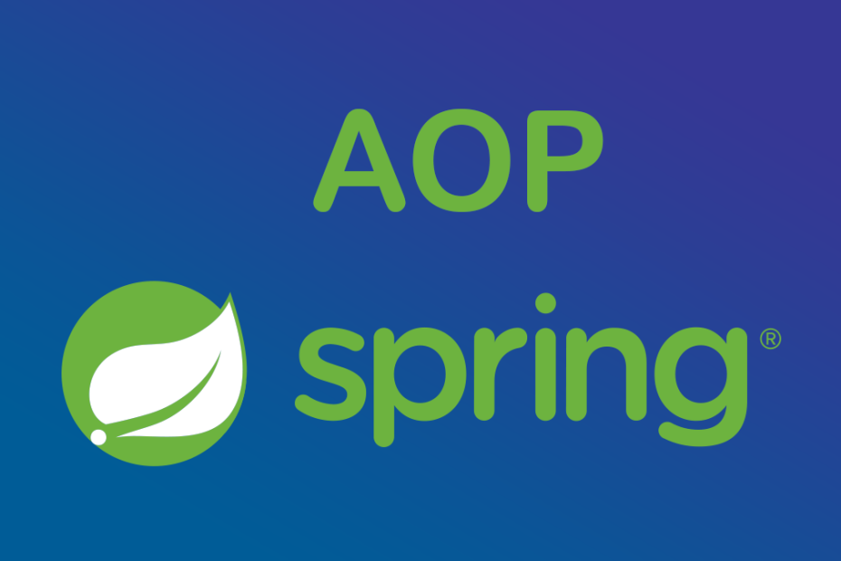
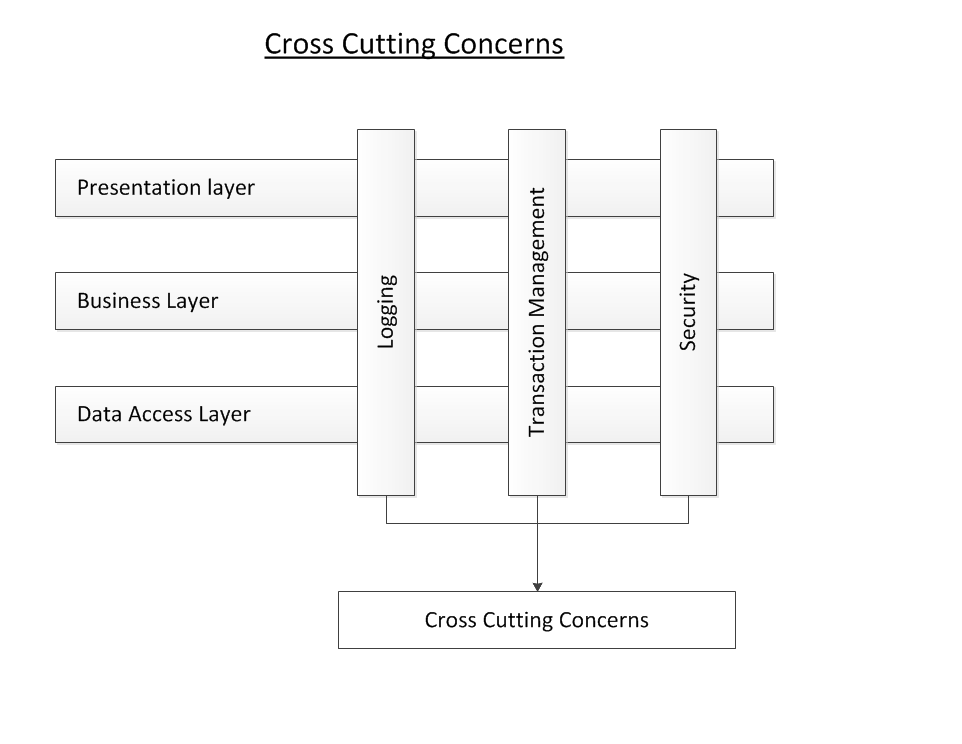

# Spring AOP基本概念

Spring 框架的一个关键组件是**面向切面的编程(AOP)框架**。AOP是Aspect Oriented Programming的缩写，是一种通过预编译(AspectJ)或运行期动态代理(Spring AOP)实现程序功能的统一维护的一种技术。

面向切面的编程需要把程序逻辑分解成不同的部分称为所谓的关注点。跨一个应用程序的多个点的功能被称为横切关注点，这些横切关注点在概念上独立于应用程序的业务逻辑。在软件开发过程中有各种各样的很好的切面的例子，如日志记录、审计、声明式事务、安全性和缓存等。

在OOP中，关键单元模块度是类，而在AOP中单元模块度是切面。依赖注入帮助你对应用程序对象相互解耦合，AOP可以帮助你从它们所影响的对象中对横切关注点解耦。

## AOP基本术语

在我们开始使用AOP工作之前，让我们熟悉一下AOP概念和术语。这些术语并不特定于Spring，而是与AOP有关的。

| 名称 | 说明 | 举例 |
| :--: | --- | --- |
| 切面(Aspect) | 一个关注点的模块化，这个关注点可能会横切多个对象。这个模块是有一组具有多个横切需求的APIs组成 | 日志记录可以被认为是一个切面，封装成日志模块，其提供的APIs将会被应用程序的各个层级调用 |
| 连接点(join Point) | 连接点是一个应用执行过程中能够插入一个切面的点。切面代码可以利用这些点插入到应用的正规流程中。| 连接点可以是调用方法时、抛出异常时、甚至修改字段时，比如可以在程序中记录日志的地方 |
| 通知(Advice) | 在切面上面某个特定的连接点上执行的动作，程序执行过程中能够应用通知的所有点。| 常见的通知有五种，后面举例说明。|
| 切点(PointCut) | 切点会匹配通知所要织入的一个或者多个连接点,用于定义定义通知被应用的位置，通常使用明确的类或者方法来指定这些切点。| 在AOP中，通知和一个切入点表达式关联 |
| 引入(Introduction) | 在不修改类代码的前提下，为类添加新的方法和属性 | 无 |
| 目标对象(Target Object) | 被一个或者多个切面所通知的对象 | 无 |

