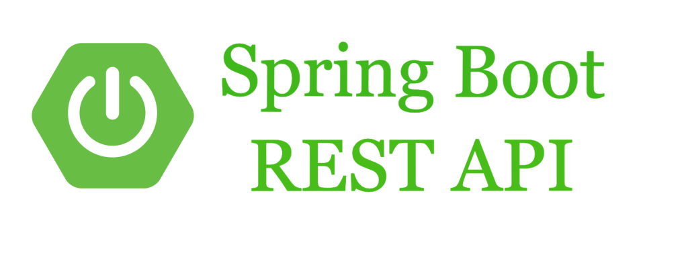

# Spring Boot RESTful API



随着互联网的发展，特别是前后端的分离，使得前后端需要一种比较清晰高效的通信范式来约束，RESTful架构就此演化而来。

RESTful架构，就是目前最流行的一种互联网软件架构。它结构清晰、符合标准、易于理解、扩展方便，所以正得到越来越多网站的采用。

## RESTful简介

REST这个词，是Roy Thomas Fielding在他2000年的博士论文中提出的。

Fielding将他对互联网软件的架构原则，定名为REST，即`Representational State Transfer`的缩写。通俗情况下，对这个词组的翻译是"表现层状态转化"。

如果一个架构符合REST原则，就称它为RESTful架构。

要理解RESTful架构，最好的方法就是去理解`Representational State Transfer`这个词组到底是什么意思，它的每一个词代表了什么涵义。如果你把这个名称搞懂了，也就不难体会REST是一种什么样的设计。

### 资源(Resource)

何为资源？通俗的理解为可以通过网络获取的一切信息统称为资源。它可以是一段文本、一张图片、一首歌曲、一种服务，总之就是一个具体的实在。我们可以使用URI(统一资源定位符)来定位它，如果你要获取这个资源，只需要访问它的URI即可。

### 表现层(Representation)

RESTful(表现层状态转化)，指的是资源的表现层的状态转化。这里其实是省略了主语。

***我们把"资源"具体呈现出来的形式，叫做它的"表现层"（Representation）。***

URI只代表资源的实体，不代表它的形式。严格地说，有些网址最后的".html"后缀名是不必要的，因为这个后缀名表示格式，属于"表现层"范畴，而URI应该只代表"资源"的位置。它的具体表现形式，应该在HTTP请求的头信息中用Accept和Content-Type字段指定，这两个字段才是对"表现层"的描述。

比如，文本可以用txt格式表现，也可以用HTML格式、XML格式、JSON格式表现，甚至可以采用二进制格式；图片可以用JPG格式表现，也可以用PNG格式表现。

### 状态转移(State Transfer)

我们都知道，HTTP协议其实是一个无状态的协议，这就意味着，客户端的所有状态都会被保存在服务器端。访问一个网站，就代表了客户端和服务器的一个互动过程。在这个过程中，势必涉及到数据和状态的变化。

因此，对一个资源的操作可以认为是一次状态的转化，比如向服务器创建一个图片，这个创建的过程就伴随着状态的转化。

***如果客户端想要操作服务器，必须通过某种手段，让服务器端发生"状态转化"（State Transfer）。而这种转化是建立在表现层之上的，所以就是"表现层状态转化"。***

在HTTP协议里面，我们是通过请求的方法来规范这种状态的转移的，具体来看：

* **GET** ：从服务器取出资源（一项或多项）。
* **POST**：在服务器新建一个资源。
* **PUT** ：在服务器更新资源（客户端提供改变后的完整资源），可以认为是全量更新。
* **PATCH** ：在服务器更新资源（客户端提供改变的属性），可以认为是部分更新。
* **DELETE** ：从服务器删除资源。

上面的方法中，只有POST方法不是幂等的。何为幂等？指的是对一个资源，只要你通过一个相同的URI，使用相同的方法，不管你执行多少次，其结果都是一样的。比如，获取一个图片`GET images/1`,不管客户端向服务端请求多少次，永远获得的是这一张同样的图片，PUT、PATCH、DELETE均是幂等的，但是POST不是，每次请求这个URI，都会创建一个新的资源。

状态转移的结果是通过返回值(Response)的状态码来判断的，详情如下：

* **200 OK - [GET]**：服务器成功返回用户请求的数据，该操作是幂等的（Idempotent）。
* **201 CREATED - [POST/PUT/PATCH]**：用户新建或修改数据成功。
* **202 Accepted - [*]**：表示一个请求已经进入后台排队（异步任务）
* **204 NO CONTENT - [DELETE]**：用户删除数据成功。
* **400 INVALID REQUEST - [POST/PUT/PATCH]**：用户发出的请求有错误，服务器没有进行新建或修改数据的操作，该操作是幂等的。
* **401 Unauthorized - [*]**：表示用户没有权限（令牌、用户名、密码错误）。
* **403 Forbidden - [*]**: 表示用户得到授权（与401错误相对），但是访问是被禁止的。
* **404 NOT FOUND - [*]**：用户发出的请求针对的是不存在的记录，服务器没有进行操作，该操作是幂等的。
* **406 Not Acceptable - [GET]**：用户请求的格式不可得（比如用户请求JSON格式，但是只有XML格式）。
* **410 Gone -[GET]**：用户请求的资源被永久删除，且不会再得到的。
* **422 Unprocesable entity - [POST/PUT/PATCH]**: 当创建一个对象时，发生一个验证错误。
* **500 INTERNAL SERVER ERROR - [*]**：服务器发生错误，用户将无法判断发出的请求是否成功。

## API设计规范

RESTful API的设计是关键核心，好的设计能够让URL非常简洁和易懂，下面我们就来介绍一下常见的设计范式：

API设计的总体原则是：***动词 + 宾语***

#### 动词

这里的动词指的是对资源的操作行为，例如API: `GET /blogs`, 意味着获取所有的博客列表，那么这里的获取动作，使用的是HTTP请求的方法GET来获取。

所以，对资源操作的行为都是通过HTTP请求的方法来呈现，按照规范，一般都是大写。

#### 宾语

宾语都是名词，表示要操作的资源。例如`GET /blogs/1`,表示获取博客id为1的博客详情。

这里要注意的一点是，最好使用复数来代表这个资源，比如`POST /blogs`表示创建博客。

有时候，我们常见的情况是，资源需要多级分类，特别是资源之间有所属关系的时候，因此很容易写出多级的URL，例如获取某个电影院的所有座位，很多人会设计成`GET /movies/1/seats`， 这种方式虽然可以表示资源的所属关系，但是不利于扩展，语义也不明确，这个URL操作的其实是座位，电影院就是一个过滤条件。

所以，针对上面的情况，好的设计我们推荐将过滤条件放到查询参数里面。

#### 查询参数

查询参数使用问号(?)开始，以`key=value`的形式表示，多个参数之间使用字符(&)来进行分割。例如我们获取某个人的所有类别为Java的博客，可以将其设计为：`GET /blogs?author=zhangsan&category=java`.

#### 请求或返回的文本

API返回的数据格式，不应该是纯文本，而应该是格式化的数据结构，比如`JASON/XML`等，因为这样才能返回标准的结构化数据。所以，服务器回应的HTTP头的Content-Type属性要设为`application/json`等。

客户端请求时，也要明确告诉服务器，可以接受JSON/XML格式，即请求的 HTTP 头的ACCEPT属性也要设成`application/json`等。

如果我们需要创建一个博客，可以在HTTP Request的Body里面传递需要创建的数据对象。例如：

```
POST /blogs

reqeust body
{
    "author": "zhangsan",
    "date" : "2022-10-23",
    "content" : "xxxxx",
    "title": "xxxx"
}
```

## 基于Spring Boot的实现


