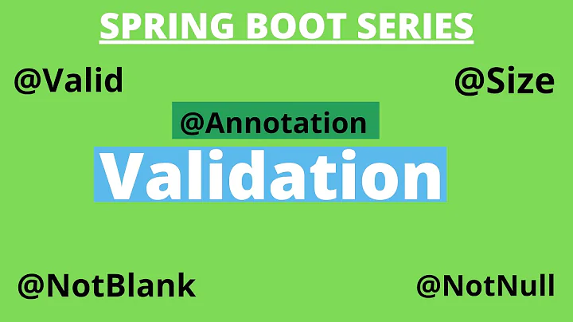

# Spring Boot数据拦截与校验



前面我们学习了RESTful API的时候，如果想提供可靠的API接口，对参数的校验，以保证最终数据入库的正确性，是必不可少的活。例如说，用户注册时，会校验手机格式的正确性，密码非弱密码。

## 常见注解
Spring Bean Validation定义了很多的约束注解，主要在包`javax.validation.constraints`下面，我们先来快速的浏览一下这些注解：

### 空和非空检查
* `@NotBlank` ：只能用于字符串不为null ，并且字符串`#trim()`以后`length`要大于0。
* `@NotEmpty` ：集合对象的元素不为0 ，即集合不为空，也可以用于字符串不为null。
* `@NotNull`：不能为null。
* `@Null` ：必须为null。

### 数值检查
* `@DecimalMax(value)` ：被注释的元素必须是一个数字，其值必须小于等于指定的最大值。
* `@DecimalMin(value)` ：被注释的元素必须是一个数字，其值必须大于等于指定的最小值。
* `@Digits(integer, fraction)` ：被注释的元素必须是一个数字，其值必须在可接受的范围内。
* `@Positive` ：判断正数。
* `@PositiveOrZero` ：判断正数或 0 。
* `@Max(value)` ：该字段的值只能小于或等于该值。
* `@Min(value)` ：该字段的值只能大于或等于该值。
* `@Negative` ：判断负数。
* `@NegativeOrZero` ：判断负数或 0 。

### Boolean 值检查
* `@AssertFalse` ：被注释的元素必须为true 。
* `@AssertTrue`：被注释的元素必须为false 。

### 长度检查
* `@Size(max, min)` ：检查该字段的size是否在min和max之间，可以是字符串、数组、集合、Map 等。

### 日期检查
* `@Future` ：被注释的元素必须是一个将来的日期。
* `@FutureOrPresent` ：判断日期是否是将来或现在日期。
* `@Past` ：检查该字段的日期是在过去。
* `@PastOrPresent` ：判断日期是否是过去或现在日期。

### 其它检查
* `@Email` ：被注释的元素必须是电子邮箱地址。
* `@Pattern(value)` ：被注释的元素必须符合指定的正则表达式。

## `@Valid` 和 `@Validated`

### `@Valid`

此注解，是Bean Validation所定义，在javax.validation包下,是jdk给提供的，可以添加在普通方法、构造方法、方法参数、方法返回、成员变量上，表示它们需要进行约束校验。但是不能用在类上面，可以用在成员变量上面，可以在嵌套校验中发挥作用。

### `@Validated`

此注解是`org.springframework.validation.annotation`包下的,是Spring提供的。`@Validated`在`@Valid`之上提供了分组功能和验证排序功能。此注解可以用在类、方法和方法参数上。但不能用于成员属性（field）上。

###  基本用法

在使用之前，必须要声明的是，如果你使用的`Spring Boot`的版本在2.3以前，则不需要引入额外的包，如果是在2.3之后，就需要手动引入包`spring-boot-starter-validation`。

* 定义一个实体类User
```java
public class User {
    @NotBlank(message = "登录账号不能为空")
    private String username;
    @NotBlank
    @Size(min = 8, max = 16, message = "密码长度为 8-16 位")
    private String password;
    @PastOrPresent
    private LocalDate birthday;

    // 省略了构造器和Getter和Setter方法
}
```

* 使用`@Valid`注解来标注Controller
```java
@RestController
@RequestMapping("/valid")
public class UserValidController {
    @PostMapping("/users")
    public User createUser(@Valid @RequestBody User user) {
        return user;
    }

    @GetMapping("/users/{id}")
    public Optional<User> getUsers(@Min(5) @PathVariable("id") Integer id ) {
        return Optional.empty();
    }
}
```

* 如果使用`@Validated`, 上面的Controller变成：

```java
@RestController
@Validated
@RequestMapping("/validated")
public class UserValidatedController {
    @PostMapping("/users")
    public User createUser(@Validated @RequestBody User user) {
        return user;
    }

    @GetMapping("/users/{id}")
    public Optional<User> getUsers(@Min(5) @PathVariable("id") Integer id ) {
        return Optional.empty();
    }
}
```

### 嵌套使用

我们给上面的User类加一个地址对象：
```java
```java
public class User {
    @NotBlank(message = "登录账号不能为空")
    private String username;
    @NotBlank
    @Size(min = 8, max = 16, message = "密码长度为 8-16 位")
    private String password;
    @PastOrPresent
    private LocalDate birthday;

    @NotNull
    @Valid
    private Address address;

    // 省略了构造器和Getter和Setter方法
}

public class Address {
    @NotBlank
    private String postCode;
    @NotBlank
    private String location;
    // 省略了构造器和Getter和Setter方法
}
```

Controller里面的方法暂时保持不变，我们发现，如果`User`类不加`@Valid`，就只能验证`address`熟悉它本身是否满足条件`@NotNull`, 但是无法校验`Address`里面的属性是否满足校验的条件。

所以，`@Valid`可以用在嵌套校验里面。

### 分组

`@Validated`注解还可以用于分组校验中，这样我们可以根据条件指定验证规则，例如：

* 我们先来创建两个验证接口：

```java
public interface MustValidation {}
public interface OptionalValidation {}
```

* 然后在User类中指定相关的分组规则：

```java
public class User {
    @NotBlank(groups = MustValidation.class, message = "登录账号不能为空")
    private String username;
    @NotBlank(groups = MustValidation.class)
    @Size(min = 8, max = 16, message = "密码长度为 8-16 位")
    private String password;
    @PastOrPresent(groups = OptionalValidation.class)
    private LocalDate birthday;

    @NotNull(groups = OptionalValidation.class)
    @Valid
    private Address address;
    
    // 省略了构造器和Getter和Setter方法
}
```

* 在Controller中使用`@Validated`的分组规则指定需要检验的条件：

```java
@RestController
@Validated
@RequestMapping("/validated")
public class UserValidatedController {
    @PostMapping("/users")
    public User createUser(@Validated(value = MustValidation.class) @RequestBody User user) {
        return user;
    }
}
```

这样，我们发现，创建用户的接口只会对标记为MustValidation`组的属性进行校验，对其他组的属性不会校验。

## 自定义注解的实现