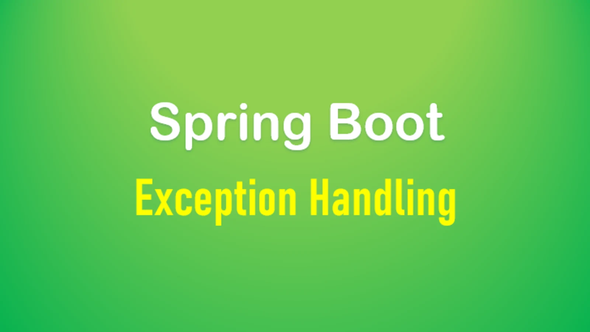

# Spring Boot 统一异常处理与日志



日常开发过程中，难免有的程序会因为某些原因抛出异常，而这些异常一般都是利用`try...catch`的方式处理异常或者`throw`的方式抛出异常。无论如何，这种方法对于程序员来说处理也比较麻烦，对客户来说也不太友好，所以我们希望既能方便程序员编写代码，不用过多的自己去处理各种异常编写重复的代码又能提升用户的体验，这时候全局异常处理就显得很重要也很便捷了，是一种不错的选择。

通过前面的学习，我们发现，对数据的校验如果抛出了异常，错误的消息竟然没有完全显示在API的Response中，这样导致前端并不能发现真正问题的所在：
```json
{
    "timestamp": "2022-05-29T10:52:26.419+00:00",
    "status": 400,
    "error": "Bad Request",
    "path": "/validated/users"
}
```

我们更期望如下的格式来显示：
```json
{
    "code": 400,
    "message": "密码验证不通过！请属于符合条件的密码长度"
}
```

那如何实现呢？这就要用到今天所学的全局的异常处理啦！

## 全局异常处理

Springboot对于异常的处理也做了不错的支持，它提供了一个`@ControllerAdvice`注解以及`@ExceptionHandler`注解，前者是用来开启全局的异常捕获，后者则是说明捕获哪些异常，对那些异常进行处理。

* 首先我们定义一个异常处理的返回体：
```java
public class ErrorResponse {
    private int code;
    private String message;

    public ErrorResponse(int code, String message) {
        this.code = code;
        this.message = message;
    }
    // Getters and Setters
}
```

* 定义一个全局异常处理器：
```java
@ControllerAdvice
public class ErrorHandler {
    @ResponseBody
    @ExceptionHandler(value = MethodArgumentNotValidException.class)
    public ErrorResponse exceptionHandler(HttpServletRequest httpServletRequest, MethodArgumentNotValidException e) {
        return new ErrorResponse(HttpStatus.BAD_REQUEST.value(), e.getBindingResult().getAllErrors().get(0).getDefaultMessage());
    }
}
```

测试之后，返回的结果如下：
```json
{
    "code": 400,
    "message": "密码验证不通过！请属于符合条件的密码长度"
}
```

在这里，我们需要注意，此处的全局异常只能捕获的是从Contoller层最终抛出去的异常，那些属于定时任务里面的异常，还有异步处理任务里面的异常都不能被捕获。

## 日志

