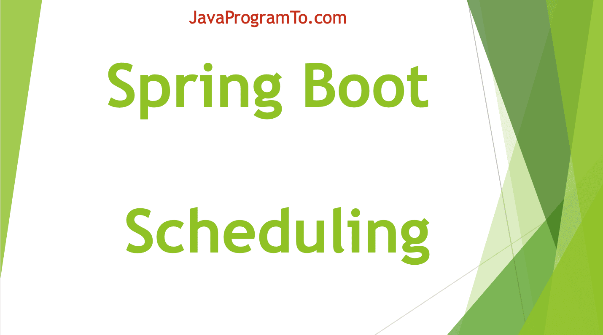

# Spring Boot Schedule



在实际开发中，总会有那么一种需求，需要定时去执行的，我们称之为定时任务，例如每小时一次的数据库备份，每天统计前一天的数据并生成报表，每个月月初的工资单的推送，每年一次的生日提醒等等。

虽然，在JDK中，有两个内置类可以实现定时功能：`Timer`和`ScheduledExecutorService`, 但是，在实际开发中，我们其实很少使用这两个类做定时任务，主要有两个方面的原因：
* 它们仅支持按照指定频率，不直接支持指定时间的定时调度，需要我们结合 Calendar 自行计算，才能实现复杂时间的调度。例如说，每天、每周五、2019-11-11 等等。
* 这些定时器都是基于进程级别的，当项目中需要多个进程，存在多个定时器的时候，很难进行统一的任务管理。

基于此，所以，用到的时候大多数需要选择专业的任务调度中间件。

## Spring Task

目前Spring Boot为我们提供了基本的定时任务执行模块：`Spring Task`,属于是Spring Framework的模块，所以在我们引入`spring-boot-starter-web`依赖后，无需特别引入它。

* 在类上，添加`@EnableScheduling`注解，启动Spring Task的定时任务调度的功能。
```java
@Configuration
@EnableScheduling
public class ScheduleConfiguration {
}
```

* 使用`@Scheduled`创建定时任务
```java
@Service
public class ScheduleJob {
    @Scheduled(fixedRate = 2000)
    public void execute() {
        System.out.println("定时任务执行了！");
    }
}
```

这样，我们就创建了每隔两秒执行一次`execute()`方法的定时任务啦。

在上面的入门例子中，使用了`@Scheduled(fixedRate = 2000)`注解来定义每过2秒执行的任务，对于`@Scheduled`的使用的属性有以下几种：
* `fixedRate`：定时任务开始后再次执行定时任务的延时（不需要等待上次定时任务完成），单位毫秒。
* `fixedDelay`：定时任务执行完成后再次执行定时任务的延时（需等待上次定时任务完成），单位毫秒。
* `initialDelay`：第一次执行定时任务的延迟时间，需配合fixedDelay或者fixedRate来使用。
* `cron`: Cron表达式语法，详情参考下面的讲解。

## Cron表达式
`Cron`表达式是一个字符串，该字符串由6个空格分为7个域`[秒] [分] [时] [日] [月] [周] [年]`，每一个域代表一个时间含义。 通常定义 “年” 的部分可以省略，实际常用的`Cron`表达式由前6部分组成。

格式如下：

|域	| 是否必填 | 值以及范围	       | 通配符 | 
|:-:| :---: | :---------------: | :----: |
|秒	| 是	  | 0-59	        | , - * / |
|分	| 是	  | 0-59	        | , - * / |
|时	| 是	  | 0-23	        | , - * / |
|日	| 是	  | 1-31	        | , - * ? / L W |
|月	| 是	  | 1-12 或 JAN-DEC	 | , - * / |
|周	| 是	  | 1-7 或 SUN-SAT	 | , - * ? / L # |
|年	| 否	  | 1970-2099	    | , - * / |

* 需要说明的是，`Cron`表达式中，“周” 是从周日开始计算的。“周” 域上的1表示的是周日，7表示周六。

## Cron中的通配符
* `,`：指的是在两个以上的时间点中都执行。如果在 “分” 这个域中定义为 8,12,35，则表示分别在第8分，第12分，第35分执行该定时任务。
* `-`：指定在某个域的连续范围。如果在 “时” 这个域中定义 1-6，则表示在 1 到 6 点之每小时都触发一次，等价于 1,2,3,4,5,6。
* `*`：表示所有值，可解读为 “每”。 如果在 “日” 这个域中设置 *，表示每一天都会触发。
* `?`：表示不指定值。使用的场景为不需要关心当前设置这个字段的值。例如，要在每月的 8 号触发一个操作，但不关心是周几，我们可以这么设置 0 0 0 8 * ?。
* `/`：表示触发步进(step)，"/" 前面的值代表初始值( "*" 等同 "0")，后面的值代表偏移量，在某个域上周期性触发。比如 在 “秒” 上定义 5/10 表示从 第 5 秒开始，每 10 秒执行一次；而在 “分” 上则表示从第 5 分钟开始，每 10 分钟执行一次。
* `L`：表示英文中的 LAST 的意思，只能在 “日” 和 “周” 中使用。在 “日” 中设置，表示当月的最后一天(依据当前月份，如果是二月还会依据是否是润年), 在 “周” 上表示周六，相当于 "7" 或 "SAT"。如果在 "L" 前加上数字，则表示该数据的最后一个。例如在 “周” 上设置 "7L" 这样的格式，则表示 “本月最后一个周六”。
* `W`：表示离指定日期的最近那个工作日(周一至周五)触发，只能在 “日” 中使用且只能用在具体的数字之后。若在 “日” 上置 "15W"，表示离每月 15 号最近的那个工作日触发。假如 15 号正好是周六，则找最近的周五(14号)触发；如果 15 号是周未，则找最近的下周一(16号)触发；如果 15 号正好在工作日(周一至周五)，则就在该天触发。如果是 "1W" 就只能往本月的下一个最近的工作日推不能跨月往上一个月推。
* `#`：例如，A#B 表示每月的第 B 个周的周 A（周的计数从周日开始），只能作用于 “周” 上。例如 2#3 表示在每月的第 3 个周二，5#3 表示本月第 3 周的星期四。
