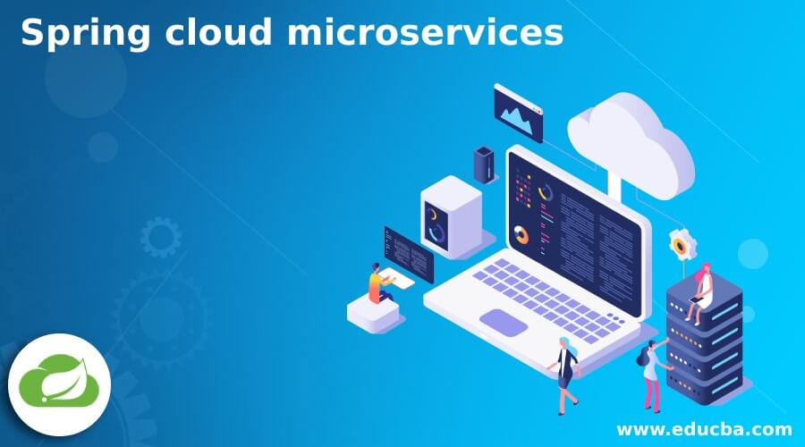
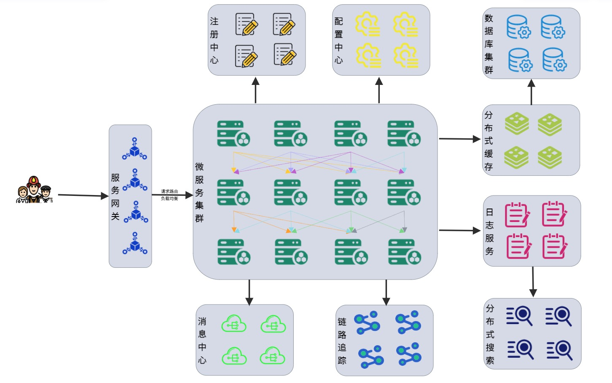
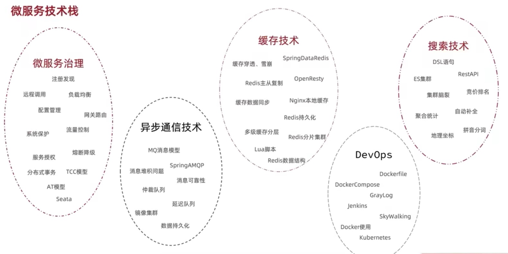
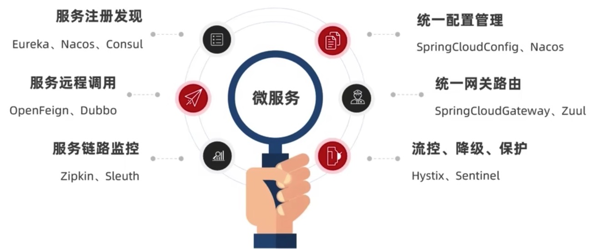
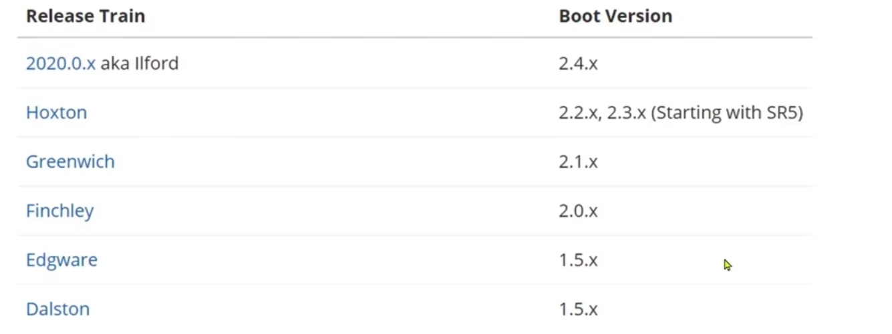

# Spring Cloud 微服务概述

微服务架构是近些年最火热的软件架构模式，微服务是一种开发软件的架构和组织方法，其中软件由通过明确定义的API进行通信的小型独立服务组成。这些服务由各个小型独立团队负责。

使用微服务架构，将应用程序构建为独立的组件，并将每个应用程序进程作为一项服务运行。这些服务是围绕业务功能构建的，每项服务执行一项功能。由于它们是独立运行的，因此可以针对各项服务进行更新、部署和扩展，以满足对应用程序特定功能的需求。

微服务的内容非常复杂，包括的服务的拆分，服务的治理，服务的部署与运维等，这其中，最每一块都包含大量的知识，本章节就着重从技术角度，以服务治理为切入点，以Spring Cloud为例子，讲解微服务治理的常用技术框架。

通常情况下，分布式架构需要考虑如下问题：
* 服务拆分的粒度如何？
* 服务集群地址如何维护？
* 服务之间如何实现远程调用？
* 服务健康状态如何感知？

## Spring Cloud

Spring Cloud是目前国内使用最广泛的框架，官网的地址是：https://spring.io/projects/spring-cloud。
Spring Cloud集成了各种微服务常用的功能组件，并基于Spring Boot实现了基于这些组件的自动装配，从而实现了良好的开箱即用体验。

下面我们挑几个重要的技术做个简介：
* **Eureka**：Eureka 是 Netflix 公司开发的一款开源的服务注册与发现组件, 主要用于提供服务注册功能。当微服务启动时，会将自己的服务注册到 Eureka Server。Eureka Server 维护了一个可用服务列表，存储了所有注册到 Eureka Server 的可用服务的信息，这些可用服务可以在 Eureka Server 的管理界面中直观看到。
* **Open Feign:** 全称 Spring Cloud OpenFeign，它是Spring官方推出的一种声明式服务调用与负载均衡组件，它的出现就是为了替代进入停更维护状态的Feign。OpenFeign 是 Spring Cloud 对 Feign 的二次封装，它具有 Feign 的所有功能，并在 Feign 的基础上增加了对 Spring MVC 注解的支持，例如 @RequestMapping、@GetMapping 和 @PostMapping 等。
* **Spring Cloud Config**: 是由 Spring Cloud 团队开发的项目，它可以为微服务架构中各个微服务提供集中化的外部配置支持。简单点说就是，Spring Cloud Config 可以将各个微服务的配置文件集中存储在一个外部的存储仓库或系统（例如 Git 、SVN 等）中，对配置的统一管理，以支持各个微服务的运行。
* **Spring Cloud Gateway**：是 Spring Cloud 团队基于 Spring 5.0、Spring Boot 2.0 和 Project Reactor 等技术开发的高性能 API 网关组件。最主要的功能就是路由转发，旨在提供一种简单而有效的途径来发送 API，并为它们提供横切关注点，例如：安全性，监控/指标和弹性。
* **Spring Cloud Hystrix**：是一款优秀的服务容错与保护组件，也是 Spring Cloud 中最重要的组件之一。是基于 Netflix 公司的开源组件 Hystrix 实现的，它提供了熔断器功能，能够有效地阻止分布式微服务系统中出现联动故障，以提高微服务系统的弹性。Spring Cloud Hystrix 具有服务降级、服务熔断、线程隔离、请求缓存、请求合并以及实时故障监控等强大功能。
* **Spring Cloud Sleuth**：是一款优秀的分布式日志收集工具包。能够提供全链路的日志追踪服务，封装了Dapper,Zipkin和HTrace操作。

## Spring Boot 与 Spring Cloud

虽然Spring Boot和Spring Cloud隶属于Spring家族，但是这两者之间有版本冲突的问题，所以大家一定要注意！

