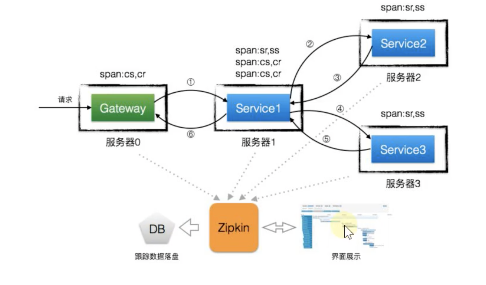
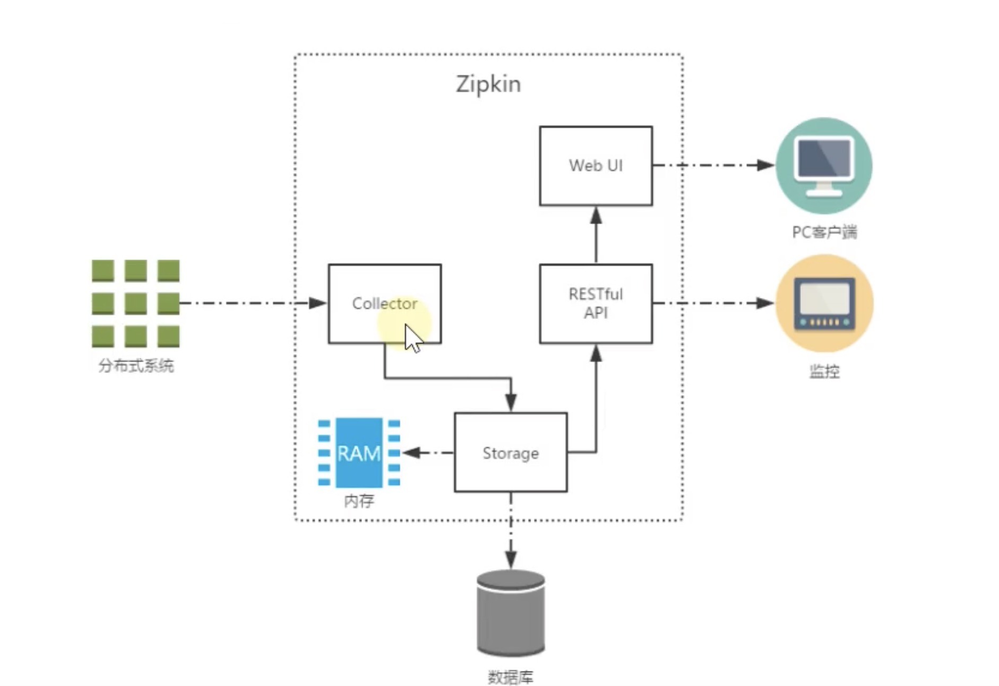
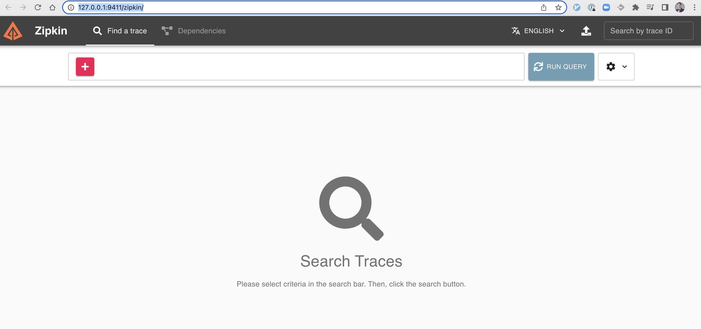
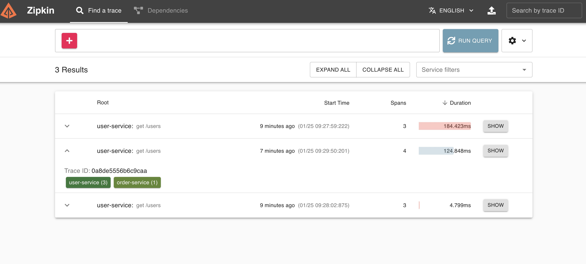
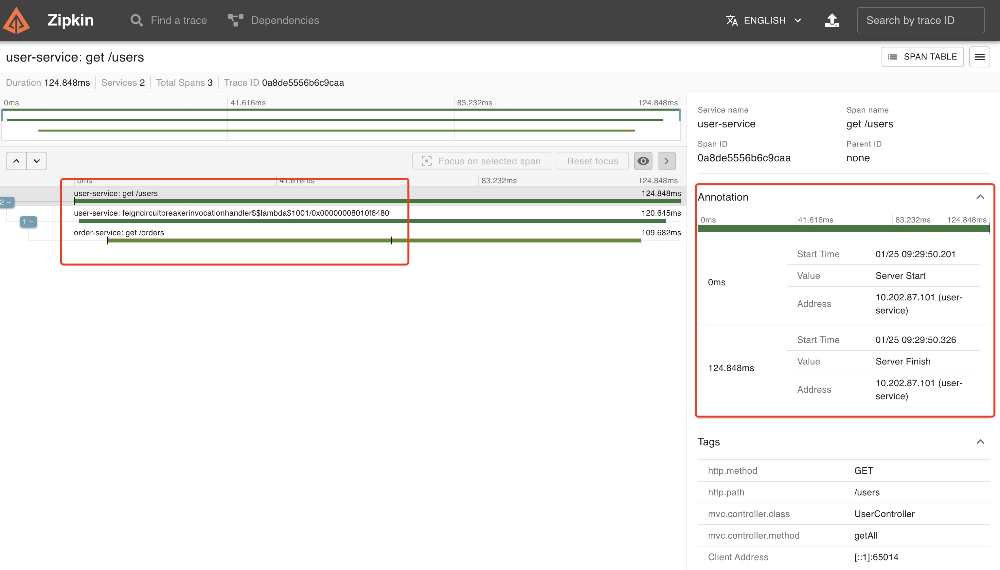
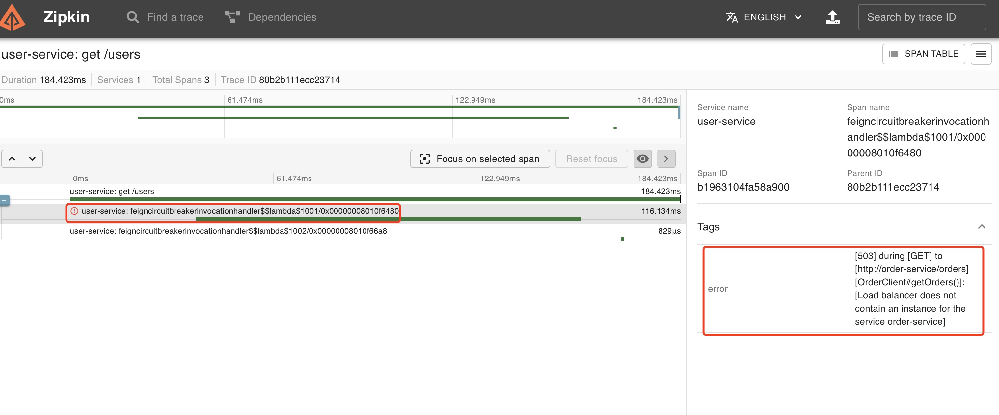
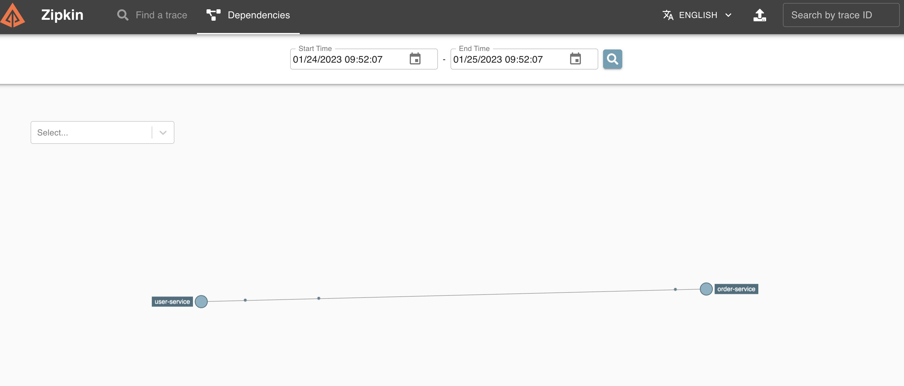

# Zipkin基本使用


Zipkin是Twitter公司开发贡献的一款开源的分布式实时数据追踪系统(Distributed Tracking System)，基于Google Dapper论文设计而来，与Sleuth等链路追踪结合使用，可以实现聚集各个异构系统的实施监控数据。

他可以收集各个服务器上请求链路的跟踪数据，并通过REST API接口来辅助我们查询跟踪数据，实现对分布式系统的实时监控，及时发现系统中出现的延迟升高问题，并找出系统性能瓶颈的根源。

除了面向开发的API接口之外，它还提供了方便的UI组件，每个服务向Zipkin报告计时数据，Zipkin会根据调用关系生成依赖关系图，帮助我们直观的搜索跟踪信息和分析请求链路明细，Zipkin提供了可插拔数据存储方式，例如In-Memory、MySQL，Cassandra，ElasticSearch等。



## 核心架构



上图展示了Zipkin的基础架构，主要由4个核心组件构成：

* **Collector**：收集器组件，它主要用于处理从外部系统发送过来的跟踪信息，将这些信息转换为Zipkin内部处理的Span格式，以支持后续的存储、分析、展示等功能。
* **Storage**：存储组件，它主要对处理收集器接收到的跟踪信息，默认会将这些信息存储在内存中，我们也可以修改此存储策略，通过使用其他存储组件将跟踪信息存储到 数据库或es 中。
* **RESTful API**：API组件，它主要用来提供外部访问接口。比如给客户端展示跟踪信息，或是外接系统访问以实现监控等。
* **Web UI**：UI组件，基于API组件实现的上层应用。通过UI组件用户可以方便而有直观地查询和分析跟踪信息。

Zipkin分为两端，一个是Zipkin服务端，一个是Zipkin客户端，客户端也就是微服务的应用，客户端会配置服务端的URL地址，一旦发生服务间的调用的时候，会被配置在微服务里面的Sleuth监听器监听，并生成相应的Trace和Span信息发送给服务端。发送的方式有两种：一种是通过消息总线的方式发送，如RabbitMQ，还有一种是通过HTTP报文的形式发送。

## 基本使用

因为Zipkin分为客户端和服务端，我们先来搭建服务端：

### 服务端

服务端的搭建非常简单，[官网](https://zipkin.io/pages/quickstart.html)给我们给出了很多方式，其中，最简答的办法是使用Docker：
```bash
docker run -d -p 9411:9411 openzipkin/zipkin
```

运行成功之后，访问：http://127.0.0.1:9411/zipkin/，可以看到如下界面既可以表示服务端搭建成功：


### 客户端

搭建完成服务端之后，我们就来搭建客户端：

**Step1: 在需要被追踪的微服务里面添加依赖**
```
implementation 'org.springframework.cloud:spring-cloud-sleuth-zipkin'
```

**Step2:在需要被追踪的微服务里面添加配置**
```yml
spring:
  zipkin:
    base-url: http://localhost:9411 # zipkin 服务端地址
    sender:
      type: web #数据传输方式，Web表示以HTTP的方式向服务端发送数据
  sleuth:
    sampler:
      probability: 1.0 #收集数据的百分比，默认0.1(10%)
```

**Step3: 访问微服务请求，在Zipkin Dashboard里面查看**

访问你的微服务接口，查看Zipkin的Dashboard里面有如下输出，表示搭建完成：



点击每个请求的详情，你还可以看到服务的调用关系，耗时等：



当然，Zipkin也能监控错误和告警：



最后，Zipkin也能贴心的为我们梳理了复杂的微服务关系：



当然，关于Zipkin的用法远远不止这么点，如果你想了解高级的用法，可以参考官网进一步学习！