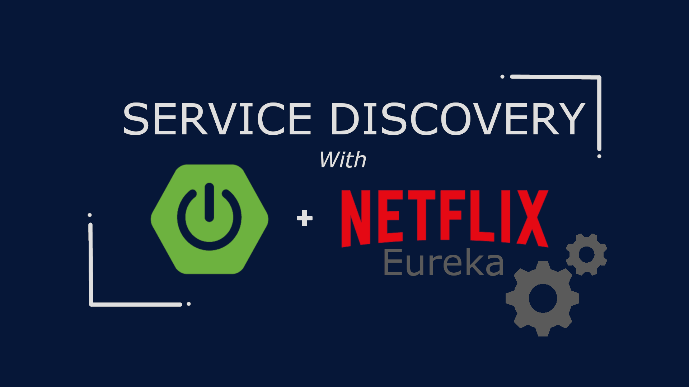

# Spring Cloud Netflix Eureka

Eureka 一词来源于古希腊词汇，是“发现了”的意思。在软件领域，Eureka是 Netflix 公司开发的一款开源的服务注册与发现组件。

Spring Cloud 将 Eureka 与 Netflix 中的其他开源服务组件（例如 Ribbon、Feign 以及 Hystrix 等）一起整合进 Spring Cloud Netflix 模块中，整合后的组件全称为 Spring Cloud Netflix Eureka。

Eureka 是 Spring Cloud Netflix 模块的子模块，它是 Spring Cloud 对 Netflix Eureka 的二次封装，主要负责 Spring Cloud 的服务注册与发现功能。

Spring Cloud 使用 Spring Boot 思想为 Eureka 增加了自动化配置，开发人员只需要引入相关依赖和注解，就能将 Spring Boot 构建的微服务轻松地与 Eureka 进行整合。

## 两大组件和三个角色

要学习服务的注册和发现，就得先了解服务的提供者和消费者：

* **服务提供者**：一次业务中，被其他微服务调用的服务。主要提供接口给其他微服务。
* **服务消费者**：一次业务中，调用其他服务的服务，调用其他服务提供的接口。

需要说明的是，服务提供者和服务消费者其实是相对的，一个服务可以同时作为服务提供者和消费者。

而对于服务的提供者和消费者而言，经常面临如下的问题：
* 服务消费者该如何获取服务提供者的地址信息？
* 如果有多个服务提供者，消费者该如何选择？
* 消费者如何得知服务提供者的健康状态？

Eureka就是解决了这些问题，Eureka采用CS（Client/Server，客户端/服务器） 架构，它包括以下两大组件：
* **Eureka Server**：Eureka 服务注册中心，主要用于提供服务注册功能。当微服务启动时，会将自己的服务注册到 Eureka Server。Eureka Server 维护了一个可用服务列表，存储了所有注册到 Eureka Server 的可用服务的信息，这些可用服务可以在 Eureka Server 的管理界面中直观看到。
* **Eureka Client**：Eureka 客户端，通常指的是微服务系统中各个微服务，主要用于和 Eureka Server 进行交互。在微服务应用启动后，Eureka Client 会向 Eureka Server 发送心跳（默认周期为 30 秒）。若 Eureka Server 在多个心跳周期内没有接收到某个 Eureka Client 的心跳，Eureka Server 将它从可用服务列表中移除（默认 90 秒）。 所以服务提供者和消费者其实都是属于这个。

### Eureka 实现服务注册与发现的流程如下：
1. 搭建一个 Eureka Server 作为服务注册中心；
2. 服务提供者 Eureka Client 启动时，会把当前服务器的信息以服务名（spring.application.name）的方式注册到服务注册中心；
3. 服务消费者 Eureka Client 启动时，也会向服务注册中心注册；
4. 服务消费者还会获取一份可用服务列表，该列表中包含了所有注册到服务注册中心的服务信息（包括服务提供者和自身的信息）；
5. 在获得了可用服务列表后，服务消费者通过 HTTP 或消息中间件远程调用服务提供者提供的服务。

所以，服务注册中心（Eureka Server）所扮演的角色十分重要，它是服务提供者和服务消费者之间的桥梁。服务提供者只有将自己的服务注册到服务注册中心才可能被服务消费者调用，而服务消费者也只有通过服务注册中心获取可用服务列表后，才能调用所需的服务。

## 基本使用

## 实现原理