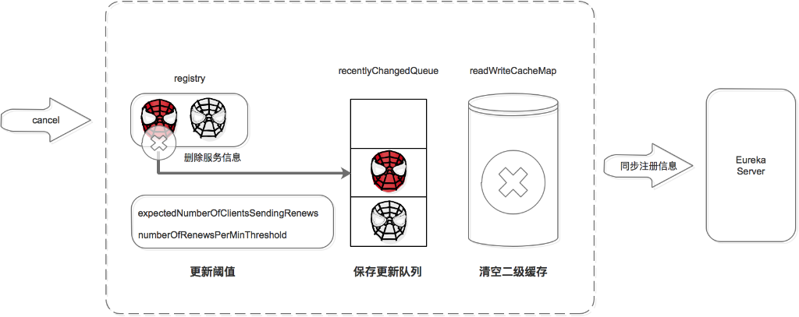

# Eureka 实现原理

关于注册中心的解决方案，dubbo支持了Zookeeper、Redis、Multicast和Simple，官方推荐Zookeeper。Spring Cloud支持了Zookeeper、Consul和Eureka，官方推荐Eureka。

两者之所以推荐不同的实现方式，原因在于组件的特点以及适用场景不同。简单来说：

ZK的设计原则是CP，即强一致性和分区容错性。他保证数据的强一致性，但舍弃了可用性，如果出现网络问题可能会影响ZK的选举，导致ZK注册中心的不可用。

Eureka的设计原则是AP，即可用性和分区容错性。他保证了注册中心的可用性，但舍弃了数据一致性，各节点上的数据有可能是不一致的（会最终一致）。

接下来，我们将从注册机制，续约机制，注销机制，剔除机制，服务获取机制，同步机制，自我保护机制，安全认证机制等全面做一个阐述！

## 注册机制

服务提供者、服务消费者、以及服务注册中心自己，启动后都会向注册中心注册服务，你知道他们是如何完成的么？

注册中心服务接收到register请求后, 内部做了如下的处理：
1. 保存服务信息，将服务信息保存到registry中；
2. 更新队列，将此事件添加到更新队列中，供Eureka Client增量同步服务信息使用。
3. 清空二级缓存，即readWriteCacheMap，用于保证数据的一致性。
4. 更新阈值，供剔除服务使用。
5. 同步服务信息，将此事件同步至其他的Eureka Server节点。

## 服务续约机制

服务注册后，要定时（默认30S，可自己配置）向注册中心发送续约请求，告诉注册中心“我还活着”。如果90S还没有发送心跳，就表示已经宕机。判断服务是否过期的条件之一是续约时间和当前时间的差值是不是大于阈值(90S)。

注册中心收到续约请求后, Registry做了如下处理：
1. 更新服务对象的最近续约时间，即Lease对象的lastUpdateTimestamp;
2. 同步服务信息，将此事件同步至其他的Eureka Server节点。

## 服务注销机制

服务正常停止之前会向注册中心发送注销请求，告诉注册中心“我要下线了”。

注册中心服务接收到cancel请求后：
1. 删除服务信息，将服务信息从registry中删除；
2. 更新队列，将此事件添加到更新队列中，供Eureka Client增量同步服务信息使用。
3. 清空二级缓存，即readWriteCacheMap，用于保证数据的一致性。
4. 更新阈值，供剔除服务使用。
5. 同步服务信息，将此事件同步至其他的Eureka Server节点。

服务正常停止才会发送Cancel，如果是非正常停止，则不会发送，此服务由Eureka Server主动剔除。

## 服务剔除机制
Eureka Server提供了服务剔除的机制，用于剔除没有正常下线的服务。

服务的剔除包括三个步骤，首先判断是否满足服务剔除的条件，然后找出过期的服务，最后执行剔除。

### 判断是否满足服务剔除的条件

有两种情况可以满足服务剔除的条件：
* 关闭了自我保护
* 如果开启了自我保护，需要进一步判断是Eureka Server出了问题，还是Eureka Client出了问题，如果是Eureka Client出了问题则进行剔除。

这里比较核心的是自我保护机制，首先我们来聊聊自我保护机制：

#### 自我保护机制

一般情况下，服务在注册到Eureka上之后，会每隔30S发送心跳包，向注册中心告知自己的健康状态，如果超过90S未收到心跳包，则任务服务不可用，通常有两种情况下，服务会产生不可用：
* 微服务自身的原因导致，即自己宕机
* 微服务与Eureka之间的网络故障

Eureka自我保护机制是为了防止误杀服务而提供的一个机制。Eureka的自我保护机制“谦虚”的认为如果大量服务都续约失败，则认为是自己出问题了（如自己断网了），也就不剔除了；反之，则是Eureka Client的问题，需要进行剔除。而自我保护阈值是区分Eureka Client还是Eureka Server出问题的临界值：如果超出阈值就表示大量服务可用，少量服务不可用，则判定是Eureka Client出了问题。如果未超出阈值就表示大量服务不可用，则判定是Eureka Server出了问题。

Eureka会在运行期间统计心跳失败比例在15min之内是否低于85%，如果低于85%，Eureka Server会将这些实例保护起来，不会让这些服务过期，同时提供一个警告。这种算法叫做Eureka的自我保护机制。

自我保护机制能带来如下的好处：
1. 同时保留“好服务”和“坏服务”总比没有服务好。
2. Eureka还有客户端缓存功能，即使集群中所有的节点都宕机失效，微服务的Provider和Consumer依然可以正常通信。
3. 微服务的负载均衡策略会自动剔除死亡的微服务节点。

### 找出过期的服务

遍历所有的服务，判断上次续约时间距离当前时间大于阈值就标记为过期。并将这些过期的服务保存到集合中。

### 剔除服务

在剔除服务之前先计算剔除的数量，然后遍历过期服务，通过洗牌算法确保每次都公平的选择出要剔除的任务，最后进行剔除。
1. 删除服务信息，从registry中删除服务。
2. 更新队列，将当前剔除事件保存到更新队列中。
3. 清空二级缓存，保证数据的一致性。

