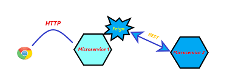

# OpenFeign

Netflix Feign 是 Netflix 公司发布的一种实现负载均衡和服务调用的开源组件。Spring Cloud 将其与 Netflix 中的其他开源服务组件（例如 Eureka、Ribbon 以及 Hystrix 等）一起整合进 Spring Cloud Netflix 模块中，整合后全称为 Spring Cloud Netflix Feign。
 
Feign 对 Ribbon 进行了集成，利用 Ribbon 维护了一份可用服务清单，并通过 Ribbon 实现了客户端的负载均衡。

## Feign vs RestTemplate

* RestTemplate: 此框架代码可读性差，编程体验不一致，对于新手来说，面对复杂的URL参数，不容易上手和维护。
* Feign：
  - 是一种声明式服务调用组件，它在 RestTemplate 的基础上做了进一步的封装。通过 Feign，我们只需要声明一个接口并通过注解进行简单的配置即可实现对 HTTP 接口的绑定。
  - 通过Feign，我们可以像调用本地方法一样来调用远程服务，而完全感觉不到这是在进行远程调用。
  - Feign支持多种注解，例如 Feign 自带的注解以及 JAX-RS 注解等，但遗憾的是 Feign 本身并不支持 Spring MVC 注解，这无疑会给广大 Spring 用户带来不便。

## OpenFeign

OpenFeign 全称 Spring Cloud OpenFeign，它是 Spring 官方推出的一种声明式服务调用与负载均衡组件，2019 年 Netflix 公司宣布 Feign 组件正式进入停更维护状态，于是 Spring 官方便推出了一个名为 OpenFeign 的组件作为 Feign 的替代方案。

OpenFeign 是 Spring Cloud 对 Feign 的二次封装，它具有 Feign 的所有功能，并在 Feign 的基础上增加了对 Spring MVC 注解的支持，例如 @RequestMapping、@GetMapping 和 @PostMapping 等。

### 常用注解

使用 OpenFegin 进行远程服务调用时，常用注解如下表：

| 注解 | 说明 |
| :--: | ----  |
| @FeignClient | 	该注解用于通知 OpenFeign 组件对 @RequestMapping 注解下的接口进行解析，并通过动态代理的方式产生实现类，实现负载均衡和服务调用。|
| @EnableFeignClients |	该注解用于开启 OpenFeign 功能，当 Spring Cloud 应用启动时，OpenFeign 会扫描标有 @FeignClient 注解的接口，生成代理并注册到 Spring 容器中。|
| @RequestMapping |	Spring MVC 注解，在 Spring MVC 中使用该注解映射请求，通过它来指定控制器（Controller）可以处理哪些 URL 请求，相当于 Servlet 中 web.xml 的配置。|
| @GetMapping |	Spring MVC 注解，用来映射 GET 请求，它是一个组合注解，相当于 @RequestMapping(method = RequestMethod.GET) 。|
| @PostMapping |	Spring MVC 注解，用来映射 POST 请求，它是一个组合注解，相当于 @RequestMapping(method = RequestMethod.POST) 。|

## 基本使用

## 自定义Feign的配置

## 性能优化

