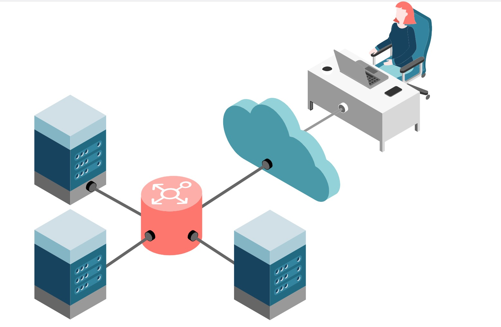

# Spring Cloud Ribbon

前面我们学习了使用Eureka来搭建注册中心，各个服务都在上面注册，互相访问的时候，只需要知道对方的服务名称即可。但是这里有个问题，如果`OrderService`服务因为并发请求较高，所以开启了多份实例，那么`UserService`每次访问的时候，该做如何选择呢？这就是我们今天要学习的负载均衡策略！

## 负载均衡

在任何一个系统中，负载均衡都是一个十分重要且不得不去实施的内容，它是系统处理高并发、缓解网络压力和服务端扩容的重要手段之一。

***负载均衡（Load Balance） ，简单点说就是将用户的请求平摊分配到多个服务器上运行，以达到扩展服务器带宽、增强数据处理能力、增加吞吐量、提高网络的可用性和灵活性的目的。***

常见的负载均衡方式有两种：
* 服务端负载均衡
* 客户端负载均衡

### 服务端负载均衡

服务端负载均衡是最常见的负载均衡方式，其工作原理如下图：

服务端负载均衡是在客户端和服务端之间建立一个独立的负载均衡服务器，该服务器既可以是硬件设备（例如 F5），也可以是软件（例如 Nginx）。这个负载均衡服务器维护了一份可用服务端清单，然后通过心跳机制来删除故障的服务端节点，以保证清单中的所有服务节点都是可以正常访问的。

当客户端发送请求时，该请求不会直接发送到服务端进行处理，而是全部交给负载均衡服务器，由负载均衡服务器按照某种算法（例如轮询、随机等），从其维护的可用服务清单中选择一个服务端，然后进行转发。

服务端负载均衡具有以下特点：
* 需要建立一个独立的负载均衡服务器。
* 负载均衡是在客户端发送请求后进行的，因此客户端并不知道到底是哪个服务端提供的服务。
* 可用服务端清单存储在负载均衡服务器上。

### 客户端负载均衡

相较于服务端负载均衡，客户端服务在均衡则是一个比较小众的概念。工作原理如下图:

客户端负载均衡是将负载均衡逻辑以代码的形式封装到客户端上，即负载均衡器位于客户端。客户端通过服务注册中心（例如 Eureka Server）获取到一份服务端提供的可用服务清单。有了服务清单后，负载均衡器会在客户端发送请求前通过负载均衡算法选择一个服务端实例再进行访问，以达到负载均衡的目的；

客户端负载均衡也需要心跳机制去维护服务端清单的有效性，这个过程需要配合服务注册中心一起完成。

客户端负载均衡具有以下特点：
* 负载均衡器位于客户端，不需要单独搭建一个负载均衡服务器。
* 负载均衡是在客户端发送请求前进行的，因此客户端清楚地知道是哪个服务端提供的服务。
* 客户端都维护了一份可用服务清单，而这份清单都是从服务注册中心获取的。

Ribbon 就是一个基于 HTTP 和 TCP 的客户端负载均衡器，当我们将 Ribbon 和 Eureka 一起使用时，Ribbon 会从 Eureka Server（服务注册中心）中获取服务端列表，然后通过负载均衡策略将请求分摊给多个服务提供者，从而达到负载均衡的目的。

### 服务端负载均衡 VS 客户端负载均衡
下面我们就来对比下，服务端负载均衡和客户端负载均衡到底有什么区别，如下表:

## Ribbon基本介绍

Spring Cloud Ribbon 是一套基于 Netflix Ribbon 实现的客户端负载均衡和服务调用工具。

Netflix Ribbon 是 Netflix 公司发布的开源组件，其主要功能是提供客户端的负载均衡算法和服务调用。Spring Cloud 将其与 Netflix 中的其他开源服务组件（例如 Eureka、Feign 以及 Hystrix 等）一起整合进 Spring Cloud Netflix 模块中，整合后全称为 Spring Cloud Netflix Ribbon。

Ribbon 是 Spring Cloud 体系中最核心、最重要的组件之一。它虽然只是一个工具类型的框架，并不像 Eureka Server（服务注册中心）那样需要独立部署，但它几乎存在于每一个使用 Spring Cloud 构建的微服务中。

Spring Cloud 微服务之间的调用，API 网关的请求转发等内容，实际上都是通过 Spring Cloud Ribbon 来实现的，包括后续我们要介绍的 OpenFeign 也是基于它实现的。

## 使用Ribbon实现负载均衡

## Ribbon的负载均衡策略

## 超时与重试

## 饥饿加载