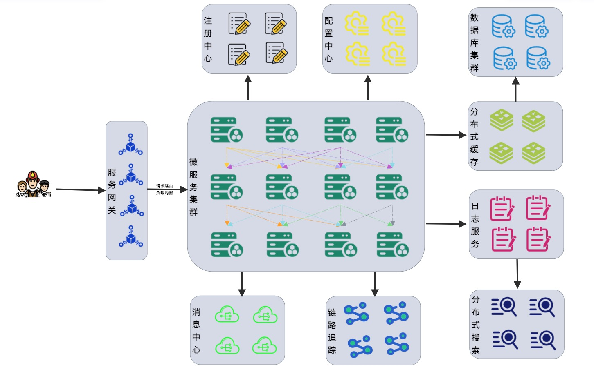

# Gateway的基本使用


在微服务架构中，一个系统往往由多个微服务组成，而这些服务可能部署在不同机房、不同地区、不同域名下。这种情况下，客户端（例如浏览器、手机、软件工具等）想要直接请求这些服务，就需要知道它们具体的地址信息，例如 IP 地址、端口号等。

这种客户端直接请求服务的方式存在以下问题：
* 当服务数量众多时，客户端需要维护大量的服务地址，这对于客户端来说，是非常繁琐复杂的。
* 在某些场景下可能会存在跨域请求的问题。
* 身份认证的难度大，每个微服务需要独立认证。

## API 网关



对于服务数量众多、复杂度较高、规模比较大的系统来说，使用 API 网关具有以下好处：
* 客户端通过 API 网关与微服务交互时，客户端只需要知道 API 网关地址即可，而不需要维护大量的服务地址，简化了客户端的开发，同时，客户端直接与 API 网关通信，能够减少客户端与各个服务的交互次数。
* 客户端通过网关解除了与后端服务的耦合，减少了后端API暴露的风险。
* API网关还提供了身份的认证，保护了后端服务的安全
* API网关还能实现流控、过滤、缓存、计费以及监控等 API 管理功能
* 网关可以统一处理跨域问题。

最常使用的API网关有两种，区别如下：

* Zuul
Zuul 网关属于 NetFix 公司开源框架，属于第一代微服务网关。Zuul网关底层基于Servlet实现，阻塞式API ，不支持长连接，依赖SpringBoot-Web。

* Gateway
Gateay 属于 SpringCloud 自己研发的网关框架，属于第二代微服务网关,相比来说 GateWay 比 Zuul 网关的性能要好很多。
Spring Cloud GateWay 基于 Spring5 构建，能够实现响应式非阻塞式API ，支持长连接，能够更好的支持 Spring 体系产品，依赖 SpringBoot-WebFlux，不支持SpringBoot-Web。

## 基本使用

**Step1: 添加依赖**

主要是添加Gateway和Eureka的依赖：
```
dependencies {
	implementation 'org.springframework.cloud:spring-cloud-starter-gateway'
	implementation 'org.springframework.cloud:spring-cloud-starter-netflix-eureka-client'
	testImplementation 'org.springframework.boot:spring-boot-starter-test'
}
```

**Step2: 添加GateWay的配置**

在application.yml里面添加user-servcie的路由配置：
```
server:
  port: 8760

spring:
  application:
    name: gateway
  cloud:
    gateway:
      routes:
        - id: user-service # 路由id，自定义，只要唯一即可
          uri: lb://user-service # 路由的目标地址，lb就是负载均衡，后面跟着服务的地址
          predicates: # 路由的断言，也就是请求是否符合路由规则的条件
            - Path=/user/** # 这个是按照路径匹配，只要以/user开头就符合匹配
eureka:
  client:
    registerWithEureka: true
    fetchRegistry: true
    serviceUrl:
      defaultZone: http://localhost:8761/eureka
```

**Step3: 启动服务**

启动Gateway服务，看到它自己已经作为服务被注册到Eureka上面去了！


然后访问`http://localhost:8760/user`, 可以看到如下输出：


## 路由断言工厂

我们在配置文件中写的`predicates`里面的规则只是字符串，这些字符串会被Predicate Factory读取并处理，进而转变为路由条件的判断。例如，`Path=/user/**`是按照路径匹配，这个规则是由`org.springframework.cloud.gateway.handler.predicate.PathRoutePredicateFactory类处理的`。


下面，我们举个简单的例子：

我们可以对所有访问`/user`路径的请求，统一添加一个请求参数：
```yml
spring:
  application:
    name: gateway
  cloud:
    gateway:
      routes:
        - id: user-service # 路由id，自定义，只要唯一即可
          uri: lb://user-service # 路由的目标地址，lb就是负载均衡，后面跟着服务的地址
          predicates: # 路由的断言，也就是请求是否符合路由规则的条件
            - Path=/user/** # 这个是按照路径匹配，只要以/user开头就符合匹配
            - Query=auth,eason # 统一添加一个参数auth，值为eason
```

此时，如果你还是使用`http://localhost:8760/user`将输出如下错误：


如果在这个url地址加上`auth=eason`参数，将能获取正确的返回：


## 过滤器链 Filter

Gateway最重要的一部分就是它提供了灵活多样的Filter，可以非常方便的对进入微服务的请求和微服务返回的响应做处理。大体流程如下：


Spring Cloud Gateway 内置了多达 31 种 GatewayFilter，下表中列举了几种常用的网关过滤器及其使用示例:

| 路由过滤器 |	描述 |	使用示例 |
| -------- | ----- | -------- |
| AddRequestHeader |	 拦截传入的请求，并在请求上添加一个指定的请求头参数。 |	- AddRequestHeader=my-request-header,1024|
| AddRequestParameter |	拦截传入的请求，并在请求上添加一个指定的请求参数。 |	- AddRequestParameter=my-request-param,test|
| AddResponseHeader |	拦截响应，并在响应上添加一个指定的响应头参数。 |	- AddResponseHeader=my-response-header,test|
| PrefixPath |	拦截传入的请求，并在请求路径增加一个指定的前缀。 |		- PrefixPath=/consumer
| PreserveHostHeader |	转发请求时，保持客户端的 Host 信息不变，然后将它传递到提供具体服务的微服务中. |	- PreserveHostHeader|
| RemoveRequestHeader |	移除请求头中指定的参数. |	- RemoveRequestHeader=my-request-header|
| RemoveResponseHeader |	移除响应头中指定的参数。 |	- RemoveResponseHeader=my-response-header|
| RemoveRequestParameter |	移除指定的请求参数。 |	- RemoveRequestParameter=my-request-param|
| RequestSize |	配置请求体的大小，当请求体过大时，将会返回 413 Payload Too Large |	- name: RequestSize.args.maxSize: 5000000|

下面我们将简单测试一个过滤器：
```yml
spring:
  application:
    name: gateway
  cloud:
    gateway:
      routes:
        - id: user-service # 路由id，自定义，只要唯一即可
          uri: lb://user-service # 路由的目标地址，lb就是负载均衡，后面跟着服务的地址
          predicates: # 路由的断言，也就是请求是否符合路由规则的条件
            - Path=/user/** # 这个是按照路径匹配，只要以/user开头就符合匹配
            - Query=auth,eason
          filters:
            - AddResponseHeader=my-response-header,test
```

我们访问请求`http://localhost:8760/user`可以看到如下的Response Header：


### 自定义Gateway Filter

有时候，我们需要对所有进入网关的请求和微服务做出响应，同时这里面包含一定的业务逻辑，那么这个时候，你就需要自己写代码来实现啦！

要自定义Filter的关键是，需要实现`GlobalFilter`:
```java
@Component
@Order(0)
public class AuthFilter implements GlobalFilter {
    @Override
    public Mono<Void> filter(ServerWebExchange exchange, GatewayFilterChain chain) {
        MultiValueMap<String, String> queryParams = exchange.getRequest().getQueryParams();
        String auth = queryParams.getFirst("auth");
        if (auth.equals("eason")) {
            return chain.filter(exchange);
        }
        exchange.getResponse().setStatusCode(HttpStatus.UNAUTHORIZED);
        return exchange.getResponse().setComplete();
    }
}
```

此时，当你输入错误的参数，将得到请求如下：


### 责任链执行顺序

上面的代码中，我们可以看到有个`@Order(0)`注解，这个注解就是用来规定自定义的责任过滤链的执行顺序，一般具有如下规则：


* 每一个过滤器必须指定一个Int类型的Order值，order值越小，优先级越高，执行顺序越靠前。
* GlobalFilter通过实现Ordered接口，或者添加@Order注解来指定Order，执行顺序由自己制定。
* 路由过滤器和DefaultFilter的Order由Spring Cloud框架指定，默认是按照申明的顺序从1递增。
* 当过滤器的Order值一样时，会按照DefaultFilter > 路由过滤器 > GlobalFilter的顺序执行。

## 跨域问题的处理

浏览器的同源策略会导致跨域，也就是说，如果协议、域名或者端口有一个不同，都被当作是不同的域，就不能使用 Ajax 向不同源的服务器发送 HTTP 请求。Ajax 的同源策略主要是为了防止 CSRF（跨站请求伪造） 攻击。

首先我们要明确一个问题，请求跨域了，请求到底发出去没有？答案是肯定发出去了，但是浏览器拦截了响应。通常的解决方式是CORS，即浏览器将跨域请求发送给后端服务，问一下后端服务对这个请求允不允许，如果允许了，就给出正确的返回，那么浏览器就可以正常解析和渲染了！

Gateway处理跨域同样采用的是CORS方案，并且只需要简单配置即可实现！

```yml
spring:
  application:
    name: gateway
  cloud:
    gateway:
      globalcors: # 全局的跨域处理
        add-to-simple-url-handler-mapping: true # 解决Option请求被拦截的问题
        corsConfigurations:
          '[/**]':
            allowedOrigins: # 允许跨域请求的地址
              - 'http://localhost:8080'
              - 'http://www.baidu.com'
            allowedMethods: # 允许跨域请求的方法
              - GET
              - PUT
              - POST
              - DELETE
              - OPTIONS
            allowedHeaders: '*' # 允许在请求头上面携带的信息
            allowCredentials: true # 是否允许携带Cookie
            maxAge: 360000 # 这次跨域检测的有效期
```