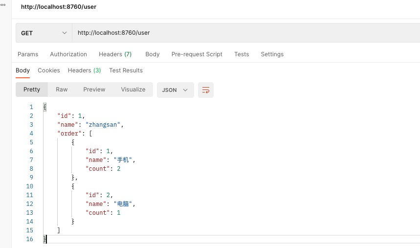
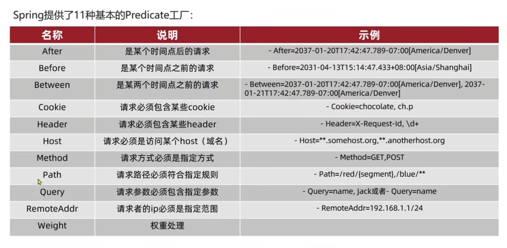

# Gateway的基本使用


在微服务架构中，一个系统往往由多个微服务组成，而这些服务可能部署在不同机房、不同地区、不同域名下。这种情况下，客户端（例如浏览器、手机、软件工具等）想要直接请求这些服务，就需要知道它们具体的地址信息，例如 IP 地址、端口号等。

这种客户端直接请求服务的方式存在以下问题：
* 当服务数量众多时，客户端需要维护大量的服务地址，这对于客户端来说，是非常繁琐复杂的。
* 在某些场景下可能会存在跨域请求的问题。
* 身份认证的难度大，每个微服务需要独立认证。

## API 网关


对于服务数量众多、复杂度较高、规模比较大的系统来说，使用 API 网关具有以下好处：
* 客户端通过 API 网关与微服务交互时，客户端只需要知道 API 网关地址即可，而不需要维护大量的服务地址，简化了客户端的开发，同时，客户端直接与 API 网关通信，能够减少客户端与各个服务的交互次数。
* 客户端通过网关解除了与后端服务的耦合，减少了后端API暴露的风险。
* API网关还提供了身份的认证，保护了后端服务的安全
* API网关还能实现流控、过滤、缓存、计费以及监控等 API 管理功能
* 网关可以统一处理跨域问题。

最常使用的API网关有两种，区别如下：

* Zuul
Zuul 网关属于 NetFix 公司开源框架，属于第一代微服务网关。Zuul网关底层基于Servlet实现，阻塞式API ，不支持长连接，依赖SpringBoot-Web。

* Gateway
Gateay 属于 SpringCloud 自己研发的网关框架，属于第二代微服务网关,相比来说 GateWay 比 Zuul 网关的性能要好很多。
Spring Cloud GateWay 基于 Spring5 构建，能够实现响应式非阻塞式API ，支持长连接，能够更好的支持 Spring 体系产品，依赖 SpringBoot-WebFlux，不支持SpringBoot-Web。

## 基本使用

**Step1: 添加依赖**

主要是添加Gateway和Eureka的依赖：
```
dependencies {
	implementation 'org.springframework.cloud:spring-cloud-starter-gateway'
	implementation 'org.springframework.cloud:spring-cloud-starter-netflix-eureka-client'
	testImplementation 'org.springframework.boot:spring-boot-starter-test'
}
```

**Step2: 添加GateWay的配置**

在application.yml里面添加user-servcie的路由配置：
```
server:
  port: 8760

spring:
  application:
    name: gateway
  cloud:
    gateway:
      routes:
        - id: user-service # 路由id，自定义，只要唯一即可
          uri: lb://user-service # 路由的目标地址，lb就是负载均衡，后面跟着服务的地址
          predicates: # 路由的断言，也就是请求是否符合路由规则的条件
            - Path=/user/** # 这个是按照路径匹配，只要以/user开头就符合匹配
eureka:
  client:
    registerWithEureka: true
    fetchRegistry: true
    serviceUrl:
      defaultZone: http://localhost:8761/eureka
```

**Step3: 启动服务**

启动Gateway服务，看到它自己已经作为服务被注册到Eureka上面去了！


然后访问`http://localhost:8760/user`, 可以看到如下输出：



## 路由断言工厂

我们在配置文件中写的`predicates`里面的规则只是字符串，这些字符串会被Predicate Factory读取并处理，进而转变为路由条件的判断。例如，`Path=/user/**`是按照路径匹配，这个规则是由`org.springframework.cloud.gateway.handler.predicate.PathRoutePredicateFactory类处理的`。



下面，我们举个简单的例子：

我们可以对所有访问`/user`路径的请求，统一添加一个请求参数：
```yml
spring:
  application:
    name: gateway
  cloud:
    gateway:
      routes:
        - id: user-service # 路由id，自定义，只要唯一即可
          uri: lb://user-service # 路由的目标地址，lb就是负载均衡，后面跟着服务的地址
          predicates: # 路由的断言，也就是请求是否符合路由规则的条件
            - Path=/user/** # 这个是按照路径匹配，只要以/user开头就符合匹配
            - Query=auth,eason # 统一添加一个参数auth，值为eason
```

此时，如果你还是使用`http://localhost:8760/user`将输出如下错误：


如果在这个url地址加上`auth=eason`参数，将能获取正确的返回：

