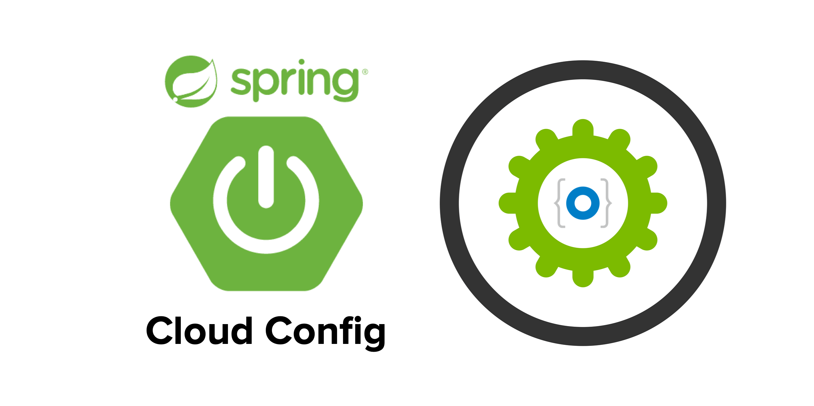
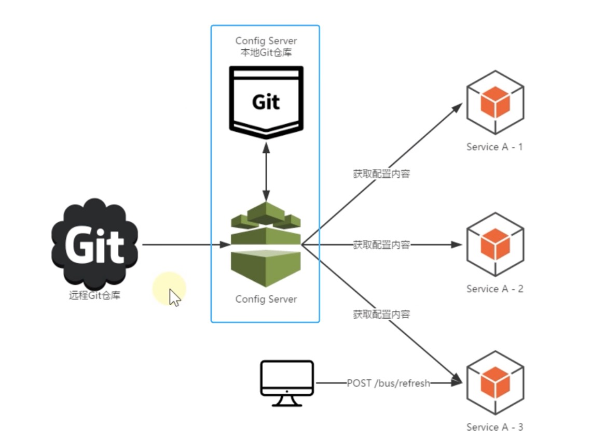

# Spring Cloud Config



在分布式微服务系统中，几乎所有服务的运行都离不开配置文件的支持，这些配置文件通常由各个服务自行管理，以`properties`或`yml`格式保存在各个微服务的类路径下，例如`application.properties`或`application.yml`等。

这种将配置文件散落在各个服务中的管理方式，存在以下问题：
* 管理难度大：配置文件散落在各个微服务中，难以管理。
* 安全性低：配置跟随源代码保存在代码库中，容易造成配置泄漏。
* 时效性差：微服务中的配置修改后，必须重启服务，否则无法生效。
* 局限性明显：无法支持动态调整，例如日志开关、功能开关。

为了解决这些问题，通常我们都会使用配置中心对配置进行统一管理。那么Spring Cloud Config应用而生！

## 简介

Spring Cloud Config 是由 Spring Cloud 团队开发的项目，它可以为微服务架构中各个微服务提供集中化的外部配置支持。

简单点说就是，Spring Cloud Config 可以将各个微服务的配置文件集中存储在一个外部的存储仓库或系统（例如 Git 、SVN 等）中，对配置的统一管理，以支持各个微服务的运行

Spring Cloud Config 包含以下两个部分：
* Config Server：也被称为分布式配置中心，它是一个独立运行的微服务应用，用来连接配置仓库并为客户端提供获取配置信息、加密信息和解密信息的访问接口。
* Config Client：指的是微服务架构中的各个微服务，它们通过 Config Server 对配置进行管理，并从 Config Sever 中获取和加载配置信息。

Spring Cloud Config 默认使用 Git 存储配置信息，因此使用 Spirng Cloud Config 构建的配置服务器天然就支持对微服务配置的版本管理。我们可以使用 Git 客户端工具方便地对配置内容进行管理和访问。除了 Git 外，Spring Cloud Config 还提供了对其他存储方式的支持，例如 SVN、本地化文件系统等。

### 工作原理


Spring Cloud Config 工作流程如下：
* 开发或运维人员提交配置文件到远程的 Git 仓库。
* Config Server 负责连接配置仓库Git, 然后在本地存储一份配置的副本，并对 Config 客户端暴露获取配置的接口。
* Config Client 通过Config服务端暴露出来的接口，拉取配置仓库中的配置。
* Config Client 获取到配置信息，以支持服务的运行。
* 管理员可以通过刷新接口，动态的获取配置或者将配置推送给客户端。

### 优势

从Spring Cloud Config的原理我们可以看出，它解决了微服务配置的中心化，版本控制，平台独立，语言独立等问题，其特性如下：

* 提供了客户端和服务端的支持。
* 集中式管理分布式环境下的应用部署。
* 支持基于属性值的对称和非对称加密，提供了安全保障。
* 基于Spring环境，与Spring无缝集成。
* 可以用于任何语言开发的程序。
* 默认实现可以基于Git，可以对配置进行版本管理。

## 基本使用

### 创建Cofig server

下面我们就使用Spring Cloud Config来搭建一个基本的Config Server：
**Step1: 创建配置仓库：**
在GitHub创建一个配置仓库config-server-test, 并添加配置文件order-service-dev.yml。
```yml
server:
  port: 8762
spring:
  application:
    name: order-service
```

**Step2: 创建config server，添加如下依赖：**
```
dependencies {
	implementation 'org.springframework.boot:spring-boot-starter-web'
	implementation 'org.springframework.cloud:spring-cloud-config-server'
	implementation 'org.springframework.cloud:spring-cloud-starter-netflix-eureka-client'
	testImplementation 'org.springframework.boot:spring-boot-starter-test'
}
```

**Step3: 修改配置文件application.yml**
```yml
server:
  port: 8760
spring:
  application:
    name: config-server  # 应用名称
  cloud:
    config:
      server:
        git:
          uri: https://github.com/Jinghua-Li/config-server-test.git #配置文件所在仓库
          search-paths:
            - config-server-test
          force-pull: true
eureka:
  client:
    registerWithEureka: true
    fetchRegistry: true
    serviceUrl:
      defaultZone: http://localhost:8761/eureka
```

**Step4: 开启Config Server**
```java
@SpringBootApplication
@EnableConfigServer
@EnableEurekaClient
public class ConfigApplication {
	public static void main(String[] args) {
		SpringApplication.run(ConfigApplication.class, args);
	}
}
```

启动服务，访问文件地址`http://localhost:8760/order-service-dev.yml`, 可以看到如下输出：
```yml
server:
  port: 8762
spring:
  application:
    name: order-service
```

Spring Cloud Config 有它的一套访问规则，我们通过这套规则在浏览器上直接访问就可以, 上面的访问路径就是使用了如下的规则。
```bash
/{application}/{profile}[/{label}]
/{application}-{profile}.yml
/{label}/{application}-{profile}.yml
/{application}-{profile}.properties
/{label}/{application}-{profile}.properties
```

* {application} 就是应用名称，对应到配置文件上来，就是配置文件的名称部分，例如我上面创建的配置文件。
* {profile} 就是配置文件的版本，我们的项目有开发版本、测试环境版本、生产环境版本，对应到配置文件上来就是以 application-{profile}.yml 加以区分，例如application-dev.yml、application-sit.yml、application-prod.yml。
* {label} 表示 git 分支，默认是 master 分支，如果项目是以分支做区分也是可以的，那就可以通过不同的 label 来控制访问不同的配置文件了。

### 配置Cofig Client

下面我们就来配置客户端，来获取Config Server的配置：

**Step1: 添加config client和bootstrap的依赖：**
```java
dependencies {
	implementation 'org.springframework.boot:spring-boot-starter-web'
	implementation 'org.springframework.cloud:spring-cloud-starter-netflix-eureka-client'
	implementation 'org.springframework.cloud:spring-cloud-starter-config'
	implementation 'org.springframework.cloud:spring-cloud-starter-bootstrap'
	testImplementation 'org.springframework.boot:spring-boot-starter-test'
}
```

**Step2: 添加配置文件bootstrap.yml**
bootstrap.yml是系统级别的，加载优先级高于application.yml，负责从外部加载配置并解析。

```yml
spring:
  cloud:
    config:
#      label: master #分支名称
      name: order-service  #配置文件名称
      profile: dev  #环境名  config-dev.yml 中的 dev
#      uri: http://config-server
      discovery:
        enabled: true  #默认false，设为true表示使用注册中心中的configserver配置，而不是自己配置configserver的uri
        service-id: CONFIG-SERVER  #指定config server在服务发现中的serviceId，默认为：configserver
```

**Step3: 提供一个RestAPI, 用于访问配置**
```java
@RestController
public class ConfigClientController {

    @Value("${server.port}")
    private String serverPort;

    @Value("${spring.application.name}")
    private String serverName;

    @GetMapping(value = "/getConfig")
    public String getConfig() {
        return "Server Port：" + serverPort + "<br/>Server Name：" + serverName;
    }
}
```

**Step4: 配置启动类：**
在启动类上面添加注解`@EnableDiscoveryClient`.
```java
@SpringBootApplication
@EnableEurekaClient
@EnableDiscoveryClient
public class OrderServiceApplication {

	public static void main(String[] args) {
		SpringApplication.run(OrderServiceApplication.class, args);
	}

}
```

访问`http://localhost:8762/getConfig`将获得如下输出，说明配置生效了！
```bash
Server Port：8762
Server Name：order-service
```
## 自动刷新

上面的配置必须在重启服务之后才能生效，为了解决不重启Config客户端无法获取最新配置的问题，需要在客户端引入引入 Spring Boot actuator 监控模块来解决。

**Step1: 添加actuator依赖**
```
implementation 'org.springframework.cloud:spring-boot-starter-actuator'
```

**Step2：添加配置，暴露监控节点**

Spring Boot 2.50对 actuator 监控屏蔽了大多数的节点，只暴露了 health 节点，本段配置（*）就是为了开启所有的节点, 在bootstrap.yml里面添加如下节点：
```yml
management:
  endpoints:
    web:
      exposure:
        include: "*"   # * 在yaml 文件属于关键字，所以需要加引号
```

**Step3：给对应的Controller添加自动刷新注解@RefreshScope**

```java
@RestController
@RefreshScope
public class ConfigClientController {
    // other codes
}
```

访问刚刚的url`http://localhost:8762/getConfig`,然后修改Git仓库里面配置的内容，手动请求地址`curl -X POST "http://localhost:8763/actuator/refresh`后，可以观察到此时并没有重启服务，但是配置却生效啦！


## 加密与解密

目前，我们所有的配置文件都存储在Git远程仓库，配置文件中的一些信息又是比较敏感的，如果黑客获取了这些信息，后果不堪设想。所以，最好的方式是对其进行加密，主要的加密方法分为两种，一种是共享秘钥加密(对称加密)，一种是公开秘钥加密(非对称加密)。

这里，我们就以对称加密为例，了解一下如何对配置文件里面的内容加密：

**Step1: 配置秘钥**

在Config Server里面创建`bootstrap.yml`文件，添加如下配置：
```yml
encrypt:
  key: test # 对称加密的秘钥
```

**Step2：检查配置是否成功**

Config Server为我们提供了检查是否加密的URL：`http://localhost:8760/encrypt/status`, 如果请求结果为`{"status":"OK"}`则表示加密成功！

**Step3：创建加密字符串**

Config Server为我们提供了创建加密字符串的URL：`curl http://localhost:8760/encrypt -d eason`, 表示对`eason`字符串进行加密，返回的结果为`b335bebd5879eb3c21849430ded6bdb4269fc7938dbeb508f665b58e69684db9`.

**Step4: 配置文件里面修改敏感字段**

把加密后的数据更新到Git远程仓库的配置文件中，值得注意的是，需要在加密结果面前添加`{cipher}`串, Config Server端如果发现字符串以`{cipher}`开头，则将其自动解密，然后再通过HTTP发送给客户端。

例如
```yml
test:
  name: "{cipher}b335bebd5879eb3c21849430ded6bdb4269fc7938dbeb508f665b58e69684db9"
```

配置完成之后，重启服务，访问`http://localhost:8763/getConfig`可以看到字符串已经被自动解密啦！