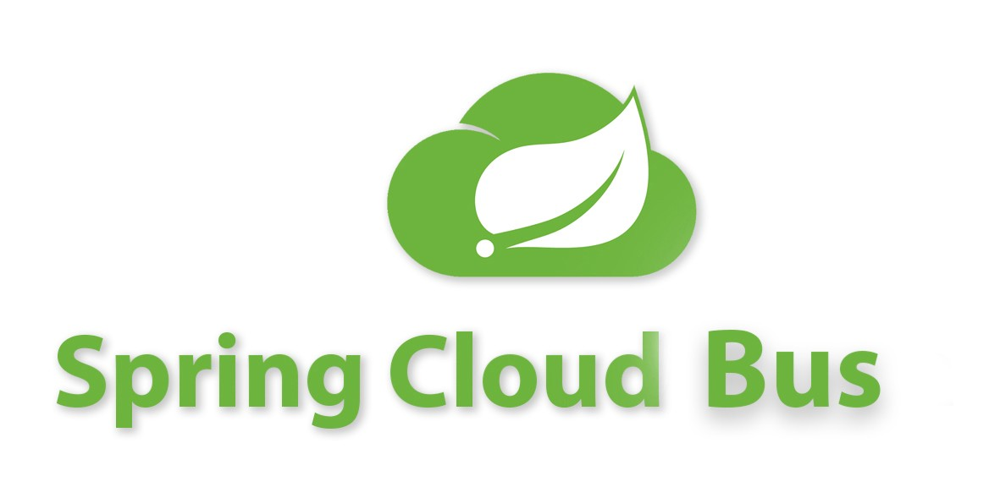
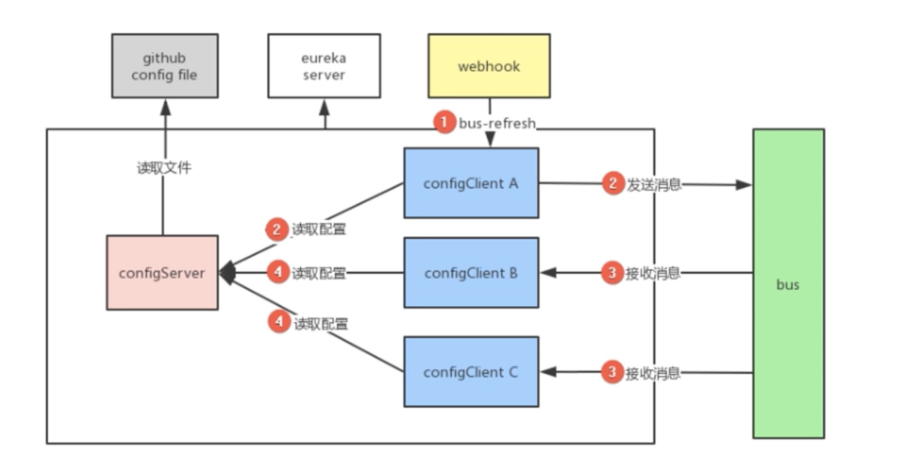
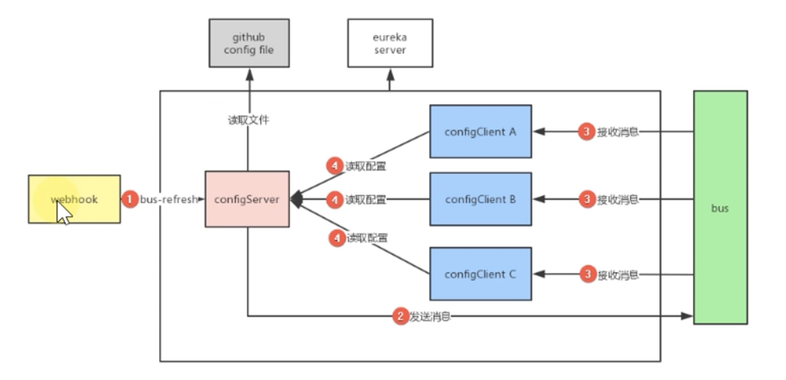
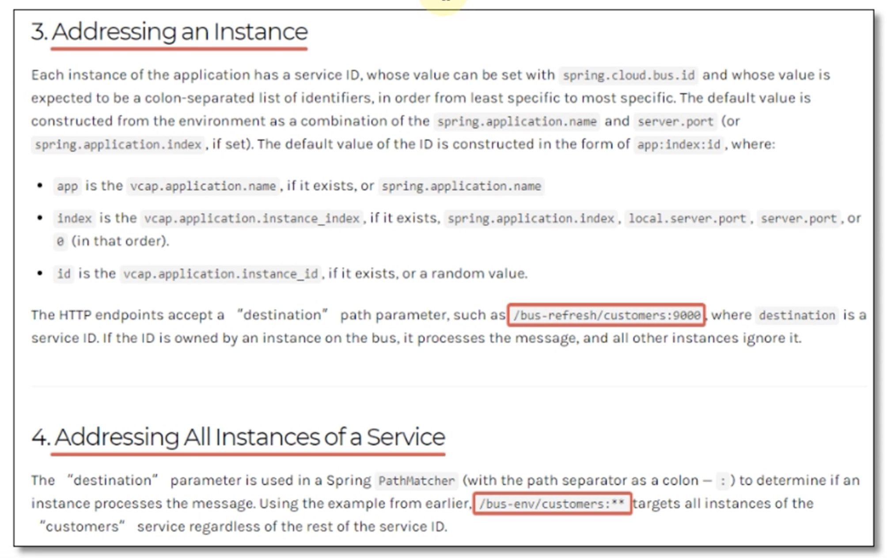

# Spring Cloud Bus

微服务一般都采用集群方式部署，而且在高并发下经常需要对服务进行扩容，萎缩，上线，下线等操作，比如我们需要更新配置，又或者需要同时失效所有服务上面的某个缓存，此时就需要向所有相关的服务器发送命令，这就需要使用消息总线啦！

## 什么是消息总线？

使用消息代理中间件构建一个共用的消息主题让所有微服务实例订阅，当该消息主题产生消息时会被所有微服务实例监听并消费。

消息代理是一个消息验证，传输，路由的架构模式，主要用来实线接受和分发消息，并根据设定好的消息处理流来转发给正确的应用。它在微服务之间起到通信调度作用，减少了服务之间的依赖。

## Spring Cloud Bus

Spring Cloud Bus是Spring Cloud体系内的消息总线，用来连接分布式系统的所有节点。

Spring Cloud Bus将分布式的节点用轻量的消息代理(RibbitMQ/Kafka)连接起来，可以通过消息代理广播配置文件的更改，或者服务之间的通信，也可以用于监控。解决了微服务数据变更，及时同步的问题。

总的来说，就是在我们需要把一个操作散发到所有后端相关服务的时候，就可以选择使用Spring cloud Bus了。比如，消息总线的典型应用就是配置中心客户端刷新。

## 基本使用

对于Spring Cloud Bus的使用，通常分为三类：客户端端发起通知，服务端发起通知，和局部刷新，下面我们就来研究一下！

### 客户端发起通知

我们上节课学习Spring Cloud Config的时候，给大家讲解了基于Actuator的配置刷新，当时的案例只有一个Config Client，我们可以使用Webhook来调用刷新地址也不算太麻烦，极端情况下，你可以通过手动调用也不是不行，但是如果遇到了复杂的集群环境，可能需要很多个服务同时刷新配置，而且业务流量比较大的情况下，手动刷新就玩不转了，那么使用Spring Cloud Config即可完美解决该问题。

我们可以借助Spring Cloud Bus的广播功能，让Config client都订阅配置更新事件，当配置更新时，触发其中一个端的更新事件，Spring Cloud Bus就把此事件广播到其他订阅客户端中，以此来达到批量更新的目的。

架构设计图如下：

然而，这种配置刷新的方式有一些比较大的缺点：
* 打破了服务的职责性单一，微服务本身是业务模块，它本不应该承担配置刷新的职责。
* 破坏了微服务各个节点的对等性。
* 存在一定的局限性，比如微服务在迁移时，它的网络地址常常发生变化，此时如果想要做到自动刷新，就不得不修改Webhook的地址。

那么服务发起通知即可解决该问题：

### 服务端发起通知

为了解决客户端发起通知产生的问题，我们改用服务端来发起通知，主要原理是讲Config Server作为事件的触发节点，触发它读取配置，然后广播给其他服务，架构设计如下：

整个执行流程如下：
1. Webhook监听Git配置仓库的触发，给config server发送`bus-refresh`请求刷新配置。
2. Config Server发送消息给Bus。
3. Bus接受消息之后，广播给所有的Config client。
4. 各Config Client收到消息重新读取最新配置。

下面我们来举例说明一下:

#### 基本使用

### 局部刷新

在实际场景中，并不是所有的微服务都需要刷新该配置，有时候，我们需要其中一个服务或者一组服务被刷新，这就需要用到了局部刷新技术：

