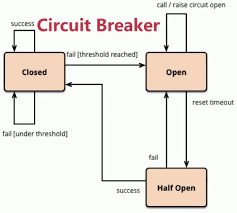
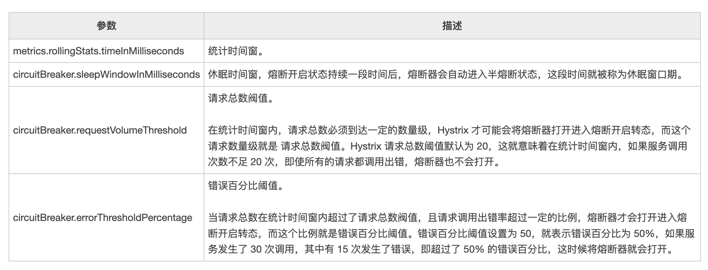

# Hystrix基本使用


在微服务架构中，一个应用往往由多个服务组成，这些服务之间相互依赖，依赖关系错综复杂。尤其是中大型项目中，错综复杂的链式调用关系非常常见。

通常情况下，一个用户请求往往需要多个服务配合才能完成，在请求比较少量的情况下，单个服务的调用失败对整个集群影响不大，但是在高并发环境中，当微服务系统中的一个服务出现故障时，即使其他所有服务都可用，但是由于其他服务依赖于此服务，导致用户请求都会主语阻塞状态，故障会沿着服务的调用链路在系统中疯狂蔓延，整个服务器的线程资源在短时间内迅速消耗殆尽，最终导致整个微服务系统的瘫痪，这就是“雪崩效应”。

“雪崩效应”的产生原因比较多，通常可以分为三类：
* 服务提供者不可用：提供服务的服务不可用，比如硬件故障，程序bug，缓存击穿，并发请求量过大等。
* 重试加大流量：如用户的多次重试和服务的重试机制。
* 服务调用者不可用：比如同步请求阻塞造成的资源耗尽等。

为了防止此类事件的发生，微服务架构引入了“熔断器”的一系列服务容错和保护机制。“熔断器”可以帮助我们实现服务的降级，熔断，请求缓存，请求合并以及隔离机制，最大程度上避免“雪崩效应”的产生。

## Spring Cloud Hystrix 

Spring Cloud Hystrix是一款优秀的服务容错与保护组件，也是Spring Cloud中最重要的组件之一。

Spring Cloud Hystrix 是基于 Netflix 公司的开源组件 Hystrix 实现的，它提供了熔断器功能，能够有效地阻止分布式微服务系统中出现联动故障，以提高微服务系统的弹性。Spring Cloud Hystrix 具有服务降级、服务熔断、线程隔离、请求缓存、请求合并以及实时故障监控等强大功能。

> Hystrix [hɪst'rɪks]，中文含义是豪猪，豪猪的背上长满了棘刺，使它拥有了强大的自我保护能力。而 Spring Cloud Hystrix 作为一个服务容错与保护组件，也可以让服务拥有自我保护的能力，因此也有人将其戏称为“豪猪哥”

### 在微服务系统中，Hystrix 能够帮助我们实现以下目标：

* **保护线程资源**：防止单个服务的故障耗尽系统中的所有线程资源。
* **快速失败机制**：当某个服务发生了故障，不让服务调用方一直等待，而是直接返回请求失败。
* **提供降级(FallBack)方案**：在请求失败后，提供一个设计好的降级方案，通常是一个兜底方法，当请求失败后即调用该方法。
* **防止故障扩散**：使用熔断机制，防止故障扩散到其他服务。
* **监控功能**：提供熔断器故障监控组件 Hystrix Dashboard，随时监控熔断器的状态。

## 基本使用

在正式学习一些常见的用法之前，首先需要添加Hystrix的依赖：
```java
implementation 'org.springframework.cloud:spring-cloud-starter-netflix-hystrix:2.2.0.RELEASE'
```
并且在启动类上面开启：
```java
@SpringBootApplication
@EnableEurekaClient
@EnableFeignClients
@EnableHystrix
public class UserServiceApplication {
	public static void main(String[] args) {
		SpringApplication.run(UserServiceApplication.class, args);
	}
}
```

### 服务降级

降级是指在请求超时，资源不足等情况下，不调用真实的服务逻辑，而是使用快速失败方式直接返回一个托底数据，保证服务链条的完整性，避免服务雪崩。

Hystrix 提供了服务降级功能，能够保证当前服务不受其他服务故障的影响，提高服务的健壮性。

服务降级的使用场景有以下 2 种：
* 在服务器压力剧增时，根据实际业务情况及流量，对一些不重要、不紧急的服务进行有策略地不处理或简单处理，从而释放服务器资源以保证核心服务正常运作。
* 当某些服务不可用时，为了避免长时间等待造成服务卡顿或雪崩效应，而主动执行备用的降级逻辑立刻返回一个友好的提示，以保障主体业务不受影响。

Hystrix 服务降级 FallBack 既可以放在服务端进行，也可以放在客户端进行。下面我们将以客户端服务降级为例，结合OpenFeign来聊一下如何实现：

**Step1: 添加依赖**
由于最新版的OpenFeign自己集成了Hystrix,所以不需要再添加，只需要添加熔断器的依赖即可：
```
dependencies {
	implementation 'org.springframework.boot:spring-boot-starter-web'
	implementation 'org.springframework.cloud:spring-cloud-starter-netflix-eureka-client'
	implementation 'org.springframework.cloud:spring-cloud-starter-openfeign'
	implementation 'org.springframework.cloud:spring-cloud-starter-circuitbreaker-resilience4j' # 熔断器的依赖
	testImplementation 'org.springframework.boot:spring-boot-starter-test'
}
```
**Step2: 开启熔断器**

在apllication.yml中开启熔断器：
```yml
feign:
  hystrix:
    enabled: true #在Feign中开启Hystrix
  circuitbreaker:
    enabled: true
```

**Step3: 使用FeignClient处理降级函数**
```java
@FeignClient(value = "order-service", fallbackFactory = OrderFallBackServiceFactory.class)
@Component
public interface OrderClient {
    @GetMapping("/orders")
    List<Order> getOrders();
}

@Component
public class OrderFallBackServiceFactory implements FallbackFactory<OrderClient>{
    @Override
    public OrderClient create(Throwable cause) {
        return new OrderClient() {
            @Override
            public List<Order> getOrders() {
                return List.of(new Order(-1, "默认订单", 0));
            }
        };
    }
}
```
通过测试得知，如果调用失败，则会直接返回降级方法。

### 服务熔断

在一定时间内，当异常的请求比例达到阈值时，启动熔断器，熔断器一旦启动成功，则会停止调用具体服务逻辑，通过FallBack快速返回托底数据，保证服务链路的完整性。这种熔断状态不是永久的，在经历了一定的时间后，熔断器会再次检测该微服务是否恢复正常，若服务恢复正常则恢复其调用链路。熔断机制是为了应对雪崩效应而出现的一种微服务链路保护机制。

降级是出错了就返回兜底数据，而熔断是出错在一定阈值之后不再访问服务。二者经常结合使用。

#### 熔断状态

在熔断机制中涉及了三种熔断状态：
* **熔断关闭状态(Closed)**：当服务访问正常时，熔断器处于关闭状态，服务调用方可以正常地对服务进行调用。
* **熔断开启状态(Open)**：默认情况下，在固定时间内接口调用出错比率达到一个阈值（例如 50%），熔断器会进入熔断开启状态。进入熔断状态后，后续对该服务的调用都会被切断，熔断器会执行本地的降级（FallBack）方法。
* **半熔断状态(Half-Open)**： 在熔断开启一段时间之后，熔断器会进入半熔断状态。在半熔断状态下，熔断器会尝试恢复服务调用方对服务的调用，允许部分请求调用该服务，并监控其调用成功率。如果成功率达到预期，则说明服务已恢复正常，熔断器进入关闭状态；如果成功率仍旧很低，则重新进入熔断开启状态。



#### Hystrix 实现熔断机制

在Spring Cloud 中，熔断机制是通过 Hystrix 实现的。Hystrix 会监控微服务间调用的状况，当失败调用到一定比例时（例如 5 秒内失败 20 次），就会启动熔断机制。

Hystrix 实现服务熔断的步骤如下：
1. 当服务的调用出错率达到或超过 Hystix 规定的比率（默认为 50%）后，熔断器进入熔断开启状态。
2. 熔断器进入熔断开启状态后，Hystrix 会启动一个休眠时间窗，在这个时间窗内，该服务的降级逻辑会临时充当业务主逻辑，而原来的业务主逻辑不可用。
3. 当有请求再次调用该服务时，会直接调用降级逻辑快速地返回失败响应，以避免系统雪崩。
4. 当休眠时间窗到期后，Hystrix 会进入半熔断转态，允许部分请求对服务原来的主业务逻辑进行调用，并监控其调用成功率。
5. 如果调用成功率达到预期，则说明服务已恢复正常，Hystrix 进入熔断关闭状态，服务原来的主业务逻辑恢复；否则 Hystrix 重新进入熔断开启状态，休眠时间窗口重新计时，继续重复第 2 到第 5 步

熔断器中常用的参数有四个，详情请看下面的表格：


由于我们上面的案例使用`resilience4j`实现了服务的降级，那么配置熔断也可以用这个配置来完成，下面的配置与Hystrix非常类似：
```yml
resilience4j:
  circuitbreaker:
    instances:
      OrderClient:
        failureRateThreshold: 50 # 失败请求百分比，超过这个比例，CircuitBreaker就会变成OPEN状态
        permittedNumberOfCallsInHalfOpenState: 5 #当CircuitBreaker处于HALF_OPEN状态的时候，允许通过的请求数量
        slidingWindowSize: 20 # 滑动窗口大小，如果配置COUNT_BASED默认值100就代表是最近100个请求，如果配置TIME_BASED默认值100就代表是最近100s的请求。
        minimumNumberOfCalls: 3 # 最小请求个数。只有在滑动窗口内，请求个数达到这个个数，才会触发CircuitBreaker对于是否打开断路器的判断。
        waitDurationInOpenState: 6000 # 从OPEN状态变成HALF_OPEN状态需要的等待时间
```

### 请求合并

请求合并是指把一段时间内的请求合并为一个请求统一发送，进而降低服务端的负载。

在微服务架构中，我们将一个项目会拆分成很多个项目，这些独立的项目会通过远程调用的方式来互相配合工作，但是在高并发的情况下，通信次数的增加会导致总的通信时间增加，同时，线程池的资源也是有限的，高并发环境会导致有大量的线程处于等待状态，进而导致响应延迟，此时，通过合并请求，节省了网络资源的消耗，虽然牺牲部分用户的响应时间，但是提高了整体系统的吞吐量，降低了服务端的负载。

虽然请求合并可以减少请求数量以缓解依赖服务线程池的资源，但是在使用的过程中也需要注意他所带来的额外的性能开销：用于请求合并的延迟时间窗会使得依赖服务的请求延迟增高。

例如：某个请求在不通过请求合并器访问的平均耗时为5ms，请求合并的延迟时间窗为10ms（默认值），那么当该请求的设置了请求合并器之后，最坏情况下（在延迟时间窗结束时才发起请求）该请求需要15ms才能完成。

所以，请求合并也需要注意场景：
* 在应用层面上来看，客户端是否要支持高并发，如果并发率不高，或可以通过增加机器节点的方式来解决，那么最好还是不要考虑请求合并。
* 服务提供者都提供的单个对象的处理接口和批量对象的处理接口，并且单个对象查询并发很高，服务提供者负载很高的时候，我们就可以使用请求合并来降低服务提供者的负载。
* 请求命令本身是否就是高延迟命令，如果依赖服务的请求命令本身是一个高延迟的命令，那么可以使用请求合并器，因为延迟时间窗的时间消耗就显得莫不足道了。

总之，请求合并在实际场景中使用不多，Hystrix支持了完整的请求合并的注解，但是与OpenFeign支持不足，所以本节课程将不再举例说明！