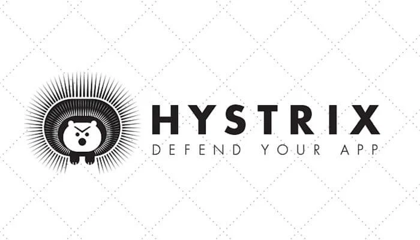

# Hystrix基本使用



在微服务架构中，一个应用往往由多个服务组成，这些服务之间相互依赖，依赖关系错综复杂。尤其是中大型项目中，错综复杂的链式调用关系非常常见。

通常情况下，一个用户请求往往需要多个服务配合才能完成，在请求比较少量的情况下，单个服务的调用失败对整个集群影响不大，但是在高并发环境中，当微服务系统中的一个服务出现故障时，即使其他所有服务都可用，但是由于其他服务依赖于此服务，导致用户请求都会主语阻塞状态，故障会沿着服务的调用链路在系统中疯狂蔓延，整个服务器的线程资源在短时间内迅速消耗殆尽，最终导致整个微服务系统的瘫痪，这就是“雪崩效应”。

“雪崩效应”的产生原因比较多，通常可以分为三类：
* 服务提供者不可用：提供服务的服务不可用，比如硬件故障，程序bug，缓存击穿，并发请求量过大等。
* 重试加大流量：如用户的多次重试和服务的重试机制。
* 服务调用者不可用：比如同步请求阻塞造成的资源耗尽等。

为了防止此类事件的发生，微服务架构引入了“熔断器”的一系列服务容错和保护机制。“熔断器”可以帮助我们实现服务的降级，熔断，请求缓存，请求合并以及隔离机制，最大程度上避免“雪崩效应”的产生。

## Spring Cloud Hystrix 

Spring Cloud Hystrix是一款优秀的服务容错与保护组件，也是Spring Cloud中最重要的组件之一。

Spring Cloud Hystrix 是基于 Netflix 公司的开源组件 Hystrix 实现的，它提供了熔断器功能，能够有效地阻止分布式微服务系统中出现联动故障，以提高微服务系统的弹性。Spring Cloud Hystrix 具有服务降级、服务熔断、线程隔离、请求缓存、请求合并以及实时故障监控等强大功能。

> Hystrix [hɪst'rɪks]，中文含义是豪猪，豪猪的背上长满了棘刺，使它拥有了强大的自我保护能力。而 Spring Cloud Hystrix 作为一个服务容错与保护组件，也可以让服务拥有自我保护的能力，因此也有人将其戏称为“豪猪哥”

### 在微服务系统中，Hystrix 能够帮助我们实现以下目标：

* **保护线程资源**：防止单个服务的故障耗尽系统中的所有线程资源。
* **快速失败机制**：当某个服务发生了故障，不让服务调用方一直等待，而是直接返回请求失败。
* **提供降级(FallBack)方案**：在请求失败后，提供一个设计好的降级方案，通常是一个兜底方法，当请求失败后即调用该方法。
* **防止故障扩散**：使用熔断机制，防止故障扩散到其他服务。
* **监控功能**：提供熔断器故障监控组件 Hystrix Dashboard，随时监控熔断器的状态。

## 基本使用

在正式学习一些常见的用法之前，首先需要添加Hystrix的依赖：
```java
implementation 'org.springframework.cloud:spring-cloud-starter-netflix-hystrix:2.2.0.RELEASE'
```
并且在启动类上面开启：
```java
@SpringBootApplication
@EnableEurekaClient
@EnableFeignClients
@EnableHystrix
public class UserServiceApplication {
	public static void main(String[] args) {
		SpringApplication.run(UserServiceApplication.class, args);
	}
}
```

### 服务降级


