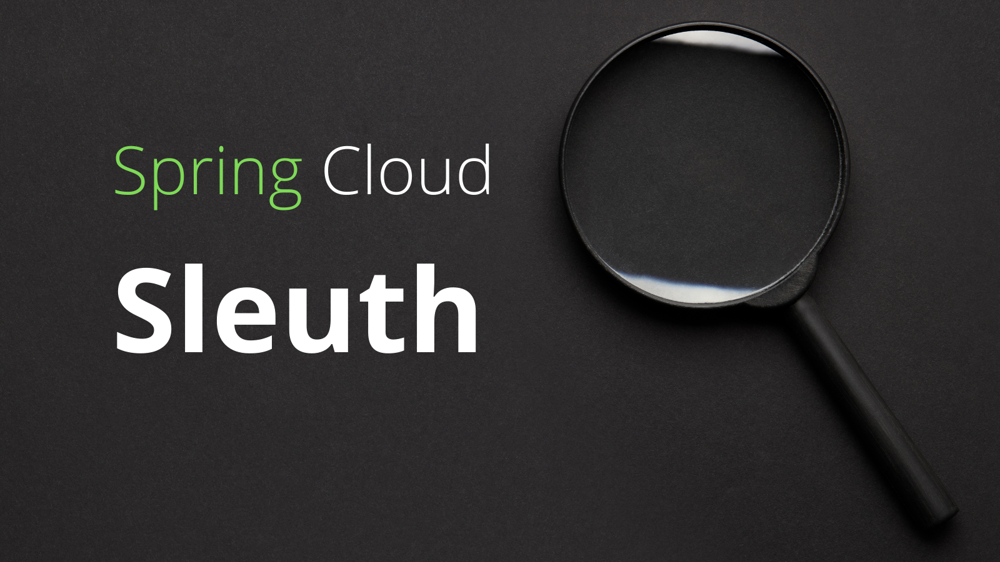
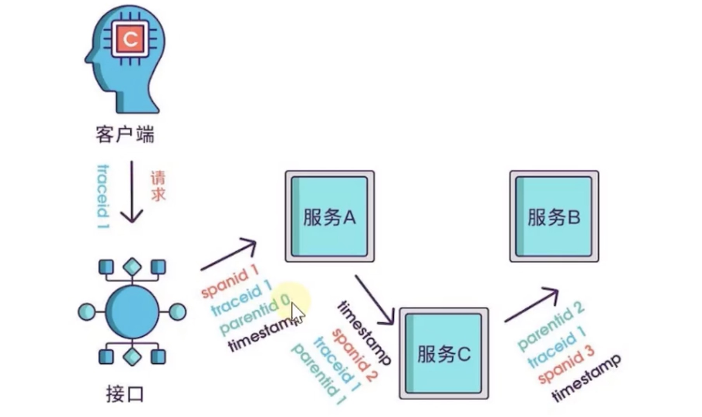
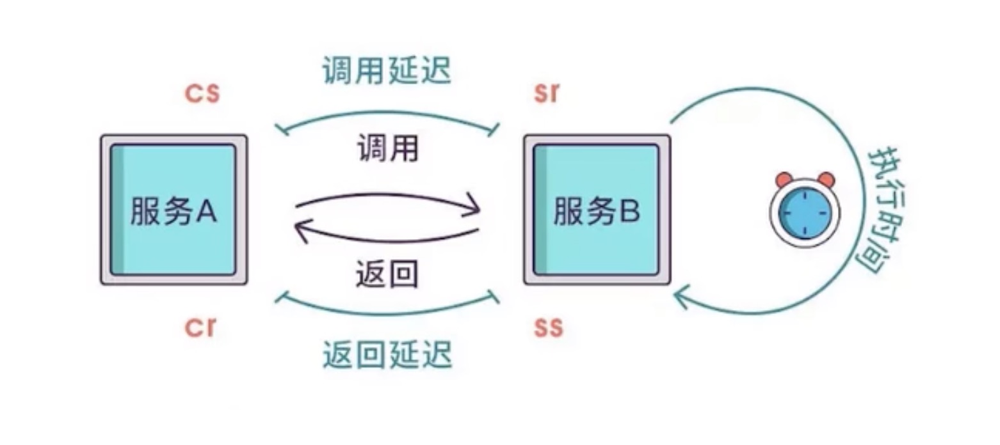

# Spring Cloud Sleuth

随着微服务架构的流行，服务按照不同的维度进行拆分，一次请求往往涉及多个服务。而这些服务有可能是被不同的开发团队维护，也可能使用不同的编程语言，甚至分布在了不同区域的不同机器中，横跨多个数据中心。在复杂的微服务架构中，几乎每一个请求都会形成一个复杂的分布式服务调用链，在这样的场景下，我们需要一些可以帮助我们理解系统行为，用于采集日志，分析性能问题，监控链路的工具，以便在发生故障的时候，能够快速定位和解决问题。那么我们今天学习的Sleuth就是这样的一款工具。

## 什么是链路追踪？

“链路追踪”一词是在2010年提出来的，当时Google发布了一篇Dapper论文：[《Dapper，大规模分布式系统的跟踪系统》](https://bigbully.github.io/Dapper-translation/)介绍了Google自研的分布式链路追踪的实现原理，还介绍了他们是怎么低成本实现对应用的透明的。

其实，Dapper一开始只是一款独立的链路调用追踪系统，后来逐渐演化成为了监控平台，并且基于监控平台孕育了很多工具，比如实时预警，过载保护，指标数据查询等。

除了Google的Dapper，还有一些其他比较出名的链路追踪工具，比如阿里的鹰眼，大众点评的CAT，Twitter的Zipkin等。

总而言之：***单纯的理解链路追踪，就是指一次任务的开始到结束，期间调用的所有系统及耗时的记录。***

## Spring Cloud Sleuth

Spring Cloud Sleuth为Spring Cloud实现了分布式跟踪解决方案，为分布式跟踪提供了 Spring Boot 自动配置。兼容Zipkin，HTrace和其他基于日志的追踪系统，例如ELK。

总体，Spring Cloud Sleuth提供了如下的功能：
* **链路追踪**：通过sleuth可以很清楚的看出一个请求经过了哪些服务，可以方便的理清服务局的调用关系。
* **性能分析**：通过sleuth可以很方便的看出每个采集请求的耗时，分析出哪些服务调用比较耗时，当服务调用的耗时随着请求量的增大而增大时，也可以对服务的扩容提供一定的提醒作用。
* **链路优化**：对于频繁地调用一个服务，或者并行地调用等，可以针对业务做一些优化措施。
* **可视化错误**：对于程序未捕获的异常，可以在zipkpin界面上看到

## 链路追踪专业术语

### Trace

从客户发起请求(request)抵达被追踪系统的边界开始，到被追踪系统向客户返回响应(response)为止的整个过程。一个Trace可以认为是一次完整的链路，内部包含多个Span。

### Span

基本的工作单位，一次单独的调用链可以称为一个Span，Dapper记录的是Span的名称，以及每个Span的ID和父ID，以重建在一次追踪过程中，不同Span之间的关系。如果一个Span没有父ID，则被称为Root Span。所有的Span都挂在一个特定的Trace上，也共用一个Trace Id。

一系列的Span组成树桩结构，Trace和Span存在一对多的关系，Span与Span之间存在父子关系。

### Annotation

用来记录一个事件的存在，一些核心的Annotation用来定义一个请求的开始和结束。

* **Client Sent(CS)**: 客户端发起一个请求，这个Annotation描述了这个Span的开始。
* **Server Received(SR)**: 服务端获得请求并准备开始处理它，如果SR减去CS的时间戳便可以得到网络延时。
* **Server Sent(SS)**: 服务端请求处理完成，返回客户端的时间戳，所以SS减去SR的时间戳便可以得到服务端处理请求的耗时。
* **Client Received(CR)**: 表示Span结束，客户端成功收到服务端的回复，所以CR减去CS的时间戳便可以得到Span的整个耗时。

## 基本使用

