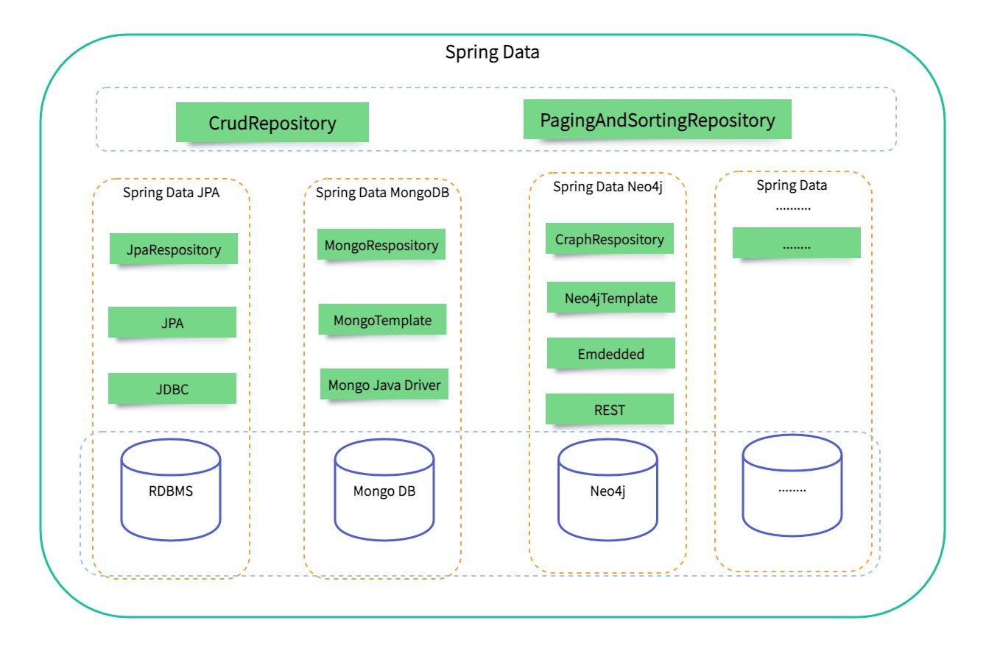

# Spring Data 简介

> Spring Data’s mission is to provide a familiar and consistent, Spring-based programming model for data access while still retaining the special traits of the underlying data store.

Spring Data的在保留底层数据存储特性的同时，为数据访问提供一个熟悉的、一致的、基于Spring编程模型的数据访问方式。

> It makes it easy to use data access technologies, relational and non-relational databases, map-reduce frameworks, and cloud-based data services. This is an umbrella project which contains many subprojects that are specific to a given database. 

它使得数据访问技术、关系及非关系数据库、`map-reduce`框架和基于云的数据服务变得容易。这是一个伞形项目，其中包含许多特定于给定数据库的子项目。

## 核心功能

* Powerful repository and custom object-mapping abstractions： 强大的Repository和自定义的对象映射模型。
* Dynamic query derivation from repository method names： 从Repository的方法名称动态派生查询。
* Implementation domain base classes providing basic properties： 实现提供基本属性的域基类。
* Support for transparent auditing (created, last changed)：支持透明审计(已创建，最近更改)。
* Possibility to integrate custom repository code：集成自定义Repository代码的可能性。
* Easy Spring integration via JavaConfig and custom XML namespaces： 通过JavaConfig和自定义XML名称空间轻松实现Spring集成。
* Advanced integration with Spring MVC controllers：与 Spring MVC 控制器的高级集成。
* Experimental support for cross-store persistence：多数据源的持久化支持。

## Spring Data 体系

对于不同的数据源，如关系型数据库，非关系型数据库，还是基于图的数据库，Spring Data为他们提供了统一的操作入口(CrudRepository/PagingAndSortingRespository)，这两个入口提供对单一域对象的CRUD（创建、读取、更新、删除）操作、查询方法、排序和分页方法等， 其目的是统一和简化对不同类型持久存储的访问。

在这两个接口之下，Spring Data提供了多种多种实现，比如`Spring Data JDBC`, `Spring Data MongoDB`等，每种实现适用于不同的数据源。我们在项目中使用的时候，只需要根据实际情况，来选择合适的数据源。

### 为什么要使用Spring Data？

从上面的架构体系中我们可以看出，Spring Data对不同的数据源提供了一套统一的访问接口，现在很多项目所面临的业务逻辑和场景都是相当复杂的，那么与之对应的都不是单一的数据源了，那么，使用这套统一的数据操作接口就非常容易学习上手，降低学习成本，而且能极大的提升开发效率。

## 主要模块

* **Spring Data Commons**: Core Spring concepts underpinning every Spring Data module.(支撑每个Spring数据模块的核心Spring概念)
* **Spring Data JDBC**: Spring Data repository support for JDBC.
* **Spring Data JPA**: Spring Data repository support for JPA.
* **Spring Data KeyValue**: Map based repositories and SPIs to easily build a Spring Data module for key-value stores.(基于映射的存储库和 SPI，可以轻松地为键值存储构建 Spring Data 模块)
* **Spring Data LDAP**: Spring Data repository support for Spring LDAP.
* **Spring Data MongoDB**: Spring based, object-document support and repositories for MongoDB.
* **Spring Data Redis**: Easy configuration and access to Redis from Spring applications.
* **Spring Data REST**: Exports Spring Data repositories as hypermedia-driven RESTful resources(将Spring Data Repository作为超媒体驱动的RESTful资源导出).
* **Spring Data for Apache Cassandra**: Easy configuration and access to Apache Cassandra or large scale, highly available, data oriented Spring applications.
* **Spring Data for Apache Geode**: Easy configuration and access to Apache Geode for highly consistent, low latency, data oriented Spring applications.
