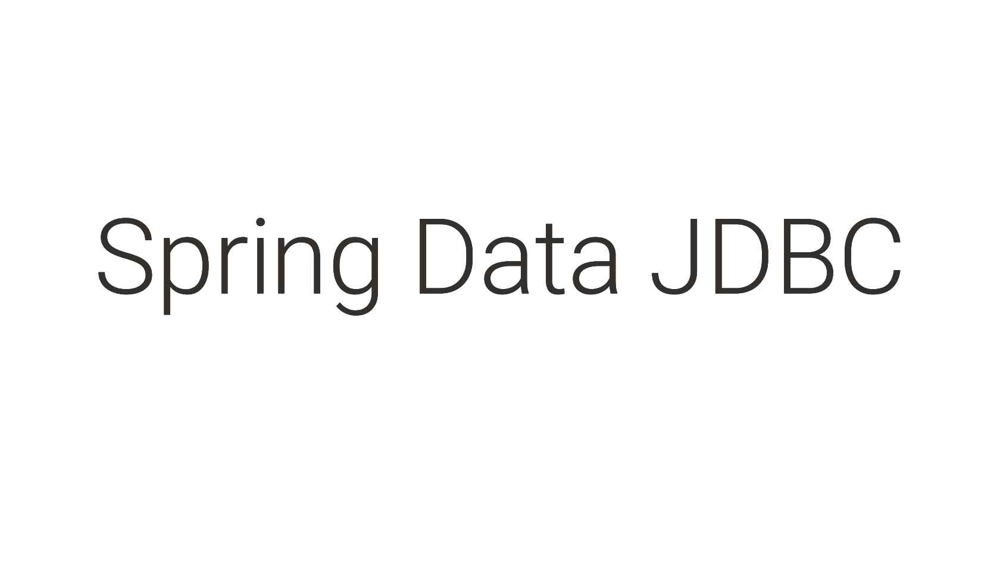

# Spring Data JDBC

JDBC(JAVA DATA BASE Connectivity) Java数据库连接，它是一个标准的Java API范式，用于Java编程语言和大量数据库之间的独立于数据库的连接。

JDBC是一种传统的数据库连接规范，是由各个传统的关系型数据库实现的，用于支持Java语言通过SQL与数据库通信。

## Spring Data JDBC 介绍

> Spring Data JDBC, part of the larger Spring Data family, makes it easy to implement JDBC based repositories. This module deals with enhanced support for JDBC based data access layers. It makes it easier to build Spring powered applications that use data access technologies

Spring Data JDBC是Spring Data大家族的一部分，它基于Repositories来轻松实现JDBC。该模块处理基于JDBC对数据库访问层提供更强的支持。它使得构建使用数据访问技术的Spring驱动的应用程序变得更加容易。

> Spring Data JDBC aims at being conceptually easy. In order to achieve this it does NOT offer caching, lazy loading, write behind or many other features of JPA. This makes Spring Data JDBC a simple, limited, opinionated ORM.

Spring Data JDBC的目标是在概念上足够简单。为了实现这一点，它没有提供缓存、延迟加载、 Write Behind或许多其他JPA特性。这使得Spring Data JDBC成为一个简单、有限、自我特性的ORM框架。

尽管如此，它有自己的ORM特性，并提供了我们在Spring Data JPA 中使用的大多数特性，比如映射实体、存储库、查询注释和 JdbcTemplate。

> An important thing to keep in mind is that Spring Data JDBC doesn't offer schema generation. As a result, we are responsible for explicitly creating the schema.

需要记住的一件重要事情是，Spring Data JDBC不提供模式生成。因此，我们负责显式创建模式。

### 主要功能

* CRUD operations for simple aggregates with customizable NamingStrategy： 用于对简单的可以自定义”名称策略“的聚合的CRUD操作。
* Support for @Query annotations.
* Support for MyBatis queries.
* Events.
* JavaConfig based repository configuration by introducing @EnableJdbcRepositories：通过引入此注解来实现Repository的配置

