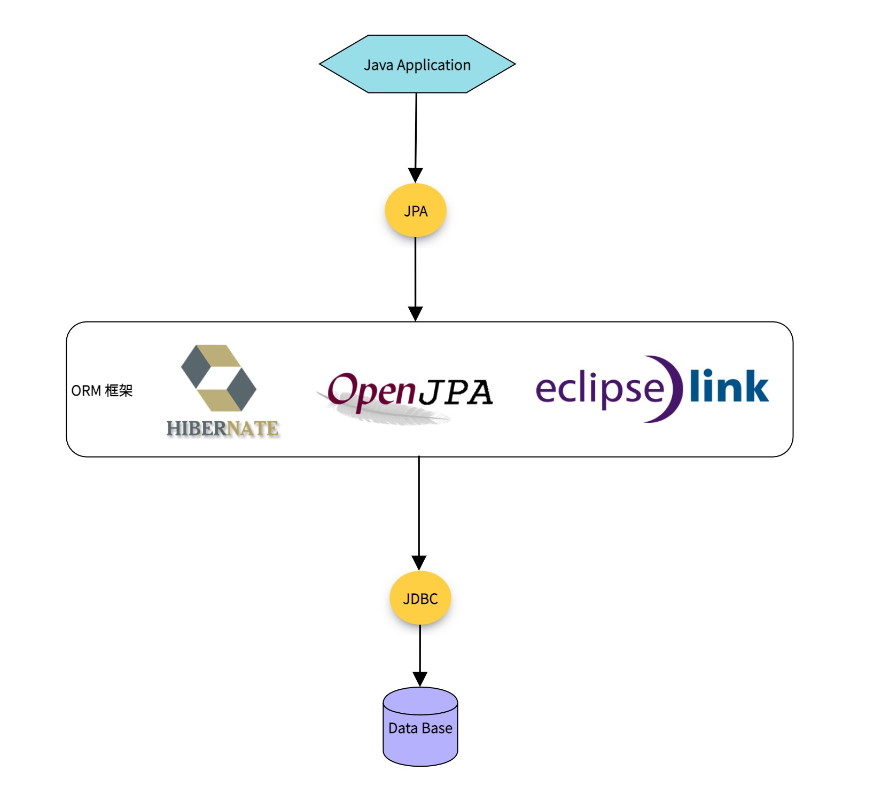
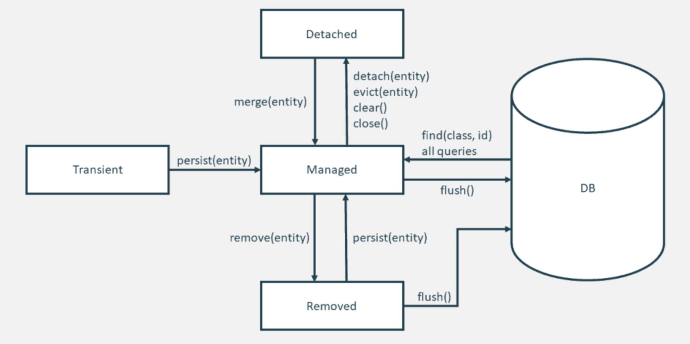

# JPA与Spring Data基本概念介绍

想要学习Spring Data JPA，就得先知道啥是JPA，只要先了解了这个，我们才能进一步学习Spring Data JPA。

## JPA简介

JPA全称Java Persistence API, 2006年5月11号，`JPA 1.0`规范作为`JCP JSR 220`的一部分最终被发布。`JPA 2.0`规范，在2009年12月发布。2019年，Jakarta Persistence API, 是SUM官方提出的一种ORM规范。用于管理自 EJB 3.0 规范以来的持久性和对象关系映射和函数。

JPA 规范在内部定义了对象关系映射，而不依赖于特定于供应商的映射实现。JPA 通过使用注释或 XML 将对象映射至数据库的一个或多个表，对对象关系映射的重要任务进行了标准化。 为了进一步简化持久性编程模型：

* EntityManager API 可以在数据库中保存、更新、检索或移除对象。
* EntityManager API 和对象关系映射元数据可处理大多数数据库操作，而不需要您编写JDBC或SQL代码来维护持久性。
* JPA 提供了查询语言，对独立EJB查询语言进行了扩展（扩展后的语言又称为 JPQL），您可以使用JPQL来检索对象，而不必针对您所使用的数据库编写SQL查询。

ORM(Object/Relational/Mapping)规范给我们提供了如下作用：
* 简化持久化操作的开发工作，让开发者从繁琐的JDBC和SQL代码中解脱出来，直接面向对象持久化操作。
* ORM技术促进了持久化操作的统一，实现天下归一，如果你是基于JPA进行持久化，那么你可以随意切换数据库。

### JPA vs Hibernate

从上面的描述中，我们可以看出，JPA是一套规范，Hibernate是实现了这套规范的ORM框架。而Spring Data JPA又是基于Hibernate封装，结合Spring的一个高可用的ORM框架。

### Mybatis vs Hibernate

在国内，还有一种使用最多的数据持久层框架是Mybatis，严格来说，Mybatis并不完全是一个ORM框架，也不依照JPA规范，本质上就是对JDBC的封装，属于一套半自动的ORM持久层框架。但是Mybatis凭借着小巧，灵活，高效，简介的优势，在国内大行其道。同时，Mybatis对于复杂业务的多表连接查询表现更好。

相比较而言，Hibernate实现了JPA规范，属于全自动的ORM持久层框架，凭借着强大，高效的特色，随着微服务的流行而广泛被使用起来。

### JPA对象的四种状态

JPA规范为我们定义了与数据库通信的对象有四种状态：
* 临时状态：一个对象刚刚被创建出来，没有与EntityManager发生关系，也没有被持久化，不会被EntityManager锁管控的状态。
* 托管状态/持久化状态：与EntityManager发生关系后将被持久化，此时，该对象的任何属性改动都会引起数据库的数据同步，当托管状态的实体Flush之后，就进入了持久态，可以认为持久态就是实实在在的数据库记录。
* 删除状态：事物提交之前，执行remove方法之后，该对象就进入了删除状态。
* 游离状态：游离状态就是提交到数据库后，事务commit后实体的状态，因为事务已经提交了，此时实体的属性任你如何改变，也不会同步到数据库，因为游离是没人管的孩子，不在持久化上下文中。如果你new出来一个对象，并为其设置了ID并且是数据库中存在的ID，那么你new出来的这个对象也是游离对象。

## Spring Data JPA介绍

我们先来看看[Spring Data JPA](https://spring.io/projects/spring-data-jpa)官方的介绍：
> Spring Data JPA, part of the larger Spring Data family, makes it easy to easily implement JPA based repositories. This module deals with enhanced support for JPA based data access layers. It makes it easier to build Spring-powered applications that use data access technologies.

Spring Data JPA是更强大的Spring Data家族的一部分，可以轻松实现基于Respositories的JPA。该模块用于增强处理基于JPA的数据库访问层。它使得基于Spring驱动的应用程序访问数据库变的更加容易。

> Implementing a data access layer of an application has been cumbersome for quite a while. Too much boilerplate code has to be written to execute simple queries as well as perform pagination, and auditing. Spring Data JPA aims to significantly improve the implementation of data access layers by reducing the effort to the amount that’s actually needed. As a developer you write your repository interfaces, including custom finder methods, and Spring will provide the implementation automatically.

实现应用程序数据访问层已经很麻烦了：必须编写太多样板代码来执行简单的查询、分页和审计。 Spring Data JPA 旨在通过减少实际需要的工作量来显着改进数据访问层的实现。作为开发人员，您编写存储库接口，包括自定义查找器方法，Spring将自动提供实现。

### 核心特性

* Sophisticated support to build repositories based on Spring and JPA： 支持基于 Spring和JPA构建Repositories

* Support for Querydsl predicates and thus type-safe JPA queries: 支持Querydsl条件查询和类型安全的JPA查询。

* Transparent auditing of domain class：

* Pagination support, dynamic query execution, ability to integrate custom data access code：分页支持、动态查询执行、集成自定义数据访问代码的能力

* Validation of `@Query` annotated queries at bootstrap time：在引导时验证 `@Query` 注释查询

* Support for XML based entity mapping：支持基于 XML 的实体映射

* JavaConfig based repository configuration by introducing `@EnableJpaRepositories`：通过引入 `@EnableJpaRepositories` 来配置基于JavaConfig 的Repository

### 总结

虽然，Spring Data JPA官方给我们列出了一些特性，但是我个人觉得，除了这些特性之外，JPA真正的优势如下：

1. **面向接口式编程**：JPA提供给我们的Repository里面几乎没有多余的代码，如果有代码，也是一些声明式的接口方法，而Spring Data为我们自动提供了这些方法里面的实现，这样做的好处是，让业务人员从SQL里面解脱出来，真正的关注于业务。
2. **充足的样板代码**：Spring Data JPA里面的`CrudRepository`/`PagingAndSortingRepository`/`JpaRespository`里面给我们提供了大量的样板代码，对于基本的读取或者写入操作，都已经给我们提供了实现，极大的简化了我们的开发工作。
3. **灵活的查询语言**：如果你遇到了复杂场景，必须要自定义查询实现的时候，那也非常简单，Spring Data JPA给我们提供了`JPQL`/`SQL`/`Query by Example`/`QueryDSL`/`Specifications`等，足够实现高复杂的查询，这些查询与原生的SQL比起来，可读性和可维护性更强。
4. **与Spring Boot的无缝结合**：Spring Boot目前是Java最流行的框架，而Spring Data JPA与Spring Boot的高度吻合使得Spring Data JPA几乎不需要额外的配置便可以和Spring Boot联合使用，这是目前其他任何持久层框架都无法比拟的优点。如果你的应用程序的主框架是Spring Boot，那么选择Spring Data JPA对你来说将会省去很多麻烦事。
