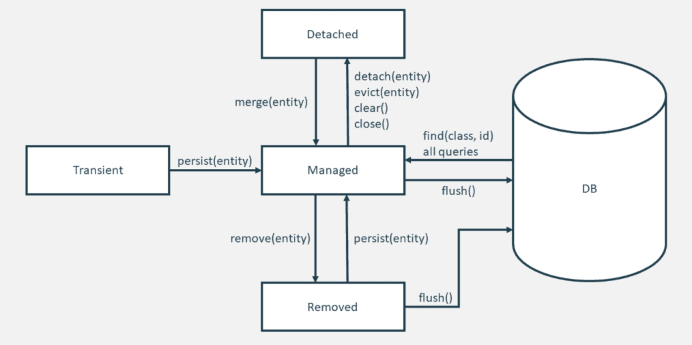

# Spring Data JPA基本概念介绍

想要学习Spring Data JPA，就得先知道啥是JPA，只要先了解了这个，我们才能进一步学习Spring Data JPA。

## JPA简介

JPA全称Java Persistence API, 2006年5月11号，`JPA 1.0`规范作为`JCP JSR 220`的一部分最终被发布。`JPA 2.0`规范，在2009年12月发布。2019年，Jakarta Persistence API, 是SUM官方提出的一种ORM规范。用于管理自 EJB 3.0 规范以来的持久性和对象关系映射和函数。

JPA 规范在内部定义了对象关系映射，而不依赖于特定于供应商的映射实现。JPA 通过使用注释或 XML 将对象映射至数据库的一个或多个表，对对象关系映射的重要任务进行了标准化。 为了进一步简化持久性编程模型：

* EntityManager API 可以在数据库中保存、更新、检索或移除对象。
* EntityManager API 和对象关系映射元数据可处理大多数数据库操作，而不需要您编写JDBC或SQL代码来维护持久性。
* JPA 提供了查询语言，对独立EJB查询语言进行了扩展（扩展后的语言又称为 JPQL），您可以使用JPQL来检索对象，而不必针对您所使用的数据库编写SQL查询。

ORM(Object/Relational/Mapping)规范给我们提供了如下作用：
* 简化持久化操作的开发工作，让开发者从繁琐的JDBC和SQL代码中解脱出来，直接面向对象持久化操作。
* ORM技术促进了持久化操作的统一，实现天下归一，如果你是基于JPA进行持久化，那么你可以随意切换数据库。

### JPA vs Hibernate

从上面的描述中，我们可以看出，JPA是一套规范，Hibernate是实现了这套规范的ORM框架。而Spring Data JPA又是基于Hibernate封装，结合Spring的一个高可用的ORM框架。

### Mybatis vs Hibernate

在国内，还有一种使用最多的数据持久层框架是Mybatis，严格来说，Mybatis并不完全是一个ORM框架，也不依照JPA规范，本质上就是对JDBC的封装，属于一套半自动的ORM持久层框架。但是Mybatis凭借着小巧，灵活，高效，简介的优势，在国内大行其道。同时，Mybatis对于复杂业务的多表连接查询表现更好。

相比较而言，Hibernate实现了JPA规范，属于全自动的ORM持久层框架，凭借着强大，高效的特色，随着微服务的流行而广泛被使用起来。

### JPA对象的四种状态

JPA规范为我们定义了与数据库通信的对象有四种状态：
* 临时状态：一个对象刚刚被创建出来，没有与EntityManager发生关系，也没有被持久化，不会被EntityManager锁管控的状态。
* 托管状态/持久化状态：与EntityManager发生关系后将被持久化，此时，该对象的任何属性改动都会引起数据库的数据同步，当托管状态的实体Flush之后，就进入了持久态，可以认为持久态就是实实在在的数据库记录。
* 删除状态：事物提交之前，执行remove方法之后，该对象就进入了删除状态。
* 游离状态：游离状态就是提交到数据库后，事务commit后实体的状态，因为事务已经提交了，此时实体的属性任你如何改变，也不会同步到数据库，因为游离是没人管的孩子，不在持久化上下文中。如果你new出来一个对象，并为其设置了ID并且是数据库中存在的ID，那么你new出来的这个对象也是游离对象。

