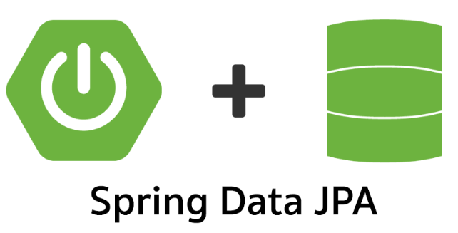

# Spring Data JPA基本方法



Spring Data JPA给我们提供了非常多的基础方法，其核心方法都在`JpaRepository`/`PagingAndSortingRepository`/`QueryByExampleExecutor`/`CrudRepository`中，
`JpaRepository`继承自`PagingAndSortingRepository`和`QueryByExampleExecutor`，`PagingAndSortingRepository`继承自`CrudRepository`，`CrudRepository`最终继承自`Repository`，此接口没有任何方法，就是一个接口的声明。
在深入学习之前，我们必须首先对这些接口中的方法进行逐个学习。

## 实体注解

在学习具体的JPA方法之前，我们先了解一些常用的实体注解，这对我们学习JPA至关重要！

* **@Entity**：指明这个`Class`是实体类，同时也是一个实体Bean，并且使用默认的ORM规则，即`Class`名即数据库表中表名，`Class`字段名即表中的字段名。
* **@Table**：注解是一个非必须的注解。指明了Entity所要映射带数据库表，其中`@Table.name()`用来指定映射表的表名。
* **@Id**：标识类里所在变量为主键。
* **@GeneratedValue**：设置主键生成策略，此方式依赖于具体的数据库，JPA为开发人员提供了四种主键生成策略,其被定义在枚举类GenerationType中：
  * GenerationType.TABLE：使用一个特定的数据库表格来保存主键,持久化引擎通过关系数据库的一张特定的表格来生成主键,这种策略的好处就是不依赖于外部环境和数据库的具体实现,在不同数据库间可以很容易的进行移植,但由于其不能充分利用数据库的特性,所以不会优先使用。
  * GenerationType.SEQUENCE：在某些数据库中,不支持主键自增长,比如Oracle,其提供了一种叫做"序列(sequence)"的机制生成主键。此时,GenerationType.SEQUENCE就可以作为主键生成策略。该策略的不足之处正好与TABLE相反,由于只有部分数据库(Oracle,PostgreSQL,DB2)支持序列对象,所以该策略一般不应用于其他数据库。
  * GenerationType.IDENTITY：此种主键生成策略就是通常所说的主键自增长,数据库在插入数据时,会自动给主键赋值,比如MYSQL可以在创建表时声明"auto_increment" 来指定主键自增长。
  * GenerationType.AUTO：把主键生成策略交给持久化引擎(persistence engine),持久化引擎会根据数据库在以上三种主键生成策略中选择其中一种。
* **@Column**：表示属性所对应字段名进行个性化设置。
* **@Transient**：表示属性并非数据库表字段的映射,ORM框架将忽略该属性。
* **@Enumerated**：使用此注解映射枚举字段，以注入类型存入数据库，注入数据库的类型有两种：EnumType.ORDINAL（Interger）、EnumType.STRING（String）。
* **@ElementCollection**：集合映射。
* **@CreatedDate**：创建实体的时候生成创建日期字段。
* **@CreatedBy**：创建实体的时候，生成用户创建字段。
* **@LastModifiedDate**：修改实体的时候，设置最后修改的时间字段，创建的时候，等同于`@CreatedDate`.
* **@LastModifiedBy**: 修改实体的时候，设置最后修改的修改人，创建实体的时候，等同于`@CreatedBy`.

## CrudRepository里面的样板方法

我们先来看看顶层的CrudRepository接口中声明的方法：
```java
@NoRepositoryBean
public interface CrudRepository<T, ID> extends Repository<T, ID> {
    // 用来插入和修改数据，如果该实体的主键不为空，那么就是修改，否则就是插入。
    // 返回值为修改或者插入后的实体，如果是新增，那么该返回实体将包含主键
    <S extends T> S save(S entity);

    //一次性保存多个实体，该方法的实现默认是循环调用`save(S entity)`方法来实现的
    <S extends T> Iterable<S> saveAll(Iterable<S> entities);

    // 通过实体的ID来查询该实体，如果找到，则返回此实体，如果找不到，则返回一个Optional#empty()
    Optional<T> findById(ID id);

    // 判断此实体ID是否存在，存在为true，不存在为false
    boolean existsById(ID id);

    // 返回数据库表中所有的实体
    Iterable<T> findAll();

    // 查找多个ID的实体，需要注意的是，ids不能为空或者包含null值，而且返回的实体对象列表的顺序和ids的顺序无关
    Iterable<T> findAllById(Iterable<ID> ids);

    // 返回表中所有实体的数量
    long count();

    // 通过实体ID来删除该实体，如果该id不存在，则直接忽略
    void deleteById(ID id);

    // 删除一个给定的实体
    void delete(T entity);

    // 通过多个实体IDs来删除多个实体，ids里面不能包含null值，如果不存在id，则默认给忽略
    void deleteAllById(Iterable<? extends ID> ids);

    // 删除多个实体，entities里面不能包含null值
    void deleteAll(Iterable<? extends T> entities);

    // 删除所有的实体
    void deleteAll();
}
```
## PagingAndSortingRepository提供的样板方法

此接口较为简单，就提供了两个方法：

```java
@NoRepositoryBean
public interface PagingAndSortingRepository<T, ID> extends CrudRepository<T, ID> {

	// 通过排序规则来查找所有的实体
	Iterable<T> findAll(Sort sort);

	// 通过分页或排序规则来查找所有的实体
	Page<T> findAll(Pageable pageable);
}
```

这两个方法都是查询的方法，第一个仅仅为排序的方法，第二个为分页或者排序，下面我们举例来说明：

* 定义Product和ProductRepository
```java
@Entity
@Table(name = "product")
@Getter
@Setter
@NoArgsConstructor
@AllArgsConstructor
@Data
public class Product {
    @Id
    @GeneratedValue(strategy = GenerationType.IDENTITY)
    private Long id;

    private String name;
    private double price;
}

@Repository
public interface ProductRepository extends PagingAndSortingRepository<Product, Long> {

}
```

* 测试：
```java
@ExtendWith(SpringExtension.class)
@DataJpaTest
@AutoConfigureTestDatabase(replace = AutoConfigureTestDatabase.Replace.NONE)
class ProductRepositoryTest {
    @Autowired
    private ProductRepository productRepository;

    @BeforeEach
    public void initData() {
        Product product = new Product();
        product.setPrice(2.0d);
        product.setName("iphone");

        Product product1 = new Product();
        product1.setPrice(3.0d);
        product1.setName("iphone max");

        Product product2 = new Product();
        product2.setPrice(3.0d);
        product2.setName("ipad");

        Product product3 = new Product();
        product3.setPrice(1.0d);
        product3.setName("max");

        productRepository.saveAll(Arrays.asList(product, product1, product2, product3));
    }

    @Test
    void should_sorted_by_name_and_price() {
        Sort.TypedSort<Product> person = Sort.sort(Product.class);

        //先使用price正序排列，再使用name倒叙
        Sort sort = person.by(Product::getPrice).ascending()
                .and(person.by(Product::getName).descending());
        final List<Product> products = new ArrayList<>();
        productRepository.findAll(sort).forEach(product -> products.add(product));

        assertEquals(4, products.size());
        assertEquals("max", products.get(0).getName());
        assertEquals(1.0, products.get(0).getPrice());
        assertEquals("ipad", products.get(3).getName());
    }

    @Test
    void should_paged_and_sorted() {
        Sort.TypedSort<Product> person = Sort.sort(Product.class);
        Sort sort = person.by(Product::getPrice).ascending();
        final Page<Product> pagedProducts = productRepository.findAll(PageRequest.of(0, 2, sort));

        assertEquals(4, pagedProducts.getTotalElements());
        assertEquals(2, pagedProducts.getTotalPages());
        assertEquals(2, pagedProducts.getContent().size());
        assertEquals("max", pagedProducts.getContent().get(0).getName());
    }
```

## JpaRepository提供的样板方法

由于`JpaRepository`继承自`PagingAndSortingRepository`和`QueryByExampleExecutor`，所以基本的方法在上面都介绍过了，只是有一些`JpaRepository`特有的方法需要简单介绍一下。

有些同学可能会问，`JpaRepository`与`CrudRepository`之间有啥区别？

从继承关系上来说，前者继承了后者，具有后者所有的方法，另外，前者继承了`QueryByExampleExecutor`, 也就具有了通过Example查询的能力，这个后面我们再做介绍。同时，还提供了一些JPA相关的方法，例如刷新持久化上下文和批量删除记录等，接下来我们就专门介绍这几个方法。

```java
@NoRepositoryBean
public interface JpaRepository<T, ID> extends PagingAndSortingRepository<T, ID>, QueryByExampleExecutor<T> {
    // 执行缓存与数据库同步，这里与save方法的最大区别是flush操作会将执行的sql发送至数据库服务器。而save方法需等到事务提交的时候，才会进行发送sql执行sql语句。
    void flush();

    // 执行Save之后，立即将SQL提交到数据库
    <S extends T> S saveAndFlush(S entity);

    <S extends T> List<S> saveAllAndFlush(Iterable<S> entities);

    // 批量删除数据库实体的方法，这个是真正的批量删除，与deleteAll不同地方是，后者是循环删除
    void deleteAllInBatch(Iterable<T> entities);

    void deleteAllByIdInBatch(Iterable<ID> ids);

    void deleteAllInBatch();

    //获取一个实例，其状态可能会被延迟获取。 如果请求的实例在数据库中不存在，则在第一次访问实例状态时抛出EntityNotFoundException。
    T getReferenceById(ID id);

    // 其他方法省略
}
```