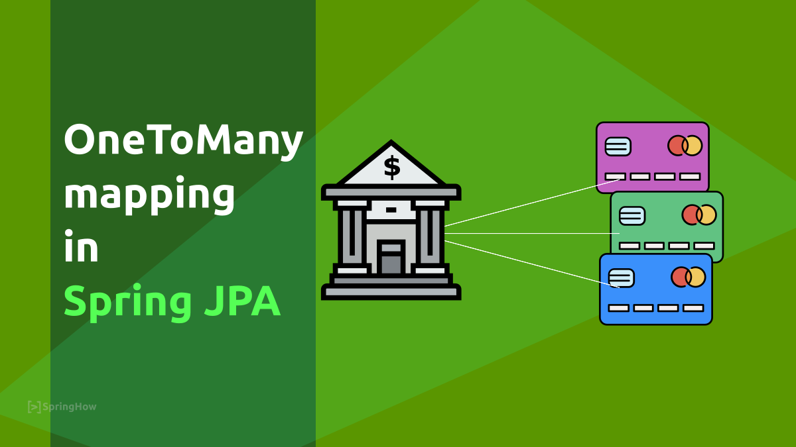

# Spring Data JPA 多表查询


前面的课程我们学习了Spring Data JPA的基本查询，自定义查询、高级查询和原生SQL查询，这些查询对于功能强大的JPA框架来说，无需任何数据访问层和sql语句即可实现完整的数据操作方法。但是这些查询也仅仅局限于单个表，如何实现一对一，一对多，多对多的关联操作呢？接下来，我们将攻克这个难题！

## One to One

一对一的关系在实际应用中非常常见，当操作单个实体的时候，利用JPA的特性对应的关联实体也能够响应的做出更改。通常有两种方式：单项一对一和双向一对一，下面我们分别举例来看：

例如：
用户表和账户表之间是一对一的关系，用户表用来存储用户的基本信息，包括用户名，密码，年龄等个人信息，账户表存储的是用户的账户信息，包括账户余额，账户等级等，一个用户只能拥有一个账户。

```sql
CREATE TABLE `user` (
  `id` INT NOT NULL AUTO_INCREMENT,
  `username` VARCHAR(255) NOT NULL,
  `password` VARCHAR(255) NOT NULL,
  `age` INT NULL,
  `account_id` INT NULL,
  PRIMARY KEY (`id`));
CREATE TABLE `account` (
  `id` INT NOT NULL AUTO_INCREMENT,
  `balance` DOUBLE NOT NULL DEFAULT 0.0,
  `grade` INT NOT NULL DEFAULT 0,
  PRIMARY KEY (`id`));
```

### 单向一对一

单向一对一指的是，在一个实体里面可以查询到另一个实体对象，而在另一个实体对象中无法查到当前实体。比如，用户实体里面有账户信息的引用，而账户信息里面没有用户的引用。

要实现一对一，需要使用两个注解`@OneToOne`和`@JoinColumn`:
* **@OneToOne**: 申明实体的关联关系为一对一。它包含如下几个属性：
  - targetEntity：指定关联的对象的类型，用的情况不多，通常使用属性对象的类型来标注即可。
  - cascade：设置关联关系在哪种持久化操作下有效：
    * ALL：所有持久化操作都执行关联操作，也就是说，如果执行的是删除操作，会把所有关联的数据都删除。
    * PERSIST：只有插入才会执行关联操作
    * MERGE：只有修改才会执行关联操作
    * REMOVE：只有删除才会执行关联操作
  - fetch：配置是否需要懒加载，默认是EAGER，即立刻查询，如果需要懒加载，可以配置为LAZY。
  - optional：限制关联对象不能为空，默认为true，表示可以为空，如果设置为false，表示不能为空。
  - mappedBy：将外键约束放在另一方维护，通常在双向关联中，放弃一方外键的维护。
  - orphanRemoval：关联移除，通常在修改的时候用到，如果其值为true，那么如果将关联的数据设置为null，则表示直接删除，默认为false。
* **@JoinColumn**：标注在连接的属性上，表示是通过那个属性与其他表相关联。

例如：
```java
@Data
@Entity
@Table(name = "user")
public class User {
    @Id
    @GeneratedValue(strategy = GenerationType.IDENTITY)
    private Long id;

    private String username;

    private String password;

    private int age;

    @OneToOne(cascade = CascadeType.ALL)
    @JoinColumn(name = "account_id")
    private Account account;
}

@Entity
@Data
@Table(name = "account")
public class Account {
    @Id
    @GeneratedValue(strategy = GenerationType.IDENTITY)
    private Long id;

    private Double balance;

    private int grade;
}

@Repository
public interface UserRepository extends JpaRepository<User, Long> {
}

@ExtendWith(SpringExtension.class)
@DataJpaTest
@AutoConfigureTestDatabase(replace = AutoConfigureTestDatabase.Replace.NONE)
class UserRepositoryTest {

    @Autowired
    private UserRepository userRepository;

    @BeforeEach
    void init() {
        final Account account = new Account();
        account.setBalance(45d);
        account.setGrade(1);

        final User user = new User();
        user.setUsername("zhangsan");
        user.setPassword("password");
        user.setAge(18);
        user.setAccount(account);

        userRepository.save(user);
    }

    @Test
    void should_can_get_account_by_find_user() {

        final List<User> users = userRepository.findAll();

        assertEquals(1, users.size());
        assertEquals("zhangsan", users.get(0).getUsername());
        assertEquals("password", users.get(0).getPassword());
        assertEquals(18, users.get(0).getAge());
        assertEquals(45d, users.get(0).getAccount().getBalance());
        assertEquals(1, users.get(0).getAccount().getGrade());
    }
}
```

### 双向一对一

双向一对一表示在两个对象任何一方都可以关联到对方，例如查询账户表的时候也可以查询用户表的信息，查询用户表的时候，也可以查询账户表的信息。

实现如下：
```sql
ALTER TABLE `jpa-test`.`account` ADD COLUMN `user_id` INT NULL AFTER `grade`;
```

```java
@Entity
@Data
@Table(name = "account")
public class Account {
    @Id
    @GeneratedValue(strategy = GenerationType.IDENTITY)
    private Long id;

    private Double balance;

    private int grade;

    @OneToOne(cascade = CascadeType.ALL, mappedBy = "account", fetch = FetchType.LAZY)
    @JoinColumn(name = "user_id")
    private User user;
}

@ExtendWith(SpringExtension.class)
@DataJpaTest
@AutoConfigureTestDatabase(replace = AutoConfigureTestDatabase.Replace.NONE)
class UserRepositoryTest {

    @Autowired
    private UserRepository userRepository;

    @BeforeEach
    void init() {
        final Account account = new Account();
        account.setBalance(45d);
        account.setGrade(1);

        final User user = new User();
        user.setUsername("zhangsan");
        user.setPassword("password");
        user.setAge(18);
        user.setAccount(account); // 给用户绑定账户
        account.setUser(user); // 给账户绑定用户

        userRepository.save(user);
    }

    @Test
    void should_can_get_account_by_find_user() {

        final List<User> users = userRepository.findAll();

        assertEquals(1, users.size());
        assertEquals("zhangsan", users.get(0).getUsername());
        assertEquals("password", users.get(0).getPassword());
        assertEquals(18, users.get(0).getAge());
        assertEquals(45d, users.get(0).getAccount().getBalance());
        assertEquals(1, users.get(0).getAccount().getGrade());

        assertEquals("zhangsan", users.get(0).getAccount().getUser().getUsername());
    }
}
```

## One to Many

一对多的场景在实际开发中比较常见，比如用户和订单的关系，一个用户可拥有多个订单。通常我们会在关系型数据库的多的一方(订单表)里面维护关联关系。一对多反过来就是多对一的场景，这两种场景实现也非常简单，下面我们举例说明一下：

* 创建一个订单表：order
```sql
CREATE TABLE `order` (
  `id` INT NOT NULL AUTO_INCREMENT,
  `order_name` VARCHAR(255) NOT NULL,
  `order_time` DATETIME NOT NULL,
  `user_id` INT NULL,
  PRIMARY KEY (`id`));
```

### 一对多

* 一对多的实体对应关系

```java
@Data
@Entity
@Table(name = "order")
public class Order {
    @Id
    @GeneratedValue(strategy = GenerationType.IDENTITY)
    private Long id;

    private String orderName;

    private LocalDateTime orderTime;
}

@Data
@Entity
@Table(name = "user")
public class User {
    @Id
    @GeneratedValue(strategy = GenerationType.IDENTITY)
    private Long id;

    // 省略其他的属性

    // 这里需要注意，fetch的属性默认是lazy
    @OneToMany(cascade = CascadeType.PERSIST, fetch = FetchType.LAZY)
    @JoinColumn(name = "user_id")
    private List<Order> orders;
}
```

* 测试一下
```java
@ExtendWith(SpringExtension.class)
@DataJpaTest
@AutoConfigureTestDatabase(replace = AutoConfigureTestDatabase.Replace.NONE)
class UserRepositoryTest {

    @Autowired
    private UserRepository userRepository;

    @BeforeEach
    void init() {
        final User user = new User();
        user.setUsername("zhangsan");
        user.setPassword("password");
        user.setAge(18);

        Order order1 = new Order();
        order1.setOrderName("zhangsan-order");
        order1.setOrderTime(LocalDateTime.now());

        Order order2 = new Order();
        order2.setOrderName("lisi-order");
        order2.setOrderTime(LocalDateTime.now());

        user.setOrders(Arrays.asList(order1, order2));

        userRepository.save(user);
    }

    @Test
    void should_can_get_all_orders_by_user() {
        final List<User> users = userRepository.findAll();

        assertEquals(1, users.size());
        assertEquals(2, users.get(0).getOrders().size());
    }
}
```

### 多对一

多对一的场景通常是在多的这一方面维护单个对应的实体，例如：

```java
@Data
@Entity
@Table(name = "order")
public class Order {
    @Id
    @GeneratedValue(strategy = GenerationType.IDENTITY)
    private Long id;

    private String orderName;

    private LocalDateTime orderTime;

    @ManyToOne(cascade = CascadeType.ALL)
    @JoinColumn(name = "user_id")
    private User user;
}

public interface OrderRepository extends JpaRepository<Order, Long> {
    List<Order> findOrdersByUser(User user);
}

@ExtendWith(SpringExtension.class)
@DataJpaTest
@AutoConfigureTestDatabase(replace = AutoConfigureTestDatabase.Replace.NONE)
class OrderRepositoryTest {

    @Autowired
    private OrderRepository orderRepository;

    private Long user_id;

    @BeforeEach
    void init() {
        final User user = new User();
        user.setUsername("zhangsan");
        user.setPassword("password");
        user.setAge(18);

        Order order1 = new Order();
        order1.setOrderName("zhangsan-order");
        order1.setOrderTime(LocalDateTime.now());
        order1.setUser(user);

        Order order2 = new Order();
        order2.setOrderName("lisi-order");
        order2.setOrderTime(LocalDateTime.now());
        order2.setUser(user);

        final List<Order> orders = orderRepository.saveAll(Arrays.asList(order1, order2));

        user_id = orders.get(0).getUser().getId();
    }

    @Test
    void should_can_query_orders_by_user() {
        User user = new User();
        user.setId(user_id);
        final List<Order> ordersByUser = orderRepository.findOrdersByUser(user);

        assertEquals(2, ordersByUser.size());
    }
}
```

## 多对多

多对多的场景也是非常常见的，比如学生和课程，一个学生可能有多门课程，一个课程可能有多门学生，课程和学生为多对多的关系，下面我们举例说明：

* 创建学生表，课程表，学生课程关系表
```sql
CREATE TABLE `student` (
  `id` INT NOT NULL AUTO_INCREMENT,
  `name` VARCHAR(255) NOT NULL,
  PRIMARY KEY (`id`));
CREATE TABLE `course` (
  `id` INT NOT NULL AUTO_INCREMENT,
  `name` VARCHAR(255) NOT NULL,
  PRIMARY KEY (`id`));
CREATE TABLE `student-course` (
  `id` INT NOT NULL AUTO_INCREMENT,
  `student_id` INT NOT NULL,
  `course_id` INT NOT NULL,
  PRIMARY KEY (`id`));
```

* 创建学生实体，课程实体
```java
@Data
@Entity
@Table(name="student")
public class Student {
    @Id
    @GeneratedValue(strategy = GenerationType.IDENTITY)
    private Long id;

    private String name;

    @ManyToMany(cascade = CascadeType.ALL, fetch = FetchType.EAGER)
    @JoinTable(
            name = "student-course",
            joinColumns = @JoinColumn(name = "student_id"),
            inverseJoinColumns = @JoinColumn(name = "course_id")
    )
    private List<Course> courses = new java.util.ArrayList<>();
}

@Entity
@Table(name = "course")
@Data
public class Course {
    @Id
    @GeneratedValue(strategy = GenerationType.IDENTITY)
    private Long id;

    private String name;

    @ManyToMany(mappedBy = "courses", fetch = FetchType.EAGER)
    private List<Student> students;
}
```

上面需要说明的是，多对多的关系，一般情况下由一方维护即可。与上面一对一和一对多不同的是，多对多有一个新的注解`@JoinTable`, 用来制定多对多之间的关系表，`name`为表名称，`joinColumns`为当前实体在中间表里面的列，`inverseJoinColumns`为关联实体的列。

* 测试一下

```java
@Repository
public interface StudentRepository extends JpaRepository<Student, Long> {
}

@ExtendWith(SpringExtension.class)
@DataJpaTest
@AutoConfigureTestDatabase(replace = AutoConfigureTestDatabase.Replace.NONE)
class StudentRepositoryTest {

    @Autowired
    private StudentRepository studentRepository;

    @BeforeEach
    void init() {
        Student student1 = new Student();
        student1.setName("zhangsan");

        Student student2 = new Student();
        student2.setName("lisi");

        Course course1 = new Course();
        course1.setName("yuwen");
        course1.setStudents(Arrays.asList(student1, student2));

        Course course2 = new Course();
        course2.setName("shuxue");
        course2.setStudents(Arrays.asList(student1, student2));

        student1.setCourses(Arrays.asList(course1, course2));
        student2.setCourses(Arrays.asList(course1, course2));

        studentRepository.saveAll(Arrays.asList(student1, student2));
    }

    @Test
    void should_can_find_courses_by_students() {
        final List<Student> students = studentRepository.findAll();

        assertEquals(2, students.size());
        assertEquals(2, students.get(0).getCourses().size());
        assertEquals(2, students.get(0).getCourses().get(0).getStudents().size());
    }
}
```