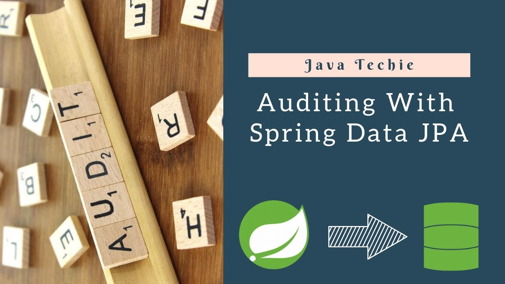

# Spring Data JPA 审计



## 何为审计(Auditing)？

审计本身是一个会计学概念，表示对组织的账簿、账目、文件和凭单进行系统和独立的检查。而要完成这一壮举，就必须就是记录好一件事情的每一个重要阶段，以便于后期检查。在软件中，我们很多时候也用到这种场景，比如一个你在淘宝下单之后，你需要追踪订单的实时状态，什么时候被发货？什么时候到了哪里？等等。

要实现这些功能，在数据层面，我们要审计的内容则重点侧重于何时创建，何人创建，最后一次修改的时间，最后一次修改的人是谁。Spring Data JPA为我们提供了及其简单的实现，我们只需要做简单的配置，然后在实体类上面加上下面四个注释即可：

* **@CreatedBy**：创建人，当实体被insert的时候，会设置值。
* **@CreatedDate**: 创建日期，当实体被insert的时候，会设置值。
* **@LastModifiedBy**：最后一次修改者，当实体每次被update的时候，会设置值。
* **@LastModifiedDate**：最后一次修改日期，当实体每次被update的时候，会设置值。

## 具体实现

#### 让我们先来创建一个测试数据表：
```sql
CREATE TABLE `product` (
  `id` INT NOT NULL AUTO_INCREMENT,
  `name` VARCHAR(255) NOT NULL,
  `price` double NOT NULL,
  `created_by` VARCHAR(255) NOT NULL,
  `created_time` DATETIME NOT NULL,
  `updated_by` VARCHAR(255) NOT NULL,
  `updated_time` DATETIME NOT NULL,
  PRIMARY KEY (`id`));
```

#### Step2: 创建实体
在数据库实体上，我们需要添加注解`@EntityListeners(AuditingEntityListener.class)`, 表示此类被审计监控的类。同时，我们还需要在相关的四个列上面添加上面的四个注解。

```java
@Entity
@Table(name = "product")
@Data
@EntityListeners(AuditingEntityListener.class)
public class Product {
    @Id
    @GeneratedValue(strategy = GenerationType.IDENTITY)
    private Long id;
    private String name;
    private double price;

    @CreatedBy
    private String createdBy;

    @CreatedDate
    private Instant createdTime;

    @LastModifiedBy
    private String updatedBy;

    @LastModifiedDate
    private Instant updatedTime;
}
```

#### Step3：配置创建和修改的者

可以通过Spring的注解`@EnableJpaAuditing`来启动审计配置, 实现接口`AuditorAware<T>`,在实际应用中，此实现类可以从当前上线文，线程，Redis里面获取当前登录用户。

```java
@Configuration
@EnableJpaAuditing
public class JpaAuditingConfiguration {

    @Bean
    public AuditorAware<String> auditorProvider() {
        return () -> Optional.ofNullable("zhangsan");
    }
}
```

#### 测试一下

```java
@SpringBootTest
class ProductRepositoryTest {
    @Autowired
    private ProductRepository productRepository;

    @BeforeEach
    public void initData() {
        Product product = new Product();
        product.setPrice(2.0d);
        product.setName("iphone");

        productRepository.save(product);
    }

    @Test
    void should_can_find_all_products() {
        List<Product> products = productRepository.findAll();

        assertEquals(1, products.size());
        assertEquals("zhangsan", products.get(0).getCreatedBy());
        assertEquals("zhangsan", products.get(0).getUpdatedBy());
        assertNotNull(products.get(0).getCreatedTime());
        assertNotNull(products.get(0).getUpdatedTime());
    }
}
```

在数据库中，我们可以看到下面的数据里面，生成了四个字段：
```bash
mysql> select * from product;
+----+--------+-------+------------+---------------------+------------+---------------------+
| id | name   | price | created_by | created_time        | updated_by | updated_time        |
+----+--------+-------+------------+---------------------+------------+---------------------+
|  1 | iphone |     2 | zhangsan   | 2022-10-29 23:19:41 | zhangsan   | 2022-10-29 23:19:41 |
+----+--------+-------+------------+---------------------+------------+---------------------+
1 row in set (0.00 sec)
```