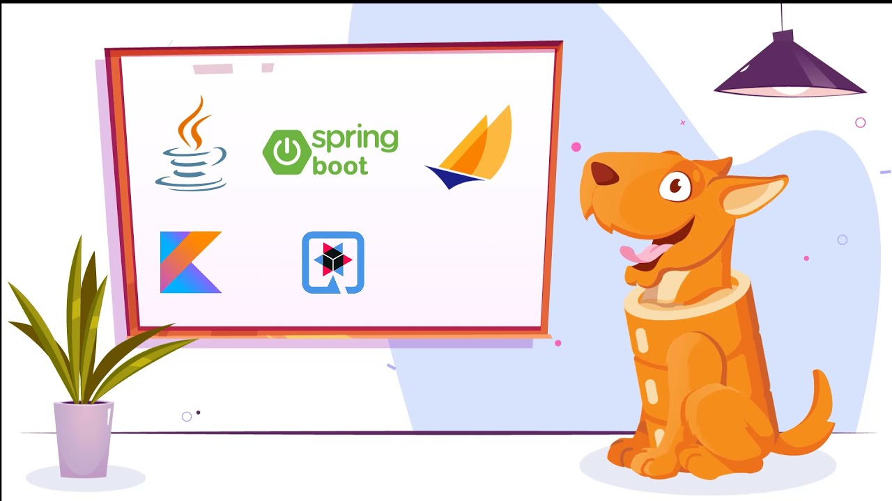

# Spring Data JPA 底层原理



学习源代码是一个枯燥而且乏味的事情，之所以枯燥是因为源代码里面充斥着大量的高级语法和设计模式(如反射，动态代理)等，这些东西如果你不太熟悉Java和Spring的设计原理，阅读起来就比较乏味了！

但是学习底层原理会给你带来以下好处：
1. 让你对框架的认知进一步加深，当你知道为什么这样实现的时候，你再去使用它的时候，就会变得得心应手啦！
2. 为面试加分。虽然在实际的开发过程中，没有哪个功能必须让你了解底层原理之后才能实现，但是面试官却对此情有独钟，一方面可能得原因是面试官想展示自己的博学多才，另一方面可能是想借此机会来深入了解候选人对技术的痴迷程度，以此了解与其他候选人的差距吧！

不管其好处如何，了解源码总有那么一些不可言说的优势，今天，我们就带大家一起来了解一下Spring Data JPA的底层实现原理！

## 动态代理

要深入学习Spring Data JPA的源码，就现需要了解动态代理，动态代码是Spring AOP实现的核心模式，如果不了解这个，就没法了解Spring Data JPA的底层原理。

动态代理是基于代理模式进行拓展的一种设计模式，如果你对此不了解，请先点击[这里](https://github.com/skill-courses/design-patterns/tree/main/src/main/java/structural_patterns/proxy)看看我的教程对代理模式的讲解！

上面的代理模式严格来说应该属于静态代理，静态代理有两个明显的缺点：
1. 会存在大量的冗余的代理类，如果有10个接口，就必须定义10个代理类。
2. 不易维护，一旦接口更改，代理类和目标类都需要更改。

对此，JDK从1.3版本就开始支持动态代理类的创建。主要核心类只有2个：`java.lang.reflect.Proxy`和`java.lang.reflect.InvocationHandler`。

那什么是动态代理呢？

***通俗点说就是：无需声明式的创建Java代理类，而是在运行过程中生成"虚拟"的代理类，被`ClassLoader`加载。从而避免了静态代理那样需要声明大量的代理类。***

举个例子：
* 声明一个Person接口和Student实现类：
```java
public interface Person {
    void wakeup();
    void sleep();
}
public class Student implements Person {
    private String name;

    public Student(String name) {
        this.name = name;
    }

    @Override
    public void wakeup() {
        System.out.println("学生" + this.name + "早晨醒来啦!");
    }

    @Override
    public void sleep() {
        System.out.println("学生" + this.name + "晚上睡觉啦!");
    }
}
```

* 声明代理类
```java
public class JdkProxy implements InvocationHandler {

    private Object bean;

    public JdkProxy(Object bean) {
        this.bean = bean;
    }

    @Override
    public Object invoke(Object proxy, Method method, Object[] args) throws Throwable {
        String methodName = method.getName();
        if (methodName.equals("wakeup")){
            System.out.println("早安~~~");
        }else if(methodName.equals("sleep")){
            System.out.println("晚安~~~");
        }
        return method.invoke(bean, args);
    }
}
```

* 测试使用
```java
JdkProxy proxy = new JdkProxy(new Student("张三"));
Person student = (Person) Proxy.newProxyInstance(proxy.getClass().getClassLoader(), new Class[]{Person.class}, proxy);
student.wakeup();
student.sleep();

结果如下：
早安~~~
学生张三早晨醒来啦!
晚安~~~
学生张三晚上睡觉啦!
```
从上面的代码可以看到，相对于静态代理类来说，无论有多少接口，这里只需要一个代理类。

唯一需要注意的点有以下2点：
1. JDK动态代理是需要声明接口的，创建一个动态代理类必须得给这个”虚拟“的类一个接口。
2. `invoke`方法的`proxy`为代理过之后的对象(并不是原对象)，method为被代理的方法，args为方法的参数。因为处理完附加的功能外，需要执行原有`bean`的方法，以完成代理的职责。

## Repository底层原理与源码

## Spring整合JPA原理

## Spring Boot整合Data JPA

## Spring Data JPA自动配置原理