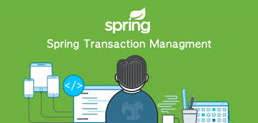

# Spring 事务概述



前面我们学习了数据库的事物，知道了数据库事务的基本概念和隔离级别。而Spring的事物管理器在数据库事务的基础之上做了更高级别的抽象，统一一致的事务抽象是Spring框架的一大优势，无论是全局事务还是本地事务，JTA、JDBC、Hibernate还是JPA，Spring都使用统一的编程模型，使得应用程序可以很容易地在全局事务与本地事务，或者不同的事务框架之间进行切换。

Spring事务具有以下特点：
* 不仅仅支持事务原有的隔离级别，同时加入了事务传播的概念，使得事务与业务的控制更加灵活。
* 可以针对不用的业务，可以更加灵活的配置事务的回滚方式，共享连接和资源管理，合并和隔离多个事物。
* 提供了声明式事务，凭借AOP的优势，让业务代码与事务分离，让事务的控制变得更加灵活！

### 编程式事务 与 声明式事务
Spring 作为 Java 开发中的基础设施，对于事务也提供了很好的支持，总体上来说，Spring 支持两种类型的事务，声明式事务和编程式事务。

编程式事务类似于JDBC事务的写法，需要将事务的代码嵌入到业务逻辑中，这样代码的耦合度较高，而声明式事务通过AOP的思想能够有效的将事务和业务逻辑代码解耦，因此在实际开发中，声明式事务得到了广泛的应用，而编程式事务则较少使用。下面我们简单来回顾一下这两种事务：

通过`TransactionTemplate`或者`TransactionManager`手动管理事务，基本上及时在`try...catch...`中进行业务操作，没问题就commit，有问题就rollback。

例如：
```java
@Autowired
private PlatformTransactionManager transactionManager;

public void testTransaction() {
  TransactionStatus status = transactionManager.getTransaction(new DefaultTransactionDefinition());
    try {
        // ....  业务代码
        transactionManager.commit(status);
    } catch (Exception e) {
        transactionManager.rollback(status);
    }
}
```

编程式事务由于代码入侵太严重了，因为在实际开发中使用的很少，我们在项目中更多的是使用声明式事务。上面的代码如果改写为声明式事务如下：

例如：
```java
@Transactional(propagation=propagation.PROPAGATION_REQUIRED)
public void testTransaction() {
    // ....  业务代码
}
```

上面的代码简单不？这就是声明式事务的优势！

## Spring 事务管理接口

Spring 中对事务的支持提供了三大基础设施，我们先来了解下。

#### TransactionDefinition

用来描述事务的具体规则，也称作事务的属性。主要属性有5种：隔离性、传播性、回滚规则、超时时间、是否只读。后面我们详细介绍。如果开发者使用了编程式事务的话，直接使用默认实现类DefaultTransactionDefinition即可。

#### TransactionStatus
事务的运行状态，可以直接理解为事务本身，该接口源码如下：
```java
public interface TransactionStatus extends SavepointManager, Flushable {
	// 判断当前事务是否是一个新事务
    boolean isNewTransaction();
    // 判断是否存在 savePoint()
	boolean hasSavepoint();
    // 设置事务必须回滚
	void setRollbackOnly();
    // 获取事务只能回滚
	boolean isRollbackOnly();
    // 将底层会话中的修改刷新到数据库，一般用于 Hibernate/JPA 的会话，对如 JDBC 类型的事务无任何影响
	void flush();
    // 获取是一个事务是否结束
	boolean isCompleted();
}
```
#### PlatformTransactionManager

Spring平台事务管理器接口，Spring事务策略的核心。

我们可以把`PlatformTransactionManager`接口可以被看作是事务上层的管理者，而`TransactionDefinition`和`TransactionStatus`这两个接口可以看作是事务的描述。
`PlatformTransactionManager`会根据`TransactionDefinition`的定义比如事务超时时间、隔离级别、传播行为等来进行事务管理 ，而`TransactionStatus`接口则提供了一些方法来获取事务相应的状态比如是否新事务、是否可以回滚等等。

Spring并不直接管理事务，而是提供了多种事务管理器:


`PlatformTransactionManager`接口非常简单，定义了三个方法：
```java
public interface PlatformTransactionManager {
    //获得事务, 是根据传入的 TransactionDefinition 获取一个事务对象
    TransactionStatus getTransaction(@Nullable TransactionDefinition var1) throws TransactionException;
    //提交事务
    void commit(TransactionStatus var1) throws TransactionException;
    //回滚事务
    void rollback(TransactionStatus var1) throws TransactionException;
}
```

可以看到`PlatformTransactionManager`中定义了基本的事务操作方法，这些事务操作方法都是平台无关的，具体的实现都是由不同的子类来实现的。这么做的好处就是我们 Java 程序员只需要掌握好这套标准即可，不用去管接口的具体实现。以 `PlatformTransactionManager`为例，它有众多实现，如果你使用的是JDBC那么可以将`DataSourceTransactionManager`作为事务管理器；如果你使用的是Hibernate，那么可以将 `HibernateTransactionManager`作为事务管理器；如果你使用的是JPA，那么可以将`JpaTransactionManager`作为事务管理器。这些子类都是`PlatformTransactionManager`的具体实现，但是我们并不需要掌握这些具体实现类的用法，我们只需要掌握好 `PlatformTransactionManager`的用法即可。

## Spring Boot 开启事务

前面做了这么多铺垫，那么如何在Spring Boot应用中开启事务呢？非常简单，就做好如下两步即可：

1. 启动类上加上`@EnableTransactionManagement`注解。
```java
@SpringBootApplication
@EnableTransactionManagement
public class TransactionalApplication {
    public static void main(String[] args) {
        SpringApplication.run(TransactionalApplication.class, args);
    }
}
```
2. 在需要事务支持的方法或者类或者接口的抽象方法或者接口类上加上`@Transactional`注解。
```java
@Controller
public class PoetryController {

    @Transactional
    @PostMapping("/register")
    public String register(User user) {
        // 需要事务处理的业务方法
    }
}
```