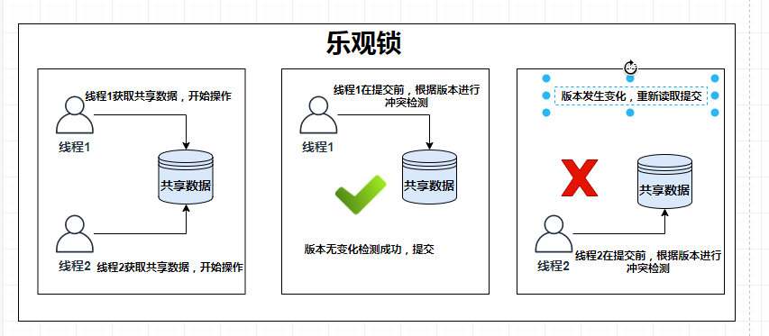
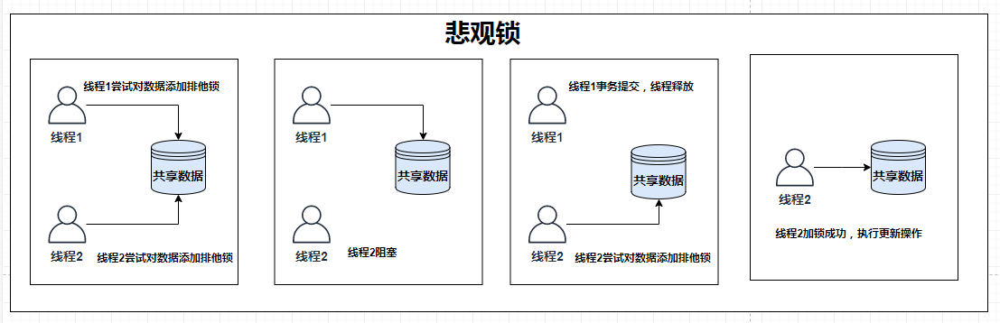

# Spring Boot 锁支持


锁(Lock)是数据库在并发访问时保证数据一致性和完整性的主要机制。

但是数据库并不是需要每时每刻都需要加锁，常见的数据库的并发操作如下：
* **读-读操作：** 此操作不需要加锁。
* **写-写操作：** 此操作需要加锁。
* **读-写操作：** 此操作使用MVCC实现，需要根据情况来选定。

所以，真正需要讨论的是`读写`并发操作，主要有两种思想：乐观锁和悲观锁，下面我们就来深入了解一下！

## 乐观锁

乐观锁在操作数据时非常乐观，认为别的线程不会同时修改数据，所以不会上锁，但是在更新的时候会判断一下在此期间有没有别的线程更新过这个数据。

### 乐观锁的执行流程：
1. 同时存在两个线程A和B，同步获取资源数据，不会加锁，执行各自的操作。
2. 线程A和B在更新同步资源之前，都会判断资源是否被其他线程修改。
3. 如果同步资源没有被其他线程修改，那么直接更新内存中同步资源的值。
4. 如果同步资源被其他线程修改了，那么根据需要执行不同的操作，直接报错或者重试。



### 实现方式：

乐观锁的实现有多重方式，一种是基于CAS的实现，利用操作系统的特性，各大语言均推出了相关的实现，比如Java中的`java.util.concurrent.atomic`包下面的原子变量使用了一种乐观锁的一种CAS实现。

最常见的实现方式是通过Version字段来控制版本号：在数据库表中加上一个数据版本号Version字段，表示数据库被修改的次数。当数据被修改时，Version值会被加1。当线程A需要更新数据时，在读取数据的同时也会读取Version值，在提交新数据时，若刚才读到的Version值与当前数据库的Version值相等时才更新，否则重试更新操作，直到更新成功！

例如，你可以写下面的SQL：
```java
@Query(value = "update client set name = :name, version = version + 1 where id = :id and version = :version", nativeQuery = true)
int updateClinetWithVersion(Long id, String name, Long version);
```
可以看到update的where有一个判断version的条件，并且会set version = version + 1。这就保证了只有当数据库里的版本号和要更新的实体类的版本号相同的时候才会更新数据。

如果你每次都这么写，未免太麻烦，Spring Data JPA提前为我们想到了这一点，所以提供了注解的实现：
```java
@Data
@Entity
public class Client {
    @Id
    @GeneratedValue(strategy = GenerationType.IDENTITY)
    private Long id;

    @Version
    private Long version;
}
```

使用了`@Version`之后，我们不需要再自己写仓库层, 正常使用`findById`,`save`方法即可。

## 悲观锁

悲观锁在操作数据的时候比较悲观，每次去拿数据的时候，都会认为别的线程同时也会修改数据，所以每次在拿数据的时候都会上锁，这样别的线程想拿这个数据就会阻塞直到他拿到锁。

### 悲观锁的执行流程：
1. 多个线程A和B同时尝试获取同步锁。
2. 假设线程A先加锁成功，开始执行对应的操作，那么线程B就只能等待线程A释放锁之后才能继续操作，此时线程B处于阻塞状态。
3. 线程A释放同步锁，然后CPU会唤醒等待的线程，即线程B会再次尝试获取锁。
4. 线程B成功获取锁，再执行自己的操作。



### 实现方式

实现原理很简单: 在`where`语句后面加上`for update`就行了。这样就能锁住这条数据。不过要注意的是，注意查询条件必须要是索引列（这里设置的是id），如果不是索引就会变成表锁，把整个表都锁住。

```java
@Query(value = "select * from client a where a.id = :id for update", nativeQuery = true)
Optional<Client> findClientForUpdate(Long id);
```

JPA有提供一个更简洁的方式，就是`@Lock`注解:
```java
@Lock(value = LockModeType.PESSIMISTIC_WRITE)
@Query("select a from Client a where a.id = :id")
Optional<Client> findClientByIdWithPessimisticLock(Long id);
```

不过，此时需要注意的是：一定要声明事务管理`@Transactional`，不添加注解会报错`no transation`,同时，事务管理的注解一定要包住对数据库的持久化操作。

## 适用场景

从上面的锁定义和实现原理可以看出：
* **乐观锁**：适合读较多的场景，不加锁的特点使其对读操作的性能大幅提升。
* **悲观锁**：适合并发写入较多的场景，先加锁再进行写操作，能保证写操作的数据正确性和一致性，但是性能较差。 