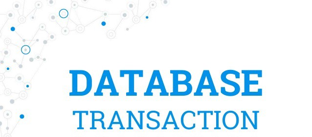
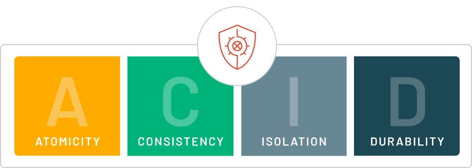
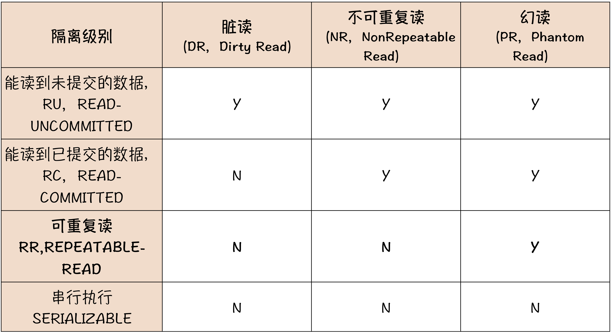

# 数据库事务

***事务(Transaction)是数据库系统中一系列操作的一个逻辑单元，所有操作要么全部成功，要么全部失败！***

事务是区分文件存储系统与NoSql数据库重要的特性之一，其存在的意义是保证即使在并发情况下，也能正确的执行CRUD操作。怎么样才能算是正确的呢？关键在于事务需要保证四个特性：ACID。

## ACID

* **原子性(Atomicity)**

一个事务(transaction)中的所有操作，要么全部完成，要么全部不完成，不会结束在中间某个环节。事务在执行过程中发生错误，会被回滚（Rollback）到事务开始前的状态，就像这个事务从来没有执行过一样。

* **一致性(Consistency)**

事务的一致性指的是在一个事务执行之前和执行之后数据库都必须处于一致性状态。如果事务成功地完成，那么系统中所有变化将正确地应用，系统处于有效状态。如果在事务中出现错误，那么系统中的所有变化将自动地回滚，系统返回到原始状态。

* **隔离性(Isolation)**

指的是在并发环境中，当不同的事务同时操纵相同的数据时，每个事务都有各自的完整数据空间。由并发事务所做的修改必须与任何其他并发事务所做的修改隔离。事务查看数据更新时，数据所处的状态要么是另一事务修改它之前的状态，要么是另一事务修改它之后的状态，事务不会查看到中间状态的数据。

事务隔离分为不同级别，包括读未提交（Read uncommitted）、读提交（read committed）、可重复读（repeatable read）和串行化（Serializable).

* **持久性(Durability)**

指的是只要事务成功结束，它对数据库所做的更新就必须永久保存下来。即使发生系统崩溃，重新启动数据库系统后，数据库还能恢复到事务成功结束时的状态。

## 读状态

在高并发条件下，对于数据库的读状态，有如下概念：

* **脏读(Dirty Reads)**

所谓脏读就是对脏数据（Drity Data）的读取，而脏数据所指的就是未提交的数据。也就是说，一个事务正在对一条记录做修改，在这个事务完成并提交之前，这条数据是处于待定状态的（可能提交也可能回滚），这时，第二个事务来读取这条没有提交的数据，并据此做进一步的处理，就会产生未提交的数据依赖关系。这种现象被称为脏读。

* **不可重复读(Non-Repeatable Reads)**

一个事务先后读取同一条记录，但两次读取的数据不同，我们称之为不可重复读。也就是说，这个事务在两次读取之间该数据被其它事务所修改。

* **幻读(Phantom Reads)**

一个事务按相同的查询条件重新读取以前检索过的数据，却发现其他事务插入了满足其查询条件的新数据，这种现象就称为幻读。

## 数据库隔离级别

MySQL的隔离级别的作用就是让事务之间互相隔离，互不影响，这样可以保证事务的一致性。 但在高并发的情况下，要完全保证ACID特性是非常困难的，除非是把所有的事物串行化执行，但是带来的负面影响将是性能的大打折扣！很多时候，业务对于事务的隔离级别的要求是不一样的，所以，数据库中设计了四种隔离级别，以满足不同业务的要求，以便用户选择！

Oracle中，数据库默认的隔离级别是读已提交`Read Committed`, 而MySQL的隔离级别更高，为可重复读`Repeatable Read`!

* 查看MySQL的默认隔离级别：`SELECT @@tx_isolation;`
* 设置MySQL的隔离级别：`SET tx_isolation='read-uncommitted';`

### 读未提交（READ UNCOMMITTED）

在读未提交隔离级别下，事务A可以读取到事务B修改过但未提交的数据。可能发生脏读、不可重复读和幻读问题，一般很少使用此隔离级别。

例如：

| 步骤 | 事务A | 事务B |
| :---: | :---: | :---: |
| 1 | begin; | select name from student where id = 1; name为lisi  |
| 2 | update student set name='zhangsan' where id = 1; | ---- |
| 3 | ---- | select name from student where id = 1; name为zhangsan |
| 4 | commit; | ---- |
| 5 | ---- | select name from student where id = 1; name为zhangsan |

### 已提交（READ COMMITTED）

在读已提交隔离级别下，事务B只能在事务A修改过并且已提交后才能读取到事务A修改的数据。读已提交隔离级别解决了脏读的问题，但可能发生不可重复读和幻读问题，一般很少使用此隔离级别。

例如：

| 步骤 | 事务A | 事务B |
| :---: | :---: | :---: |
| 1 | begin; | select name from student where id = 1; name为lisi  |
| 2 | update student set name='zhangsan' where id = 1; | ---- |
| 3 | ---- | select name from student where id = 1; name为lisi |
| 4 | commit; | ---- |
| 5 | ---- | select name from student where id = 1; name为zhangsan |

### 可重复读（REPEATABLE READ）

在可重复读隔离级别下，事务B只能在事务A修改过数据并提交后，自己也提交事务后，才能读取到事务B修改的数据。可重复读隔离级别解决了脏读和不可重复读的问题，但可能发生幻读问题。

例如：

| 步骤 | 事务A | 事务B |
| :---: | :---: | :---: |
| 1 | begin; | ----  |
| 2 | update student set name='zhangsan' where id = 1; | begin; |
| 3 | select name from student where id = 1; name为zhangsan | select name from student where id = 1; name为lisi |
| 4 | commit; | ---- |
| 5 | ---- | commit; |
| 6 | ---- | select name from student where id = 1; name为zhangsan |

### 串行化（SERIALIZABLE）

串行化是最高标准，各种问题（脏读、不可重复读、幻读）都不会发生，通过加锁实现（读锁和写锁）。

阻塞级别如下：

| | 事务A 读操作 | 事务A 写操作 |
|:--:|:--:|:--:|
| 事务B 读操作 | 不阻塞 | 阻塞 |
| 事务B 写操作 | 阻塞 | 阻塞 |

下面是四种隔离级别的比较：

