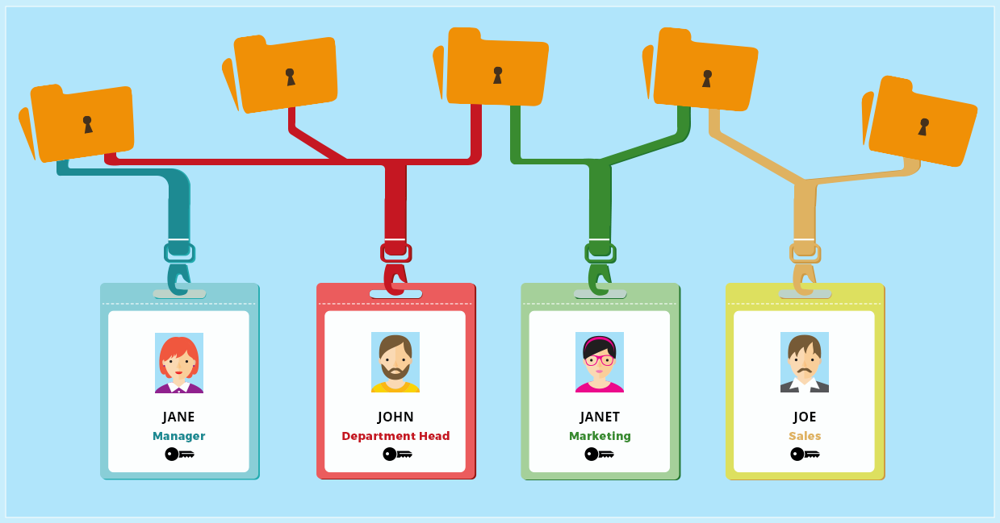
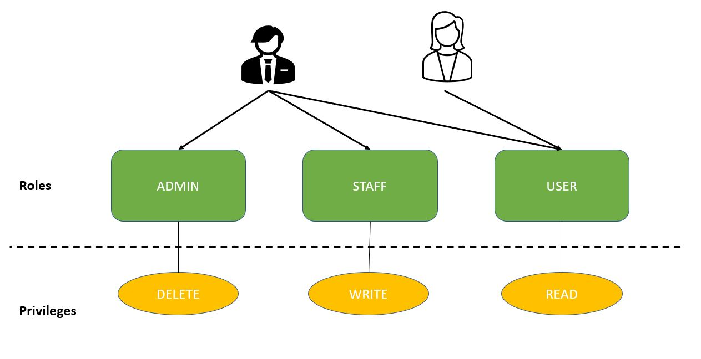
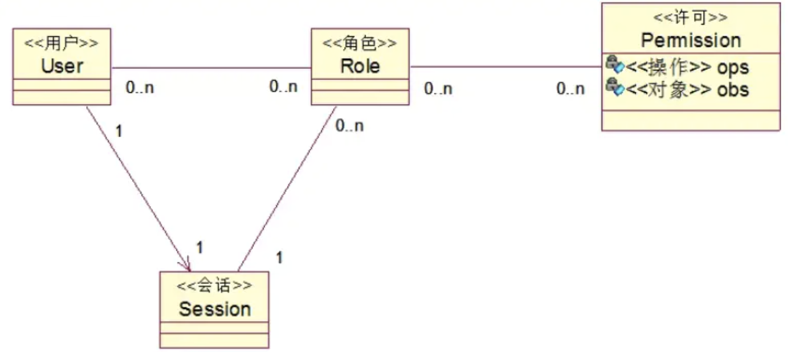

# Spring Security 权限控制



任何系统，在授权中永远绕不开的话题是权限管理，Spring Security目前均支持市面上比较流行的集中权限管理模型，今天我们会就最流行的权限管理模型结合Spring Security举例来实现。

## 权限管理模型概述

目前市面上常用的权限管理模型有这么几个：ACL、RBAC、DAC、MAC 以及 ABAC、PBAC等。这些模型中，最常用的就是ACL和RBAC啦，今天我们就这两个模型进行讲解。

### ACL(Access Control List) 访问控制列表

ACL是一种比较古老的权限控制模型。英文全称是Access Control List，中文称作访问控制列表，这是一种面向资源的访问控制模型，所有的权限配置都是针对资源的。

**它的原理是这样:**

对于系统中的每一个资源，都会配置一个访问列表，这个列表中记录了用户/角色对于资源的CURD权限，当系统需要访问这些资源时，会首先检查列表中是否存在当前用户的访问权限，进而确定当前用户是否可以执行相应的操作。Linux操作系统基于文件的权限管理模型本质上就是ACL。

ACL的使用非常简单，搞明白它的原理自己分分钟就能实现。从这个角度看，Acl是一种粒度非常细的权限控制，它就是专门控制某一个对象的操作权限。所有的这些权限都记录在数据库中，这带来了另外一个问题就是需要维护的权限数据量非常庞大，不利于后期扩展。当然，对于一个简单的系统，使用Acl还是可以的，没有任何问题。

### RBAC（Role-based access control）基于角色的访问控制

RBAC（Role-based access control）是一种以角色为基础的访问控制，它是一种较新且广为使用的权限控制机制，这种机制不是直接给用户赋予权限，而是将权限赋予角色。

RBAC权限模型将用户按角色进行归类，通过用户的角色来确定用户对某项资源是否具备操作权限。RBAC 简化了用户与权限管理的直接耦合，它将用户与角色关联、角色与权限关联、权限与资源关联，这种模式使得用户的授权管理变得非常简单和易于维护。

Ferraiolo和Kuhn两位大佬于 1992 年提出了一种基于通用角色的访问控制模型（看来这个模型比松哥年龄还大），首次提出了RBAC权限模型用来代替传统的MAC和DAC两种权限控制方案，并且就RBAC中的相关概念给出了解释。

#### RBAC 三原则
* 最小权限：给角色配置的权限是其完成任务所需要的最小权限集合。
* 责任分离：通过相互独立互斥的角色来共同完成任务。
* 数据抽象：通过权限的抽象来体现，RBAC支持的数据抽象程度与RBAC的实现细节有关。



#### 基本模型

一般都是分为用户（user），角色（role），权限（permission）三个实体，角色（role）和权限（permission）是多对多的关系，用户（user）和角色（role）也是多对多的关系。用户（user）和权限（permission）之间没有直接的关系，都是通过角色作为代理，才能获取到用户（user）拥有的权限。
一般情况下，使用5张表就够了，3个实体表，2个关系表。




## 与Spring Security结合使用

接下来我们就以RBAC为例子，使用Spring Security来实现！

### Step1 创建表和数据

我们需要创建5张表：用户表(user), 角色表(role), 用户角色关系表(user_role), 权限表(privilege), 角色权限关系表(role-privilege)

此处省略创建表的SQL，创建完成之后，向5张表中插入一些测试数据，此处省略插入基础数据的SQL。

### Step2 创建实体对象和Repository

** 1. User Entity **
```java
@Entity
public class User {
 
    @Id
    @GeneratedValue(strategy = GenerationType.AUTO)
    private Long id;

    private String firstName;
    private String lastName;
    private String email;
    private String password;
    private boolean enabled;
    private boolean tokenExpired;

    @ManyToMany 
    @JoinTable( 
        name = "users_roles", 
        joinColumns = @JoinColumn(
          name = "user_id", referencedColumnName = "id"), 
        inverseJoinColumns = @JoinColumn(
          name = "role_id", referencedColumnName = "id")) 
    private Collection<Role> roles;
}
```

** 2. Role Entity **
```java
@Entity
public class Role {
    @Id
    @GeneratedValue(strategy = GenerationType.AUTO)
    private Long id;

    private String name;
    @ManyToMany(mappedBy = "roles")
    private Collection<User> users;

    @ManyToMany
    @JoinTable(
        name = "roles_privileges", 
        joinColumns = @JoinColumn(
          name = "role_id", referencedColumnName = "id"), 
        inverseJoinColumns = @JoinColumn(
          name = "privilege_id", referencedColumnName = "id"))
    private Collection<Privilege> privileges;
}
```

** 3. Privilege Entity**
```java
@Entity
public class Privilege {
 
    @Id
    @GeneratedValue(strategy = GenerationType.AUTO)
    private Long id;

    private String name;

    @ManyToMany(mappedBy = "privileges")
    private Collection<Role> roles;
}
```

使用Spring Data JPA创建上述几个实体的Repository，此处省略。

### Step3 创建UserService

```java
@Service("userDetailsService")
@Transactional
public class MyUserDetailsService implements UserDetailsService {

    @Autowired
    private UserRepository userRepository;
 
    @Autowired
    private RoleRepository roleRepository;

    @Override
    public UserDetails loadUserByUsername(String email)
      throws UsernameNotFoundException {
 
        User user = userRepository.findByEmail(email);
        if (user == null) {
            return new org.springframework.security.core.userdetails.User(
              " ", " ", true, true, true, true, 
              getAuthorities(Arrays.asList(
                roleRepository.findByName("ROLE_USER"))));
        }

        return new org.springframework.security.core.userdetails.User(
          user.getEmail(), user.getPassword(), user.isEnabled(), true, true, 
          true, getAuthorities(user.getRoles()));
    }

    private Collection<? extends GrantedAuthority> getAuthorities(
      Collection<Role> roles) {
 
        return getGrantedAuthorities(getPrivileges(roles));
    }

    private List<String> getPrivileges(Collection<Role> roles) {
 
        List<String> privileges = new ArrayList<>();
        List<Privilege> collection = new ArrayList<>();
        for (Role role : roles) {
            privileges.add(role.getName());
            collection.addAll(role.getPrivileges());
        }
        for (Privilege item : collection) {
            privileges.add(item.getName());
        }
        return privileges;
    }

    private List<GrantedAuthority> getGrantedAuthorities(List<String> privileges) {
        List<GrantedAuthority> authorities = new ArrayList<>();
        for (String privilege : privileges) {
            authorities.add(new SimpleGrantedAuthority(privilege));
        }
        return authorities;
    }
}
```

后面我们省略用户注册，资源定义，和Spring config的相关代码，此处代码和《Spring Security基于数据库身份认证》的代码一致，请参考。

至此，我们基本上就实现了基于RBAC的权限控制啦！