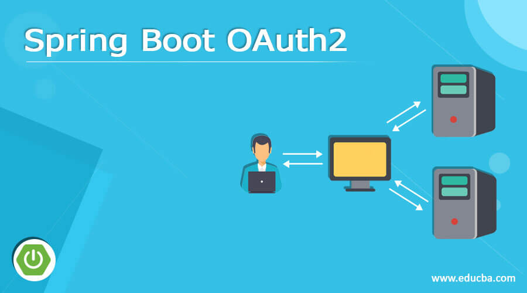
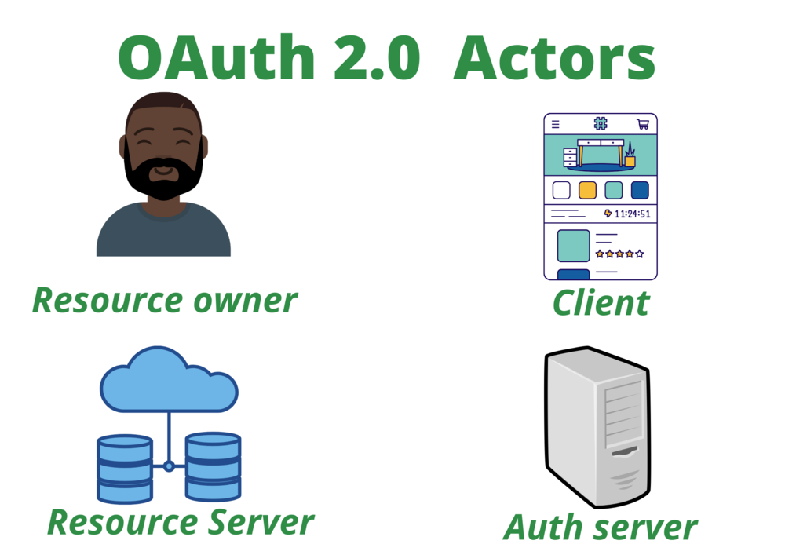
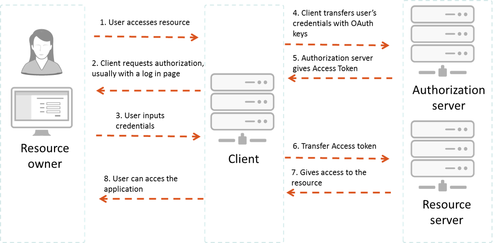

# Spring Security OAuth

当今社会，第三方登录是非常常见的功能，比如我们想访问一个服务，但是又不想登录，经常会使用第三方平台，如微信，Google，Github等来登录，登录之后，我们会授予此服务有限制的访问这些平台上的部分资源，比如头像，用户名，手机号等，但是对于联系人列表，消息等他们将无法访问。这样做的好处是，对于此服务，我们无需注册登录，通过第三方的授权就可以创建用户进而登录，并且在登录的过程中，此服务是无法感知到第三方平台的密码和其他所有信息，安全性较高。

## 什么是OAuth？

OAuth（开放授权）是一个开放标准，允许用户授权第三方移动应用访问他们存储在另外的服务提供者上的信息，而不需要将用户名和密码提供给第三方移动应用或分享他们数据的所有内容，OAuth2.0是OAuth协议的延续版本，但不向后兼容OAuth1.0，即完全废止了OAuth1.0。

简单说，OAuth 就是一种授权机制。数据的所有者告诉系统，同意授权第三方应用进入系统，获取这些数据。系统从而产生一个短期的进入令牌（token），用来代替密码，供第三方应用使用。

### 令牌与密码

令牌（token）与密码（password）的作用是一样的，都可以进入系统，但是有三点差异。
* **令牌是短期的，到期会自动失效，用户自己无法修改**。密码一般长期有效，用户不修改，就不会发生变化。
* **令牌可以被数据所有者撤销，会立即失效**。以上例而言，屋主可以随时取消快递员的令牌。密码一般不允许被他人撤销。
* **令牌有权限范围（scope)**，比如只能进小区的二号门。对于网络服务来说，只读令牌就比读写令牌更安全。密码一般是完整权限。

上面这些设计，保证了令牌既可以让第三方应用获得权限，同时又随时可控，不会危及系统安全。这就是 OAuth 2.0 的优点。

注意，只要知道了令牌，就能进入系统。系统一般不会再次确认身份，所以令牌必须保密，泄漏令牌与泄漏密码的后果是一样的。 这也是为什么令牌的有效期，一般都设置得很短的原因。

### OAuth2.0认证流程

通常来看，OAuth2.0会涉及到四个角色，下面我们给出具体的解释：
* 资源拥有者(Resource Owner): 资源的最终拥有者，通常值的是用户。
* 资源服务器(Resource Server): 存储资源的服务器，资源拥有者会在此服务上存储资源。
* 客户端(Client): 资源的使用者，可以是一个第三方应用。
* 授权服务器(Auth Server): 为用户提供授权的服务器，有时候，资源服务器和授权服务器是同一个。

他们四个角色之间的交互流程如下：

1. 用户想通过Client来访问自己存储在资源服务器上面的资源。
2. Client请求Auth Server，返回给用户一个登录表单用于登录授权。
3. 用户输入登录凭证到这个表单里面，提交。
4. Client携带此凭据向Auth Server请求认证。
5. Auth Server认证成功之后，给Client一个Access Token。
6. Client使用此Token请求Resource Server。
7. Resource Server对此Token请求校验(可能去再次向Auth Server进行认证)。
8. 认证通过之后，给与Client访问资源的权限，Client获取所需资源之后，展示给用户。

### OAuth2.0的四种模式

## 基于Spring Security与GitHub的Autho2.0登录案例

1.http://www.javaboy.org/2020/0413/oauth2-info.html
2.http://www.javaboy.org/2020/0415/oauth2-password-implicit.html
3.http://www.javaboy.org/2020/0417/oauth2-redis.html
4.http://www.javaboy.org/2020/0420/oauth2-authorization-code-video.html
5.https://www.iocoder.cn/Spring-Security/OAuth2-learning/?github
6.https://www.iocoder.cn/Spring-Security/OAuth2-learning-store/?github
7.https://www.iocoder.cn/Spring-Security/OAuth2-learning-sso/?github