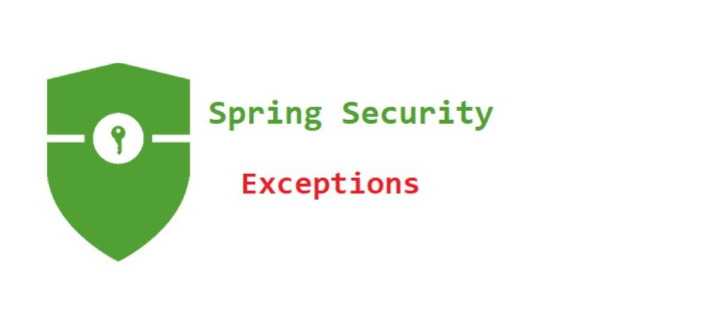
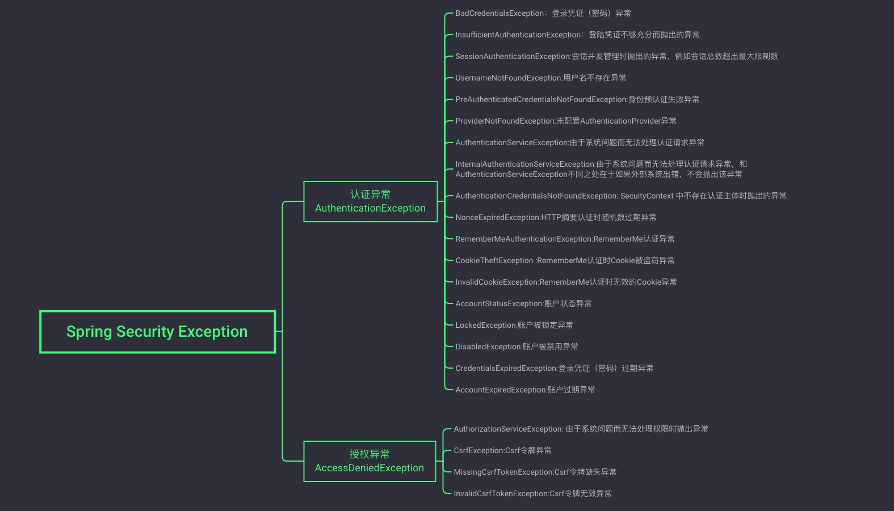

# Spring Security 异常处理



异常处理是任何框架都需要考虑的东西，Spring Security的异常也不例外，今天我们就来简单了解它。

## Spring Security的异常分类

在 Spring Security 的过滤器链中，ExceptionTranslationFilter 过滤器专门用来处理异常，在 ExceptionTranslationFilter 中，我们可以看到，异常被分为了两大类：认证异常和授权异常，两种异常分别由不同的回调函数来处理。



## Spring Security的异常处理逻辑

我们在使用Spring Security时，自定义配置类继承自WebSecurityConfigurerAdapter并重写的`configure(HttpSecurity http)`方法就是在这里调用的，换句话说，当我们去配置HttpSecurity时，其实它已经完成了一波初始化了。

在默认的 HttpSecurity 初始化的过程中，调用`exceptionHandling`方法，这个方法会将ExceptionHandlingConfigurer配置进来，最终调用`ExceptionHandlingConfigurer#configure`方法将ExceptionTranslationFilter 添加到Spring Security过滤器链中。

```java
@Override
public void configure(H http) {
    AuthenticationEntryPoint entryPoint = getAuthenticationEntryPoint(http);
    ExceptionTranslationFilter exceptionTranslationFilter = new ExceptionTranslationFilter(
            entryPoint, getRequestCache(http));
    AccessDeniedHandler deniedHandler = getAccessDeniedHandler(http);
    exceptionTranslationFilter.setAccessDeniedHandler(deniedHandler);
    exceptionTranslationFilter = postProcess(exceptionTranslationFilter);
    http.addFilter(exceptionTranslationFilter);
}
```

可以看到，这里构造了两个对象传入到 ExceptionTranslationFilter 中：
* AuthenticationEntryPoint: 这个用来处理认证异常。
* AccessDeniedHandler: 这个用来处理授权异常。

然后调用`postProcess`方法把`ExceptionTranslationFilter`过滤器注册到Spring容器中，最后调用`addFilter`方法将其添加在Spring Security过滤器链中。

### AuthenticationEntryPoint

AuthenticationEntryPoint 的默认实现类是LoginUrlAuthenticationEntryPoint，因此默认的认证异常处理逻辑就是`LoginUrlAuthenticationEntryPoint#commence`方法，如下：
```java
public void commence(HttpServletRequest request, HttpServletResponse response,AuthenticationException authException) throws IOException, ServletException {
    String redirectUrl = null;
    if (useForward) {
        if (forceHttps && "http".equals(request.getScheme())) {
            redirectUrl = buildHttpsRedirectUrlForRequest(request);
        }
        if (redirectUrl == null) {
            String loginForm = determineUrlToUseForThisRequest(request, response,
                    authException);
            RequestDispatcher dispatcher = request.getRequestDispatcher(loginForm);
            dispatcher.forward(request, response);
            return;
        }
    }
    else {
        redirectUrl = buildRedirectUrlToLoginPage(request, response, authException);
    }
    redirectStrategy.sendRedirect(request, response, redirectUrl);
}
```

从上面的代码片段可以看到，当我们未登录就去访问一个需要登录才能访问的资源时，会自动重定向到登录页面。

### AccessDeniedHandler

AccessDeniedHandler的默认实现类则是AccessDeniedHandlerImpl，所以授权异常默认是在`AccessDeniedHandlerImpl#handle`方法中处理的：
```java
public void handle(HttpServletRequest request, HttpServletResponse response,AccessDeniedException accessDeniedException) throws IOException, ServletException {
    if (!response.isCommitted()) {
        if (errorPage != null) {
            request.setAttribute(WebAttributes.ACCESS_DENIED_403,accessDeniedException);
            response.setStatus(HttpStatus.FORBIDDEN.value());
            RequestDispatcher dispatcher = request.getRequestDispatcher(errorPage);
            dispatcher.forward(request, response);
        }
        else {
            response.sendError(HttpStatus.FORBIDDEN.value(),
                HttpStatus.FORBIDDEN.getReasonPhrase());
        }
    }
}
```

从上面的代码可以看到，如果存在错误页面就直接跳转到错误页面，并设置响应码为403；如果没有错误页面，则直接给出错误响应。

### ExceptionTranslationFilter

默认情况下ExceptionTranslationFilter过滤器在整个Spring Security过滤器链中排名倒数第二，倒数第一是FilterSecurityInterceptor。在FilterSecurityInterceptor中将会对用户的身份进行校验，如果用户身份不合法，就会抛出异常，抛出的异常刚好就在ExceptionTranslationFilter中处理了

下面我们来看下doFilter方法：
```java
 private void doFilter(HttpServletRequest request, HttpServletResponse response, FilterChain chain) throws IOException, ServletException {
    try {
        chain.doFilter(request, response);
    } catch (IOException var7) {
        throw var7;
    } catch (Exception var8) {
        Throwable[] causeChain = this.throwableAnalyzer.determineCauseChain(var8);
        RuntimeException securityException = (AuthenticationException)this.throwableAnalyzer.getFirstThrowableOfType(AuthenticationException.class, causeChain);
        if (securityException == null) {
            securityException = (AccessDeniedException)this.throwableAnalyzer.getFirstThrowableOfType(AccessDeniedException.class, causeChain);
        }

        if (securityException == null) {
            this.rethrow(var8);
        }

        if (response.isCommitted()) {
            throw new ServletException("Unable to handle the Spring Security Exception because the response is already committed.", var8);
        }

        this.handleSpringSecurityException(request, response, chain, (RuntimeException)securityException);
    }

}
```

可以看到，在该过滤器中直接执行了chain.doFilter方法，让当前请求继续执行剩下的过滤器（FilterSecurityInterceptor），然后用一个`try catch`代码块将`chain.doFilter`包裹起来，如果有异常就直接在这里捕获到了.

## 自定义异常

经过上面的分析，我们可以看到异常处理在AuthenticationEntryPoint的`commence`方法 和 AccessDeniedHandler的`handle`方法 中，那么我们只需要自定义AuthenticationEntryPoint和AccessDeniedHandler的实现类，并重写`commence`方法和`handle`方法。

```java
@Component
public class MyAuthenticationEntryPoint implements AuthenticationEntryPoint {
    @Override
    public void commence(HttpServletRequest request, HttpServletResponse response, AuthenticationException authException) throws IOException, ServletException {
        response.getWriter().write("Auth failed:" + authException.getMessage());
    }
}
@Component
public class MyAccessDeniedHandler implements AccessDeniedHandler {
    @Override
    public void handle(HttpServletRequest request, HttpServletResponse response, AccessDeniedException accessDeniedException) throws IOException, ServletException {
        response.setStatus(403);
        response.getWriter().write("Forbidden:" + accessDeniedException.getMessage());
    }
}
```

然后在Spring Security中配置即可：
```java
@Configuration
public class SecurityConfig extends WebSecurityConfigurerAdapter {
    @Override
    protected void configure(HttpSecurity http) throws Exception {
        http.authorizeRequests()
                ...
                ...
                .and()
                .exceptionHandling()
                .authenticationEntryPoint(myAuthenticationEntryPoint)
                .accessDeniedHandler(myAccessDeniedHandler)
                .and()
                ...
                ...
    }
}
```
配置完成后，重启项目，认证异常和授权异常就会走我们自定义的逻辑了.