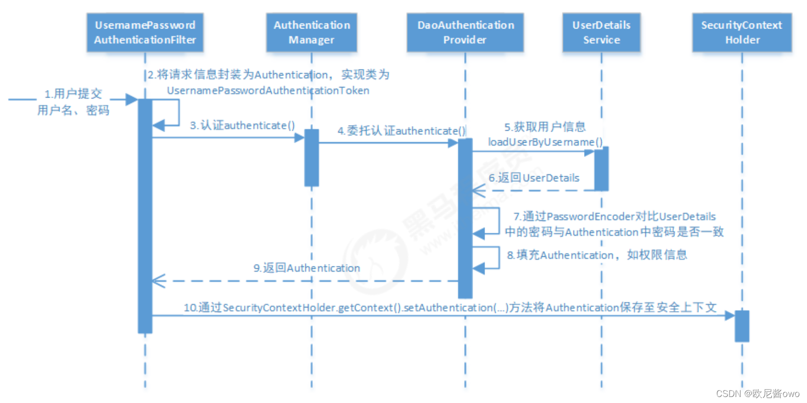

# Spring Security 认证流程

通过前面课程的简单了解，通过简单的配置就可以实现认证功能，感觉非常简单和适用。但是如果你想要对其认证流程自定义的话，可能就不知道从哪里下手了，所以，深入了解和分析Spring Security的认证过程，对我们的实际开发将大有裨益。

抛开Spring Security，如果你自己想做一个简单的Web认证，可能会有以下认证过程：
* 前端将用户名和密码通过POST请求发送给后端
* 后端拿到用户名和密码等相关的信息之后，去指定的地方获取服务端保存的信息
* 将前端的用户名和密码与后端保存的密码等进行对比
* 如果对比成功，就生成一个Token保存在Session中，同时将token以cookie的方式返回给前端，后续前端所有的请求将携带这个cookie
* 如果对比失败，则返回认证异常给前端

上面的流程非常简单，Spring Security 中的认证流程又何尝不是这样的呢？只不过，Spring Security 通过更加统一的抽象接口实现了这样的认证流程。

## Spring Security 认证链解析

设计模式中，有个叫做责任链的设计模式，简单理解为，如果我这边处理不了，就交给下一层级来处理，直到最终有处理的对象将其处理，如果都处理不了，责任链将抛出异常。Spring Security借鉴了这一做法，将认证过程分为两个部分：**过滤器(Filter)** 和**认证管理器(AuthenticationManager)**.

### 过滤器(Filter)

### 认证管理器(AuthenticationManager)

## 自定义过滤器