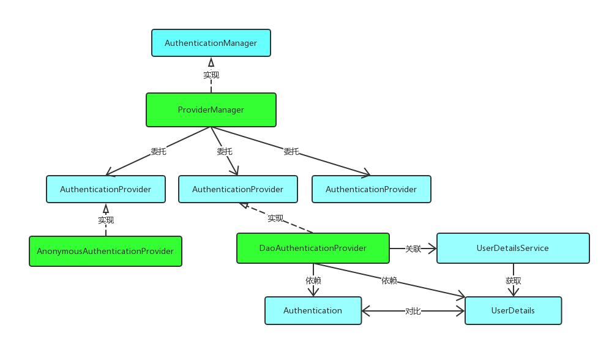

# Spring Security认证管理器


上一节课程的学习可以知道，完成Spring Security的认证有两个重要的部分：**过滤器(Filter)** 和**认证管理器(AuthenticationManager)**， 上节课我们已经学习了过滤器，这节课我们就来学习认证管理器吧。

## 概述

从`UsernamePasswordAuthenticationFilter`里面的方法`attemptAuthentication`中，我们了解到：
```java
public Authentication attemptAuthentication(HttpServletRequest request, HttpServletResponse response)
        throws AuthenticationException {
    if (this.postOnly && !request.getMethod().equals("POST")) {
        throw new AuthenticationServiceException("Authentication method not supported: " + request.getMethod());
    }
    String username = obtainUsername(request);
    username = (username != null) ? username : "";
    username = username.trim();
    String password = obtainPassword(request);
    password = (password != null) ? password : "";
    UsernamePasswordAuthenticationToken authRequest = new UsernamePasswordAuthenticationToken(username, password);
    // Allow subclasses to set the "details" property
    setDetails(request, authRequest);
    return this.getAuthenticationManager().authenticate(authRequest);
}
```

从`request`的参数中取出用户名和密码，封装成`UsernamePasswordAuthenticationToken`对象，交给`AuthenticationManager`的`authenticate`来做认证，认证成功后，`AuthenticationManager`身份管理器返回一个被填充满了信息的（包括上面提到的权限信息，身份信息，细节信息，但密码通常会被移除）`Authentication`实例。

`AuthenticationManager`是一个接口，认证`Authentication`，如果认证通过之后，返回的`Authentication`应该带上该`principal`所具有的`GrantedAuthority`。

```java
public interface AuthenticationManager {
    Authentication authenticate(Authentication authentication)
            throws AuthenticationException;
}
```

该接口的注释中说明，必须按照如下的异常顺序进行检查和抛出：

* `DisabledException`：账号不可用
* `LockedException`：账号被锁
* `BadCredentialsException`：证书不正确

`AuthenticationManager`是一个接口,其实现类较多，我们先大概看一下继承图，有个基本的认知：



如果对Spring Security的这些概念感到理解不能，不用担心，因为这是架构先行(Architecture First)导致的必然结果，先过个眼熟。后面我们将陆续详细地讲解这些实现类的使用场景，源码分析等。

## AuthenticationManager

初次接触Spring Security的朋友相信会被`AuthenticationManager`，`ProviderManager`，`AuthenticationProvider`等这么多相似的Spring认证类搞得晕头转向，但只要稍微梳理一下就可以理解清楚它们的联系和设计者的用意。`AuthenticationManager（接口）`是认证相关的核心接口，也是发起认证的出发点，因为在实际需求中，我们可能会允许用户使用`用户名 + 密码登录`，同时允许用户使用`邮箱 + 密码`，`手机号码 + 密码登录`，甚至，可能允许用户使用指纹登录，所以说`AuthenticationManager`一般不直接认证，此接口的常用实现类`ProviderManager`内部会维护一个`List<AuthenticationProvider>`列表，存放多种认证方式，实际上这是委托者模式的应用（Delegate）。也就是说，核心的认证入口始终只有一个：`AuthenticationManager`，不同的认证方式：`用户名 + 密码（UsernamePasswordAuthenticationToken）`，`邮箱 + 密码`，`手机号码 + 密码登录`则对应了三个`AuthenticationProvider`。这样一来是不是就好理解多了？

那我们先来看看`ProviderManager`的源码，此类实现了基本的认证逻辑：

```java
public class ProviderManager implements AuthenticationManager, MessageSourceAware, InitializingBean {
    private List<AuthenticationProvider> providers = Collections.emptyList();
    @Override
	public Authentication authenticate(Authentication authentication) throws AuthenticationException {
		Class<? extends Authentication> toTest = authentication.getClass();
		AuthenticationException lastException = null;
		AuthenticationException parentException = null;
		Authentication result = null;
		Authentication parentResult = null;
		int currentPosition = 0;
		int size = this.providers.size();
		for (AuthenticationProvider provider : getProviders()) {
			if (!provider.supports(toTest)) {
				continue;
			}
			if (logger.isTraceEnabled()) {
				logger.trace(LogMessage.format("Authenticating request with %s (%d/%d)",
						provider.getClass().getSimpleName(), ++currentPosition, size));
			}
			try {
				result = provider.authenticate(authentication);
				if (result != null) {
					copyDetails(authentication, result);
					break;
				}
			} catch (AccountStatusException | InternalAuthenticationServiceException ex) {
				prepareException(ex, authentication);
				// SEC-546: Avoid polling additional providers if auth failure is due to
				// invalid account status
				throw ex;
			} catch (AuthenticationException ex) {
				lastException = ex;
			}
		}
		if (result == null && this.parent != null) {
			// Allow the parent to try.
			try {
				parentResult = this.parent.authenticate(authentication);
				result = parentResult;
			}
			catch (ProviderNotFoundException ex) {
				// ignore as we will throw below if no other exception occurred prior to
				// calling parent and the parent
				// may throw ProviderNotFound even though a provider in the child already
				// handled the request
			}
			catch (AuthenticationException ex) {
				parentException = ex;
				lastException = ex;
			}
		}
		if (result != null) {
			if (this.eraseCredentialsAfterAuthentication && (result instanceof CredentialsContainer)) {
				// Authentication is complete. Remove credentials and other secret data
				// from authentication
				((CredentialsContainer) result).eraseCredentials();
			}
			// If the parent AuthenticationManager was attempted and successful then it
			// will publish an AuthenticationSuccessEvent
			// This check prevents a duplicate AuthenticationSuccessEvent if the parent
			// AuthenticationManager already published it
			if (parentResult == null) {
				this.eventPublisher.publishAuthenticationSuccess(result);
			}

			return result;
		}

		// Parent was null, or didn't authenticate (or throw an exception).
		if (lastException == null) {
			lastException = new ProviderNotFoundException(this.messages.getMessage("ProviderManager.providerNotFound",
					new Object[] { toTest.getName() }, "No AuthenticationProvider found for {0}"));
		}
		// If the parent AuthenticationManager was attempted and failed then it will
		// publish an AbstractAuthenticationFailureEvent
		// This check prevents a duplicate AbstractAuthenticationFailureEvent if the
		// parent AuthenticationManager already published it
		if (parentException == null) {
			prepareException(lastException, authentication);
		}
		throw lastException;
	}
}
```

看到这段代码，我的第一感觉是Shit，代码晦涩难懂，又臭又长，简直和代码整洁之道背道而驰，里面充斥了各种空判断，各种异常处理，各种注释和各种Loger，职责一点儿都不单一。我个人对超过15行的方法就感到反感，但是这可是Spring Security呀，谁叫人家成功成名了呢，没办法，只能硬着头皮看了。下面我大体给大家说一下这个源码里面讲的是啥逻辑：

1. 首先获取`authentication`的Class，遍历所有`providers`是否支持该`authentication`，如果不支持，则跳出循环。
2. 如果支持，则调用`provider`的`authenticate`方法开始做校验，校验完成后，会返回一个新的Authentication。
3. 这里的`provider`可能有多个，如果`provider`的`authenticate`方法没能正常返回一个Authentication，则调用`provider`的`parent`的`authenticate`方法继续校验。
4. 如果调用`provider`验证成功，则`copyDetails`方法则用来把旧的`Token`的`details`属性拷贝到新的Token`中来。
5. 接下来会调用`eraseCredentials`方法擦除凭证信息，也就是你的密码，这个擦除方法比较简单，就是将`Token`中的`credentials`属性置空。
6. 最后通过`publishAuthenticationSuccess`方法将登录成功的事件广播出去。

大致的流程，就是上面这样，在`for`循环中，第一次拿到的`provider`是一个`AnonymousAuthenticationProvider`，这个`provider`压根就不支持`UsernamePasswordAuthenticationToken`，也就是会直接在`provider.supports`方法中返回`false`，结束`for`循环，然后会进入到下一个`if`中，直接调用`parent`的`authenticate`方法进行校验。