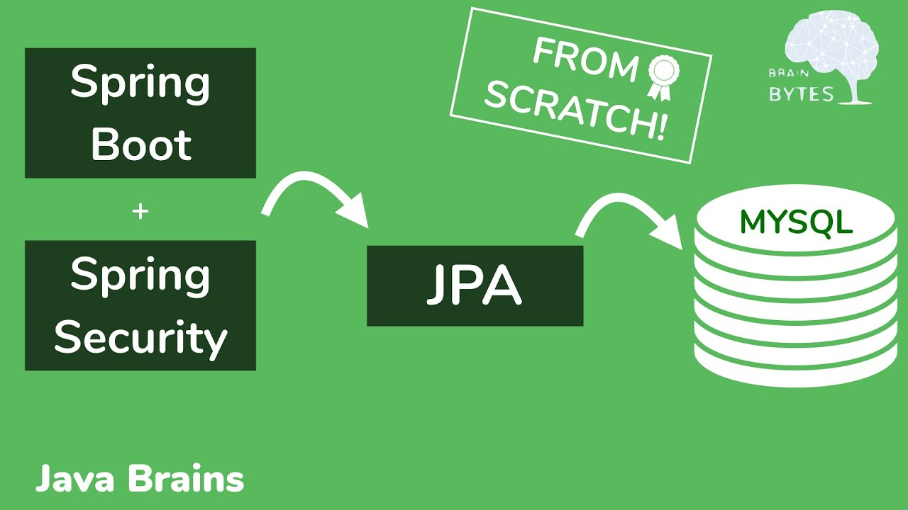
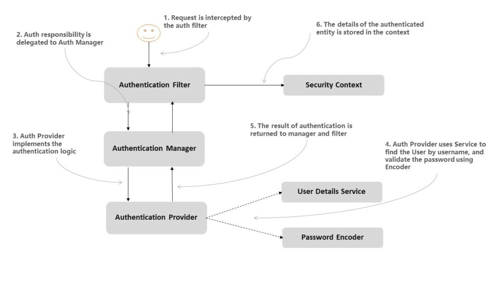
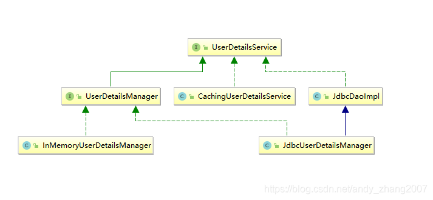

# Spring Security 基于数据库的身份认证



前面我们学习了Spring Security的认证过程，其中包括认证过滤器，认证管理器。其中的用户也是基于内存或者配置来指定的，这显然不适合于项目级别的应用。今天我们就将目光回归的数据层面上来，结合数据库来实现安全认证的控制。



从上图可以看到，`UserDetailService`接口是负责真正的数据源的，Spring Security 支持多种不同的数据源，这些不同的数据源最终都将被封装成`UserDetailsService`的实例。

我们来看下`UserDetailsService`都有哪些实现类:



可以看到，在几个能直接使用的实现类中，除了`InMemoryUserDetailsManager`之外，还有一个`JdbcUserDetailsManager`，使用`JdbcUserDetailsManager`可以让我们通过JDBC的方式将数据库和Spring Security连接起来。

## 基于JDBC的身份认证实现

`JdbcUserDetailsManager`自己提供了一个标准的数据库模型，主要包括如下几个表：

* **users**：用于保存用户的基本信息，包括用户名、用户密码以及账户是否可用。
* **authorities**：用于存储了用户的角色，通过外键将`users`表中的用户名关联起来。其中这个表中的`username`和`authority`是唯一的。

#### Step1: 创建表的SQL如下：
```sql
create table users (
    username varchar(50) not null primary key,
    password varchar(500) not null,
    enabled boolean not null
);

create table authorities (
    username varchar(50) not null,
    authority varchar(50) not null,
    constraint fk_authorities_users foreign key(username) references users(username)
);

create unique index ix_auth_username on authorities (username,authority);
```

#### Step2: 创建表之后，我们需要引入JDBC的依赖和配置数据源：

* 引入依赖
```
implementation 'org.springframework.boot:spring-boot-starter-jdbc'
implementation 'mysql:mysql-connector-java'
```

* 配置数据源
```properity
spring.datasource.username=root
spring.datasource.password=password
spring.datasource.url=jdbc:mysql:///security-database?useUnicode=true&characterEncoding=UTF-8
```

#### Step3: 注入自定义的`UserDetailsService`

在上一节课程中所讲的`SecurityConfig`中，重写`userDetailsService`方法，注入自定义的`UserDetailsService`。

```java
@Configuration
public class SecurityConfig extends WebSecurityConfigurerAdapter {
    @Autowired
    private DataSource dataSource;
    
    @Override
    @Bean
    protected UserDetailsService userDetailsService() {
        JdbcUserDetailsManager manager = new JdbcUserDetailsManager();
        manager.setDataSource(dataSource);
        if (!manager.userExists("javaboy")) {
            manager.createUser(User.withUsername("javaboy").password("123").roles("admin").build());
        }
        if (!manager.userExists("eason")) {
            manager.createUser(User.withUsername("eason").password("123").roles("user").build());
        }
        return manager;
    }
}
```

上面的代码非常简单，首先创建的`DataSource`，使用`JdbcUserDetailsManager`来操作数据库。当容器启动之后，自动注入`UserDetailsService`的实例，然后创建指定的用户。

#### Step4: 基于不同的角色，配置允许其访问的资源

* 创建资源

```java
@RestController
@RequestMapping("/security")
public class SecurityController {
    @GetMapping("/admin/hello")
    public String getAdminHello() {
        return "Hello admin body";
    }

    @GetMapping("/user/hello")
    public String getUserHello() {
        return "Hello user body";
    }
}
```

* 针对不同的角色，在`SecurityConfig`中配置访问权限

```java
@Override
protected void configure(HttpSecurity http) throws Exception {
    http.authorizeHttpRequests()
            .antMatchers("/admin/**").hasRole("admin")
            .antMatchers("/user/**").hasRole("user")
            .anyRequest().authenticated();
}
```

#### Step5: 测试一下：


上面是关于JDBC的实现，下面我们来看看如何基于Spring Data JPA来实现：

## 基于JPA的身份认证实现

基于JPA的实现本质上与JDBC没有什么不同，涉及到的表还是上面的两个，只是多了一个主键Id而已，这次为了测试简单，我们就创建一个`users`表即可。不同点是我们需要定义数据库的Entity和Repository。下面我们就看如何实现：

#### Step1: 创建`uers`表：

```java
create table users (
    id int(4) not null primary key,
    username varchar(50) not null,
    password varchar(500) not null,
    role varchar(50) not null,
    enabled boolean not null
);
```

#### Step2: 引入JPA依赖和配置数据源

* 引入依赖
```
implementation 'org.springframework.boot:spring-boot-starter-data-jpa'
implementation 'mysql:mysql-connector-java'
```

* 配置数据源
```properity
spring.jpa.hibernate.ddl-auto=none
spring.datasource.url=jdbc:mysql://localhost:3306/security
spring.datasource.username=root
spring.datasource.password=password
```

#### Step3：创建User实体类，实现`UserDetails`接口

```java
@Entity
@Table(name = "users")
@Setter
public class User implements UserDetails{
 
    @Id
    @GeneratedValue(strategy = GenerationType.IDENTITY)
    private Long id;
    private String username;
    private String password;
    private String role;
    private boolean enabled;
 
    @Override
    public Collection<? extends GrantedAuthority> getAuthorities() {
        SimpleGrantedAuthority authority = new SimpleGrantedAuthority(getRole());
        return Arrays.asList(authority);
    }

    public Long getId() {
        return this.id;
    }
 
    @Override
    public String getPassword() {
        return this.password;
    }
 
    @Override
    public String getUsername() {
        return this.username();
    }
 
    @Override
    public boolean isAccountNonExpired() {
        return true;
    }
 
    @Override
    public boolean isAccountNonLocked() {
        return true;
    }
 
    @Override
    public boolean isCredentialsNonExpired() {
        return true;
    }
 
    @Override
    public boolean isEnabled() {
        return this.enbled;
    }
}
```

#### Steo4: 定于数据库访问层UserDao

```java
public interface UserDao extends JpaRepository<User,Long> {
    Option<User> findUserByUsername(String username);
}
```

#### Step5: 定义`UserService`实现`UserDetailsService`接口

```java
@Service
public class UserService implements UserDetailsService {
    @Autowired
    private UserDao userDao;
    
    @Override
    public UserDetails loadUserByUsername(String username) throws UsernameNotFoundException {
        return userDao.findUserByUsername(username).orElseThrow(UsernameNotFoundException::new);
    }
}
```

#### Step6: 在`SecurityConfig`添加相关配置:

```java
@Configuration
public class SecurityConfig extends WebSecurityConfigurerAdapter {
    @Autowired
    private UserService userService;

    @Override
    protected void configure(AuthenticationManagerBuilder auth) throws Exception {
        auth.userDetailsService(userService);
    }
}
```

#### Step 7: 定义资源配置访问权限，并测试

定义相关的资源配置和访问权限，与上面`Step4`里面的内容相同，测试的结果也和上面一节的`Step 5`相同，此处不做过多讲解。