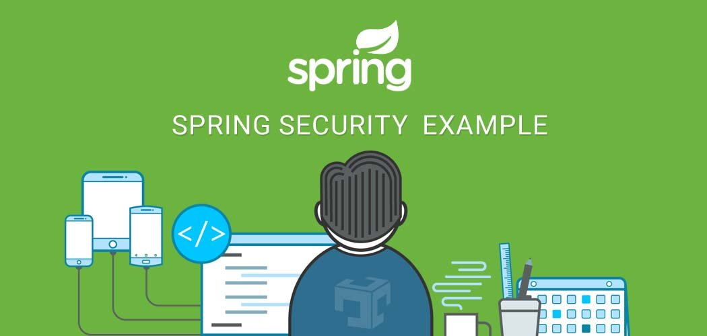

# Spring Security 单用户登录



有时候，系统中会有一种特殊且常见的需求，限制用户仅仅在一台或两台设备上登录，一般来说，这种需求可能出自于安全的考虑，也有时候可能是出自于业务的考虑，比如，爱奇艺的会员账户只允许在两台设备上登录，微信只允许在一台移动设备上登录等。

要实现限制一个用户仅在一台设备上登录，俗称为“单用户登录”，通常有两种思路：
1. 后面登录的用户踢掉前面登录的用户，与微信的登录类似。
2. 已经登录的用户如果没有登出，那么就限制此用户后面的登录。

这两种方式在Spring Security中实现都比较简单，具体选择可以需要看当前业务的需求。

## 实现单用户登录

我们先看看如何让后来登录的用户踢掉前面登录的用户：

### 后登录用户清掉以前登录的用户

Spring Security 有一个配置是对Session的管理，叫做`sessionManagement`, 在这个配置里面，我们只需要将最大会话数量`maximumSessions`设置为1即可。配置如下：

```java
@Configuration
public class SecurityConfig extends WebSecurityConfigurerAdapter {
    @Override
    protected void configure(HttpSecurity http) throws Exception {
        http.headers().and().authorizeHttpRequests()
                .antMatchers("/security/registry").permitAll()
                .and()
                .formLogin()
                .and().authorizeHttpRequests()
                .antMatchers("/security/admin/hello").hasAnyAuthority("admin")
                .antMatchers("/security/user/hello").hasAnyAuthority("user")
                .anyRequest().authenticated()
                .and()
                .csrf().disable()
                .sessionManagement()
                .maximumSessions(1);
    }
}
```
配置完成之后，你可以在两个浏览器分别登录相同的账户，后面登录的用户登录之后，在刷新前面已经登录的用户，这个时候，就会出现如下的错误：
```bash
This session has been expired (possibly due to multiple concurrent logins being attempted as the same user).
```

### 禁止后来的用户登录

如果你想让后面的用户不要登录，那么也非常好办，你只需在上面的配置里面加一个新的配置`maxSessionsPreventsLogin`, 设置为true即可，同时，提供一个新的Bean，用来监听Session的销毁事件的，来及时的清理Session的记录。在该Bean中，可以将Session创建以及销毁的事件及时感知到，并且调用Spring中的事件机制将相关的创建和销毁事件发布出去，进而被Spring Security感知到。

实现如下：

```java
@Configuration
public class SecurityConfig extends WebSecurityConfigurerAdapter {
    @Override
    protected void configure(HttpSecurity http) throws Exception {
        http.headers().and().authorizeHttpRequests()
                .antMatchers("/security/registry").permitAll()
                .and()
                .formLogin()
                .and().authorizeHttpRequests()
                .antMatchers("/security/admin/hello").hasAnyAuthority("admin")
                .antMatchers("/security/user/hello").hasAnyAuthority("user")
                .anyRequest().authenticated()
                .and()
                .csrf().disable()
                .sessionManagement()
                .maximumSessions(1)
                .maxSessionsPreventsLogin(true);
    }
    
    @Bean
    HttpSessionEventPublisher httpSessionEventPublisher() {
        return new HttpSessionEventPublisher();
    }
}
```
这样配置之后，你就可以用两个浏览器来测试登录啦，后面登录的用户将被禁止。

## 源码分析

关于Session的管理，核心的代码逻辑在`ConcurrentSessionControlAuthenticationStrategy`类的`onAuthentication`方法里面，我么来仔细看看这个方法：

```java
@Override
public void onAuthentication(Authentication authentication, HttpServletRequest request,
        HttpServletResponse response) {
    int allowedSessions = getMaximumSessionsForThisUser(authentication);
    if (allowedSessions == -1) {
        // We permit unlimited logins
        return;
    }
    List<SessionInformation> sessions = this.sessionRegistry.getAllSessions(authentication.getPrincipal(), false);
    int sessionCount = sessions.size();
    if (sessionCount < allowedSessions) {
        // They haven't got too many login sessions running at present
        return;
    }
    if (sessionCount == allowedSessions) {
        HttpSession session = request.getSession(false);
        if (session != null) {
            // Only permit it though if this request is associated with one of the
            // already registered sessions
            for (SessionInformation si : sessions) {
                if (si.getSessionId().equals(session.getId())) {
                    return;
                }
            }
        }
        // If the session is null, a new one will be created by the parent class,
        // exceeding the allowed number
    }
    allowableSessionsExceeded(sessions, allowedSessions, this.sessionRegistry);
}

protected void allowableSessionsExceeded(List<SessionInformation> sessions, int allowableSessions,
        SessionRegistry registry) throws SessionAuthenticationException {
    if (this.exceptionIfMaximumExceeded || (sessions == null)) {
        throw new SessionAuthenticationException(
                this.messages.getMessage("ConcurrentSessionControlAuthenticationStrategy.exceededAllowed",
                        new Object[] { allowableSessions }, "Maximum sessions of {0} for this principal exceeded"));
    }
    // Determine least recently used sessions, and mark them for invalidation
    sessions.sort(Comparator.comparing(SessionInformation::getLastRequest));
    int maximumSessionsExceededBy = sessions.size() - allowableSessions + 1;
    List<SessionInformation> sessionsToBeExpired = sessions.subList(0, maximumSessionsExceededBy);
    for (SessionInformation session : sessionsToBeExpired) {
        session.expireNow();
    }
}
```

上面的代码逻辑执行过程如下：
1. 首先获取当前被配置用户登录的所有Sesssion数量，如果配置为-1，表示不受限制，无限登录。
2. 获取当前用户已经存在的Session数量，如果此数量小于被配置的数量，直接登录；如果正好等于被配置的数量，那就先看看当前Session是否不为 null，并且已经存在于Sessions中了，如果已经存在了，那都是自家人，不做任何处理，直接登录；如果当前Session 为null，那么意味着将有一个新的Session 被创建出来，届时当前Session数（SessionCount）就会超过Session并发数（allowedSessions），就交给方法`allowableSessionsExceeded`处理啦。
3. 首先会有`exceptionIfMaximumExceeded`属性，这就是我们在`SecurityConfig`中配置的`maxSessionsPreventsLogin`的值，默认为 false，如果为true，就直接抛出异常，禁止这次登录，那么这次登录就失败了，如果为false，则对Sessions按照请求时间进行排序，然后再使多余的Session过期即可，就相当于踢掉前面已经登录的用户。

这样，我们就明白Spring Security是如何实现单用户登录的啦。

2.http://www.javaboy.org/2020/0508/springboot-vue-session-management.html