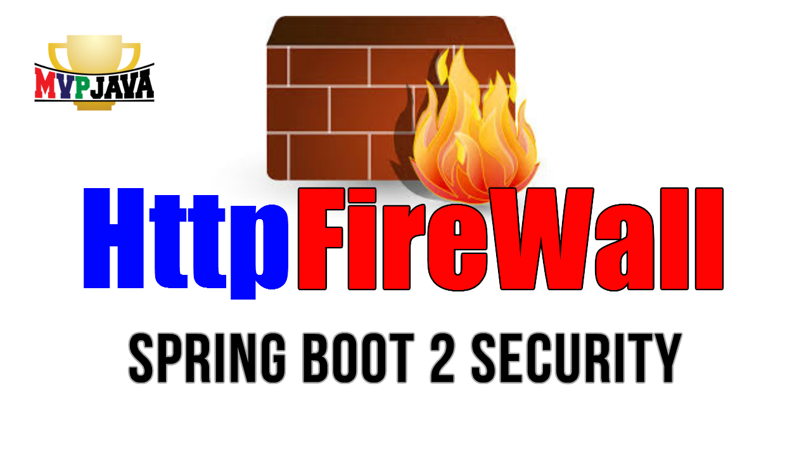
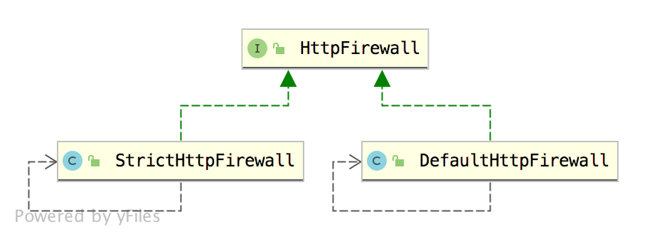

# Spring Security 自带防火墙



我们都知道，Spring Security是一个比较重量级的框架，之所以这么重，是因为它能够给应用程序屏蔽几乎常见的所有攻击，让开发者投入很少的成本就可以获取很高的安全防护。使用它的好处就是，即使不了解这些攻击，也不用担心这些攻击，因为Spring Security已经帮你做好防御工作了。

正所谓：“那有什么岁月静好，只不过有人为你负重前行罢了！”。

在这其中，Spring Security自带的防火墙起到了举足轻重的作用，今天就让我们一起来揭开其神秘的面纱！

## HttpFirewall



Spring Security中提供了一个[HttpFirewall](https://docs.spring.io/spring-security/reference/servlet/exploits/firewall.html), 用来自动处理掉一些非法的请求。从上面的架构图可以看出，`HttpFirewall`接口总共有两个实现类：`StrictHttpFirewall`和`DefaultHttpFirewall`, 前者是严格模式的防火墙设置，后者是默认的防火墙设置，相对于严格模式来说要宽松一些，但也意味着安全系数较低一些。

不过这里需要说明的是，虽然`DefaultHttpFirewall`叫做默认的防火墙设置，但是事实上并不是Spring Security模式的防火墙模式，`StrictHttpFirewall`才是默认的防火墙模式哦~

## 防护策略

`StrictHttpFirewall`的防火策略多而且非常复杂，这里我们就简单来列举一下：

### 限制HTTP请求方法

Spring Security 支持的HTTP请求方法必须是`DELETE`、`GET`、`HEAD`、`OPTIONS`、`PATCH`、`POST`以及`PUT`中的一个，请求才能发送成功，否则的话，就会抛出`RequestRejectedException`异常。这一点你可以从源码中看出来：

```java
private static Set<String> createDefaultAllowedHttpMethods() {
    Set<String> result = new HashSet<>();
    result.add(HttpMethod.DELETE.name());
    result.add(HttpMethod.GET.name());
    result.add(HttpMethod.HEAD.name());
    result.add(HttpMethod.OPTIONS.name());
    result.add(HttpMethod.PATCH.name());
    result.add(HttpMethod.POST.name());
    result.add(HttpMethod.PUT.name());
    return result;
}
```

如果你要对其他HTTP请求放行或者进一步限制HTTP请求的方法，那么你可以自定义`StrictHttpFirewall`即可：

```java
@Bean
HttpFirewall httpFirewall() {
    StrictHttpFirewall firewall = new StrictHttpFirewall();
    // firewall.setUnsafeAllowAnyHttpMethod(true); 对所有HTTP请求方法放行
    List<String> methods = Arrays.asList(HttpMethod.DELETE.name(), HttpMethod.GET.name(), HttpMethod.PUT.name(), HttpMethod.POST.name());
    firewall.setAllowedHttpMethods(methods);
    return firewall;
}
```

### 请求地址里面不能有分号

正常的HTTP请求的URL里面一般是不含有分号的，如果有了分号，就会请求失败。如果你想设置为可以识别分号，只需要设置如下方法`setAllowSemicolon`即可。

```java
@Bean
HttpFirewall httpFirewall() {
    StrictHttpFirewall firewall = new StrictHttpFirewall();
    firewall.setAllowSemicolon(true);
    return firewall;
}
```

### 必须是标准化URL

什么是标准化的URL？标准化的URL必须要从四个方面来判断，包括URI，request Path，servlet Path，context Path。我们从源码上可以看到：

```java
private static boolean isNormalized(HttpServletRequest request) {
	if (!isNormalized(request.getRequestURI())) {
		return false;
	}
	if (!isNormalized(request.getContextPath())) {
		return false;
	}
	if (!isNormalized(request.getServletPath())) {
		return false;
	}
	if (!isNormalized(request.getPathInfo())) {
		return false;
	}
	return true;
}
```

### 双斜杠(//)，百分号(%), 反斜杠(\)，点(.) 都不被允许

如果一个HTTP请求的URL里面包含了双斜杠(//)，百分号(%), 反斜杠(\)，点(.)的任意一种，HttpFireWall都讲拒绝此请求，如果你需要放开这些限制，请做如下配置：

```java
@Bean
HttpFirewall httpFirewall() {
    StrictHttpFirewall firewall = new StrictHttpFirewall();
    firewall.setAllowUrlEncodedDoubleSlash(true); // 双斜杠
    firewall.setAllowUrlEncodedPercent(true); // 百分号
    firewall.setAllowBackSlash(true); // 反斜杠
    firewall.setAllowUrlEncodedSlash(true);
    firewall.setAllowUrlEncodedPeriod(true); // 点号
    return firewall;
}
```

***特别注意：虽然我们可以手动修改Spring Security中的这些限制，但是不建议大家做任何修改，每一条限制都有它的原由，每放开一个限制，就会带来未知的安全风险。***

## 两种资源放行策略

Spring Security中，常见的资源放行策略有两种，第一种就是在 configure(WebSecurity web) 方法中配置放行，像下面这样：

```java
@Override
public void configure(WebSecurity web) throws Exception {
    web.ignoring().antMatchers("/css/**", "/js/**", "/index.html", "/img/**", "/fonts/**", "/favicon.ico", "/verifyCode");
}
```

第二种方式是在configure(HttpSecurity http) 方法中进行配置：

```java
@Override
protected void configure(HttpSecurity http) throws Exception {
    http.headers().and().authorizeHttpRequests()
            .antMatchers("/security/registry").permitAll()
            .and()
            .formLogin()
            .and().authorizeHttpRequests()
            .antMatchers("/security/admin/hello").hasAnyAuthority("admin")
            .antMatchers("/security/user/hello").hasAnyAuthority("user")
            .anyRequest().authenticated()
            .and()
            .csrf().disable();
}
```

两种方式最大的区别在于，第一种方式是不走 Spring Security 过滤器链, 不需要通过验证，例如前端页面的静态资源，就可以按照第一种方式配置放行。

第二种方式是需要走过滤链，在过滤器链中，给请求放行。例如登录接口。大家知道，登录接口也是必须要暴露出来的，不需要登录就能访问到的，但是我们却不能将登录接口用第一种方式暴露出来，登录请求必须要走 Spring Security 过滤器链，因为在这个过程中，需要交换Session，获取当前线程的用户等等。