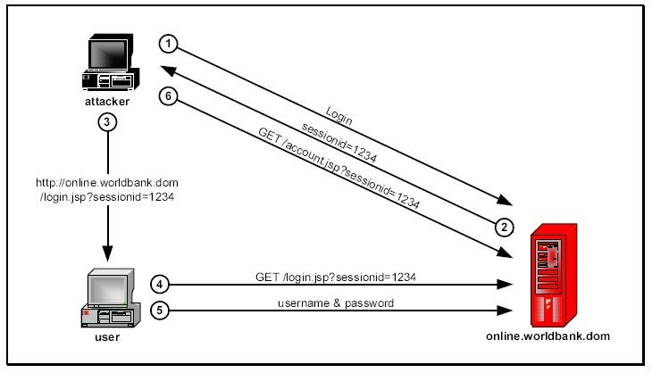
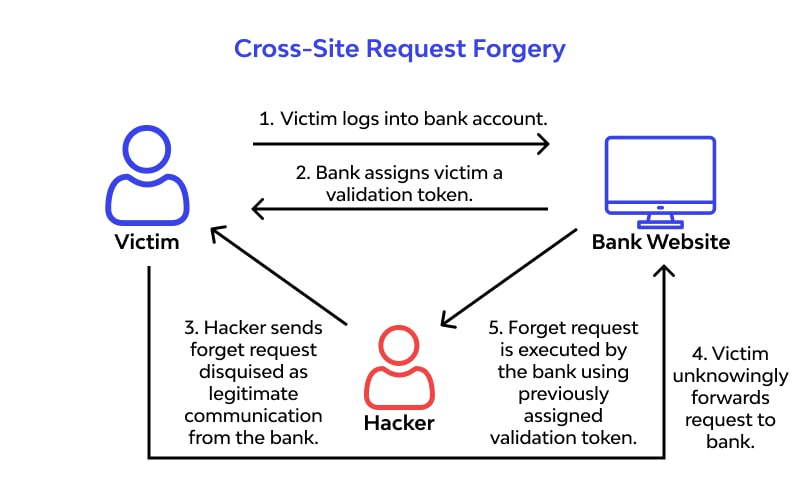

# Spring Security 处理常见攻击


通过前面的课程，我们学习防火墙的时候，知道Spring Security的强大之处在于其能够防御常见的多种网络攻击，例如会话固定攻击、跨域请求伪造等。今天我们就来简单了解如何使用Spring Security来防御这些常见的网络攻击。

## 会话固定攻

会话固定攻击（session fixation attack）是利用应用系统在服务器的会话ID固定不变机制，借助他人用相同的会话ID获取认证和授权，然后利用该会话ID劫持他人的会话以成功冒充他人，造成会话固定攻击。

这听起来有点抽象，我们先来了解一个基本的概念--HttpSession：HttpSession 是一个服务端的概念，服务端生成的 HttpSession 都会有一个对应的sessionid，这个sessionid会通过cookie传递给前端，前端以后发送请求的时候，就带上这个 sessionid参数，服务端看到这个sessionid就会把这个前端请求和服务端的某一个HttpSession对应起来，形成“会话”的感觉。

但是，需要知道的是，浏览器关闭并不会导致服务端的HttpSession失效，想让服务端的HttpSession失效，要么手动调用服务器提供的失效方法；要么等到session自动过期；要么重启服务端。

正常来说，只要你不关闭浏览器，并且服务端的 HttpSession 也没有过期，那么维系服务端和浏览器的 sessionid 是不会发生变化的，而会话固定攻击，则是利用这一机制，借助受害者用相同的会话 ID 获取认证和授权，然后利用该会话 ID 劫持受害者的会话以成功冒充受害者，造成会话固定攻击。

会话固定攻击的常见流程如下：



1. 攻击者(Attacker)以一个合法的用户身份登录在线网站(online.worldbank.com)
2. 攻击者(Attacker)登录成功之后与服务器建立了一个会话，例如sessionId为1234.
3. 攻击者(Attacker)用该会话(sessionId)构造了一个URL(https://www.online.worldbank.com/login.html?sessionId=1234),发送给普通其他用户。
4. 普通用户点击该连接进行了登录。
5. 普通用户使用了用户名和密码登录成功之后， 建立成功的会话被原先的攻击者(Attacker)劫持(被预设为sessionId=1234)。
6. 攻击者(Attacker)用该会话(sessionId)成功冒充并劫持了普通用户的会话，使用此会话来操作普通用户的资源。

### 会话攻击的实现方式

一般来说，会话固定可以通过下面几种方式实现。
1. 在URL中注入Session ID，这是最简单的一种方式，当然也最容易被检测到。
2. 用隐藏的表单字节。攻击者可以构造一个很像登录方式的登录表单并设定Session ID，然后诱惑用户登录。
3. 通过跨站脚本用客户端脚本来设定Cookie，如攻击者可以构造一个链接如下：http://www.buybook.com/viewprofile.jsp?p=30。

### Spring Security对会话固定攻击的防御策略

如果你使用了Spring Security，其实是不用担心这个问题的，因为Spring Security中默认已经做了防御工作了。

Spring Security 中的防御主要体现在三个方面：
1. 默认的防火墙(StrictHttpFirewall)会轻松过滤URL中包含分号(;)的。
2. 对Http Response的Set-Cookie字段中有HttpOnly属性，这种方式避免了通过 XSS 攻击来获取 Cookie 中的会话信息进而达成会话固定攻击。
3. 登录成功之后，创建一个新的会话，重新生成新的SessionId。Spring Security默认有四个选项用来设置这个：
  * migrateSession：表示在登录成功之后，创建一个新的会话，然后讲旧的session中的信息复制到新的session中，默认即此。
  * none：表示不做任何事情，继续使用旧的session。
  * changeSessionId：表示session不变，但是会修改sessionid，这实际上用到了Servlet容器提供的防御会话固定攻击。
  * newSession：表示登录后创建一个新的session

```java
@Override
protected void configure(HttpSecurity http) throws Exception {
    http.headers().and().authorizeHttpRequests()
            .antMatchers("/security/registry").permitAll()
            .and()
            .formLogin()
            .and().authorizeHttpRequests()
            .antMatchers("/security/admin/hello").hasAnyAuthority("admin")
            .antMatchers("/security/user/hello").hasAnyAuthority("user")
            .anyRequest().authenticated()
            .and()
            .csrf().disable()
            .sessionManagement()
            .maximumSessions(1)
            .maxSessionsPreventsLogin(true)
            .and()
            .sessionFixation()
            .migrateSession();
}
```

## 跨域请求伪造

CSRF就是跨域请求伪造，英文全称是Cross Site Request Forgery。

CSRF是一个非常场景的攻击方式，防御方式也比较简单，但是经常被开发者忽略。下面我们先来了解啥是跨域请求伪造。



其实这个流程很简单：
1. 普通用户打开了某个网上银行的网站，并且登录。
2. 登录成功后，网上银行会返回Cookie给前端，浏览器将Cookie保存下来。
3. 用户在没有登出网上银行的情况下，在浏览器里边打开了一个新的选项卡，然后又去访问了一个危险网站。
4. 这个危险网站上有一个超链接，超链接的地址指向了这个网上银行。
4. 用户点击了这个超链接，由于这个超链接会自动携带上浏览器中保存的Cookie，所以用户不知不觉中就访问了网上银行，进而可能给自己造成了损失。

### 预防策略


2.http://www.javaboy.org/2020/0519/springsecurity-csrf.html