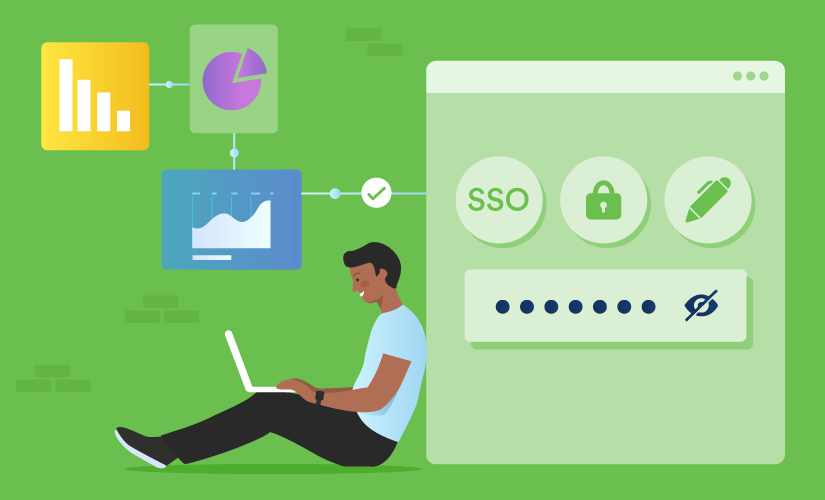
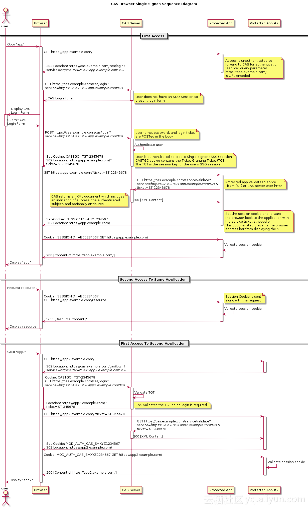
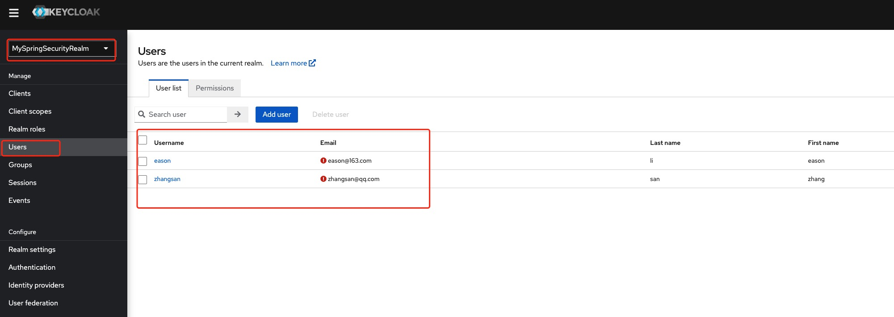
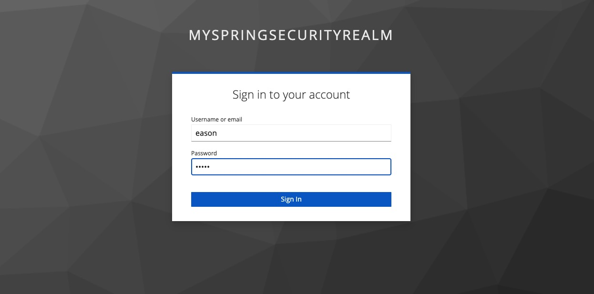

# Spring Security 单点登录




一般对于小型公司，可能内部系统很少，每个系统都使用用户名和密码登录的方式，但是一旦公司开发发展壮大的时候，就会存在很多内部系统，如果每个系统都拥有不同的用户名和密码，那么对于员工来说就很繁琐，明明都是这一个用户在使用系统，却要多次登录；当然，更麻烦的是如果员工离职了，那么每个系统还要各自删除该员工的账户信息。这种登录方式弊端的根源是“用户的登录状态无法实现共享”。那么今天我们说的单点登录(Single Sign On)就能够解决这样的问题。

## 何为单点登录？

单点登录(SSO)是一种身份认证方法，用户一次可通过一组登录凭证登入会话，在该次会话期间无需再次登录，即可安全访问多个相关的应用程序和服务。

简单来理解就是：在多个应用系统中，只需要登录一次，就可以访问其他相互信任的应用系统。

SSO通常用于管理一些环境中的身份认证，包括企业内部网或外部网、学生门户网站、公有云服务以及用户需要使用多个应用程序以完成工作的其他环境。 它还越来越多地用于面向客户的网站和应用程序（如银行和电子商务网站），将第三方供应商提供的应用程序打造成无缝、不间断的用户体验。

### SSO身份验证的一般工作原理是： 
1. 用户使用 SSO 登录凭证登录到一个可信的应用程序或连接所有可信应用程序的中央门户网站（如员工门户网站或学生网站）。
2. 用户成功通过身份验证后，SSO 解决方案将生成一个会话身份验证令牌，其中包含关于用户身份（用户名、电子邮件地址等）的特定信息。 该令牌会存储在用户的 Web 浏览器或 SSO 或 IAM 服务器上。
3. 用户尝试访问其他可信的应用程序中时，该应用程序会检查 SSO 或 IAM 服务器，以确定用户是否通过会话身份验证。 若通过，SSO 解决方案会使用由数字证书签署的身份验证令牌来验证用户，并为用户提供该应用程序的访问权限。 若未通过，则会提示用户重新输入登录凭证。

### SSO身份验证的基本工作原理：

一般情况下，SSO的身份认证信息都存储在CAS服务器上，CAS 全称叫做中央认证服务，英文是 Central Authentication Service。CAS分为两部分：一个是CAS Server，这是单点验证服务，用来校验用户名/密码等，一般来说都是独立部署。另一个则是CAS Client，相当于就是一个一个的应用服务。

SSO的常见登录流程如下：



上图是CAS官网上的标准流程，具体流程如下：

1. 用户访问app系统，app系统是需要登录的，但用户现在没有登录。
2. 跳转到CAS server，即SSO登录系统，以后图中的CAS Server我们统一叫做SSO系统。 SSO系统也没有登录，弹出用户登录页。
2. 用户填写用户名、密码，SSO系统进行认证后，将登录状态写入SSO的session，浏览器（Browser）中写入SSO域下的Cookie。
3. SSO系统登录完成后会生成一个ST（Service Ticket），然后跳转到app系统，同时将ST作为参数传递给app系统。
4. app系统拿到ST后，从后台向SSO发送请求，验证ST是否有效。
5. 验证通过后，app系统将登录状态写入session并设置app域下的Cookie。

至此，跨域单点登录就完成了。以后我们再访问app系统时，app就是登录的。接下来，我们再看看访问app2系统时的流程。

1. 用户访问app2系统，app2系统没有登录，跳转到SSO。
2. 由于SSO已经登录了，不需要重新登录认证。
3. SSO生成ST，浏览器跳转到app2系统，并将ST作为参数传递给app2。
4. app2拿到ST，后台访问SSO，验证ST是否有效。
5. 验证成功后，app2将登录状态写入session，并在app2域下写入Cookie。

这样，app2系统不需要走登录流程，就已经是登录了。SSO，app和app2在不同的域，它们之间的session不共享也是没问题的

## 搭建SSO认证流程

从上面SSO的流程可以看出，要搭建SSO认证，必须先搭建一个中央认证服务器CAS，下面我们先来搭建这个：

### 搭建CAS

为了简单起见，可以自己搭建一套CAS，目前比较简单的中央认证服务有[keycloak](https://www.keycloak.org/), 可以使用Docker将其pull下来启动起来，相关的启动文档参考这里：[Docker start](https://www.keycloak.org/getting-started/getting-started-docker).

按照操作步骤，拉取镜像，使用用户名admin，密码也是admin,来启动：
```bash
docker run -p 8080:8080 -e KEYCLOAK_ADMIN=admin -e KEYCLOAK_ADMIN_PASSWORD=admin quay.io/keycloak/keycloak:19.0.1 start-dev
```

启动完成之后，访问`http://localhost:8080/admin`使用admin来登录，配置`realm`为`MySpringSecurityRealm`, `client`为`SpringSecuritySSO`, 创建两个角色(Admin、User)和两个用户(eason, zhangsan), 然后将`eason`设置为`Admin`, `zhangsan`设置为`User`即可。




### 搭建应用程序

#### Step1: 添加依赖

`keycloak`非常友好的为Spring Boot提供了兼容的`starter(keycloak-spring-boot-starter)`, 我们只需要加入进去即可。

```bash
implementation 'org.springframework.boot:spring-boot-starter-security'
implementation 'org.springframework.boot:spring-boot-starter-web'
implementation 'org.keycloak:keycloak-spring-boot-starter:19.0.1'
implementation 'org.projectlombok:lombok:1.18.16'
testImplementation 'org.springframework.boot:spring-boot-starter-test'
testImplementation 'org.springframework.security:spring-security-test'
```

#### Step2：配置keycloak的属性

在`application.yml`里面配置中央认证服务的地址和相关信息：

```yml
server:
  port: 9091

keycloak:
  auth-server-url: http://localhost:8080
  realm: MySpringSecurityRealm
  resource: SpringSecuritySSO
  public-client: true
```

#### Step3: 配置SecurityConfig

```java
@KeycloakConfiguration
public class KeycloakSecurityConfig extends KeycloakWebSecurityConfigurerAdapter {

    @Autowired
    public void configureGlobal(AuthenticationManagerBuilder auth) {
        KeycloakAuthenticationProvider keycloakAuthenticationProvider = new KeycloakAuthenticationProvider();
        //SimpleAuthorityMapper adds the prefix ROLE_ to keycloak roles.
        keycloakAuthenticationProvider.setGrantedAuthoritiesMapper(new SimpleAuthorityMapper());
        auth.authenticationProvider(keycloakAuthenticationProvider);
    }

    @Bean
    @Override
    protected SessionAuthenticationStrategy sessionAuthenticationStrategy() {
        return new RegisterSessionAuthenticationStrategy(new SessionRegistryImpl());
    }

    @Override
    protected void configure(HttpSecurity http) throws Exception {
        super.configure(http);
        http.authorizeRequests()
                .antMatchers("/security/hello").permitAll()
                .antMatchers("/security/admin/hello").hasRole("Admin")
                .antMatchers("/security/user/hello").hasRole("User")
                .anyRequest().authenticated()
                .and().exceptionHandling().accessDeniedPage("/security/access-denied-response");
    }
}
```

上面的说明如下：

* `@KeycloakConfiguration`: This annotation has Configuration, ComponentScan for KeycloakSecurityComponents and EnableWebSecurity.
* `Authentication Manager`: Set KeycloakAuthenticationProvider to the authentication manager.
* `SimpleAuthorityMapper`: It adds the prefix ROLE_ to keycloak roles.
* `KeycloakConfigResolver()`: It uses application.properties instead of default WEB-INF/keycloack.json.
* `configure()`: Override the configure() method and set the roles to the rest endpoints, and for invalid roles and exceptions set denied response.

#### Step4: 配置KeycloakConfig

如果你使用的`keycloak-spring-boot-starter`的版本大于17，就需要单独配置`KeycloakConfigResolver`, 配置如下：

```java
@Configuration
public class KeycloakConfig {

    @Bean
    public KeycloakSpringBootConfigResolver keycloakConfigResolver() {
        return new KeycloakSpringBootConfigResolver();
    }
}
```

#### Step5: 提供访问的资源

```java
@RestController
@RequestMapping("/security")
public class SecurityController {

    @GetMapping("/hello")
    public String hello() {
        return "Hello every";
    }

    @GetMapping("/admin/hello")
    public String getAdminHello() {
        return "Hello admin body";
    }

    @GetMapping("/user/hello")
    public String getUserHello() {
        return "Hello user body";
    }

    @GetMapping("/access-denied-response")
    public String accessDeny() {
        return "You can't access it!";
    }
}
```

### 测试

启动应用程序之后:

* 访问`http://localhost:9091/security/hello`, 浏览器将直接返回`"Hello every`.

* 如果访问`http://localhost:9091/security/admin/hello`就会导航到登录页面:



* 使用`eason`登录之后，就可以获得返回值: `Hello admin body`。

* 使用`eason`登录之后，如果访问`http://localhost:9091/security/user/hello`, 就会获得返回值`You can't access it!`.

* 切换浏览器，使用`zhangsan`登录，访问`http://localhost:9091/security/user/hello`, 就会获得返回值`Hello user body`.